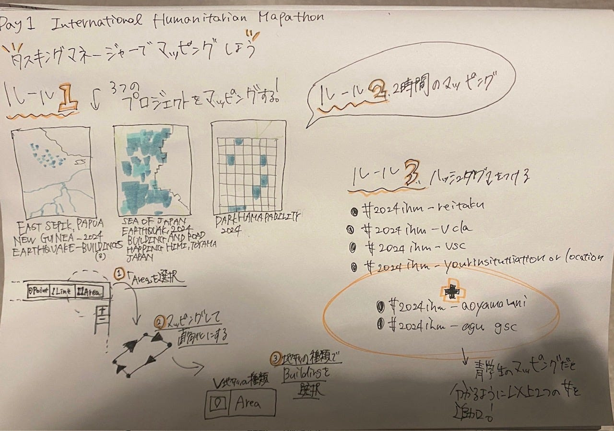

### IHM 2024に参加しました

こんにちは。三年の金澤です。

2024年4月24日～26日にフィリピンと日本で、4月24日～26日にはアメリカとメキシコで、IHM(International Humanitarian Mapathon)が行われました。これらは事前に予約が必須のものでした。

### Day1 Humanitarian Mapping

OSMでは以下のハッシュタグを共に、マッピングが完了する際に投稿します。

_**#2024ihm-reitaku_**

_**#2024ihm-ucla_**

_**#2024ihm-usc_**

_**#2024ihm-yourinstitution or location_**

＋青学生は

_**#2024ihm-aoyama uni_**

_**#2024ihm-agu gsc_**

### Day2 UN Crisis Map Challenge

日本では26日午前10時までにStorymap Challengeの課題が出されました。

①一度ワークを終えたら完璧かどうかをいう必要がある。

②沢山の建物のあるタスクもあれば、そうでないものある。

③ピンクの枠内でマッピングをする

④二時間以内

etc.

成果物のPermalinkがこちらとなります。

[International Humanitarian Mapathon 2024
Made with Padletpadlet.com](https://padlet.com/UCLA_Library/international-humanitarian-mapathon-2024-v9xzbflkecfhwugp/wish/2970029244)

反省としては、私自身がオンタイムで参加できていない点です。そのせいで良いテーマ名がみつからず、いい記事もかけませんでした。ですが、参加した子からの情報収集、記事からの情報収集でなんとかこの記事を仕上げました。今後はなるべく予定をあけます！

#furuhashilab #古橋研究室 #AoyamaGSC #地球社会共生学 #AGU#青学
