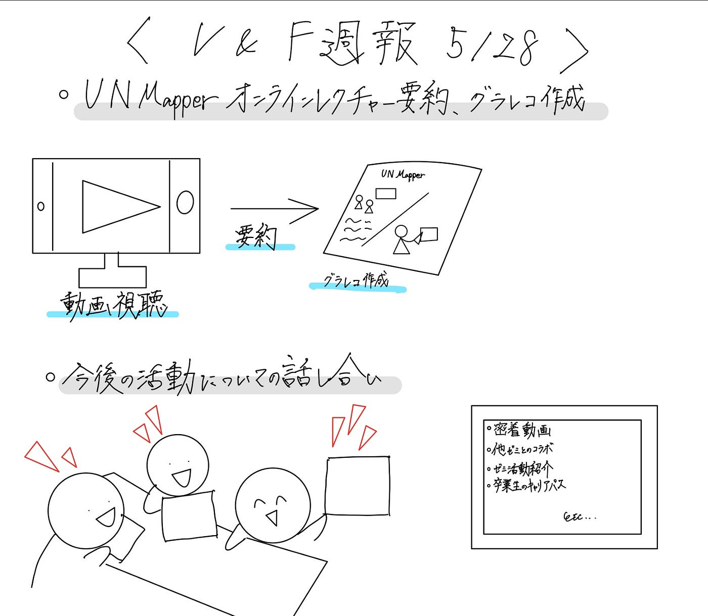

## V&F週報5/28

3年の古内です。

今週のV&Fの活動は、

[UN Mapperの動画要約とグラレコ作成](https://drive.google.com/drive/u/0/folders/1tcTesKug-n3E2IQR9Fp98IFp5Jldsq5-)、今後のV&F活動についての話し合いを行いました。

UN Mapperの動画要約とグラレコ作成は、動画8を古内、動画9を高井、動画10を深水が担当しています。

それぞれ動画要約を進めていますが、グラレコが完成したメンバーはまだいません。

今後の活動についての話し合いでは、一人一人V&Fとしてどのような活動をしたいかについての案の出し合いと、ツリーハウス合宿の動画作成についての話し合いを行いました。

深水: [DaVinci Resolve](https://www.blackmagicdesign.com/jp/products/davinciresolve)の簡単なマニュアル動画

高井: 古橋先生の1日密着動画、エリックゼミとのコラボ動画

古内: ゼミ活動紹介動画、ゼミ卒業生のキャリアパス紹介動画

福田: ゼミ活動の様子撮影、ゼミ紹介動画

滝沢: ゼミ紹介動画

ツリーハウス合宿の動画に関する話し合いでは、対面ではそれぞれの予定が合う日程を調整することができなかったため、6月4日の22時からGoogle meetでオンラインミーティングを行い、そこで詳しく動画作成に関する計画立てを行うこととなりました。

今回の反省としては、話し合いを行う上でメンバーそれぞれの日程の調整が難しいことはあらかじめ予測できたことなので、もっと早い段階でオンラインでの話し合いを行う日程を決めるべきでした。この反省を活かし、6月4日の話し合いの場ではきちんと動画を作成する際の役割分担や期限等を決め、動画を完成させる目処が立つようにさせます。

今回のグラレコです。（古内担当）

