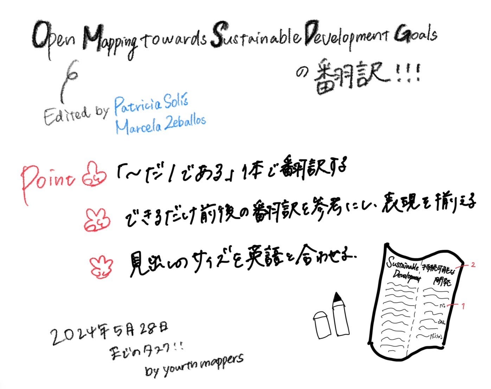

## Youth週報5/28

こんにちは！3年の末木です。

今週のYouthの活動は、

[Open Mapping towards Sustainable Development Goals](https://link.springer.com/book/10.1007/978-3-031-05182-1)の翻訳作業でした。

去年の活動からの引き継ぎで今週は380ページのうちの37ページからの翻訳作業をYouthのメンバーで手分けして行いました。

[翻訳文](https://github.com/furuhashilab/Open-Mapping-towards-Sustainable-Development-Goals/issues/1)

今回の作業で54ページまで終えましたが、まだ7分の1程度しか終わっていないので今後も時間を見つけて翻訳を続け、9月にはじまる [UN Mappers](http://mappers.un.org/home) basic Workshopまでに全ての翻訳を完成させたいと思います。

また、以下が翻訳を行う上でのポイントでした。

- 「だ/である」体で翻訳する

- できるだけ前後の翻訳を参考にし、表現を揃える

- 見出しのサイズを英語と合わせる

専門的な用語の適切な翻訳の仕方が難しかったこと、翻訳者によってその翻訳にもズレが生じてしまうのが課題であるため、今後全体を通して読み直し、文章の適切さと統一感も高めていきたいです！

今回のグラレコです(金澤作)

