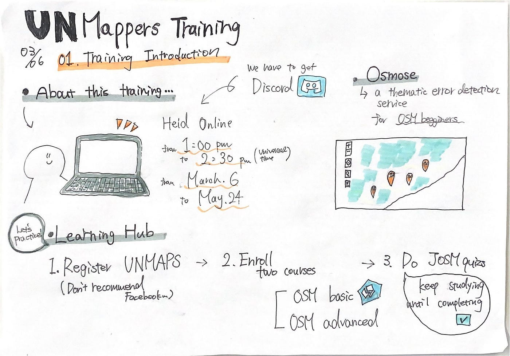
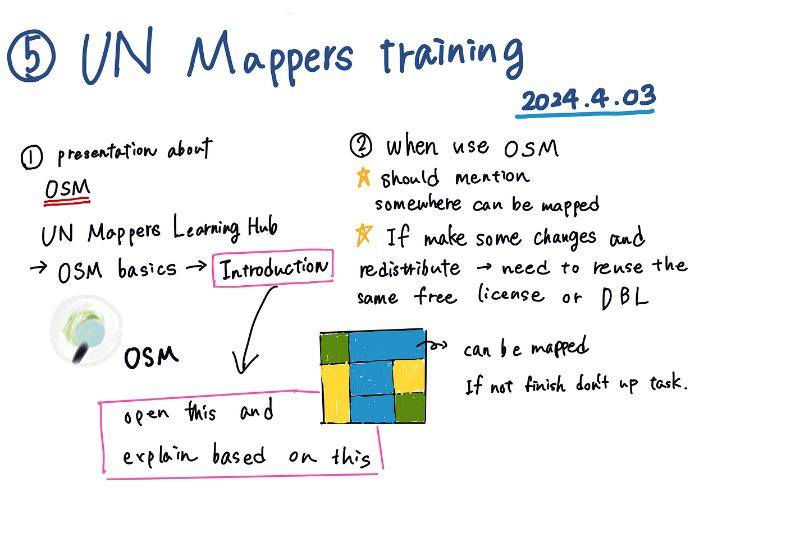
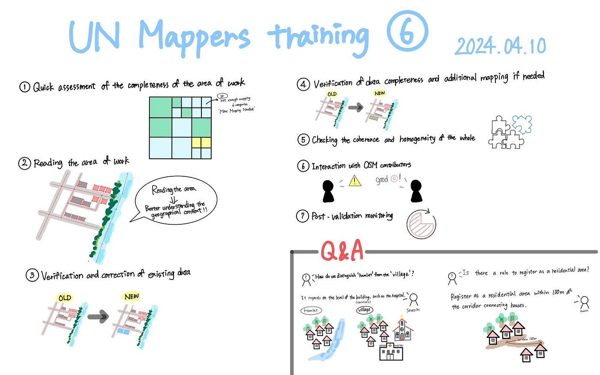
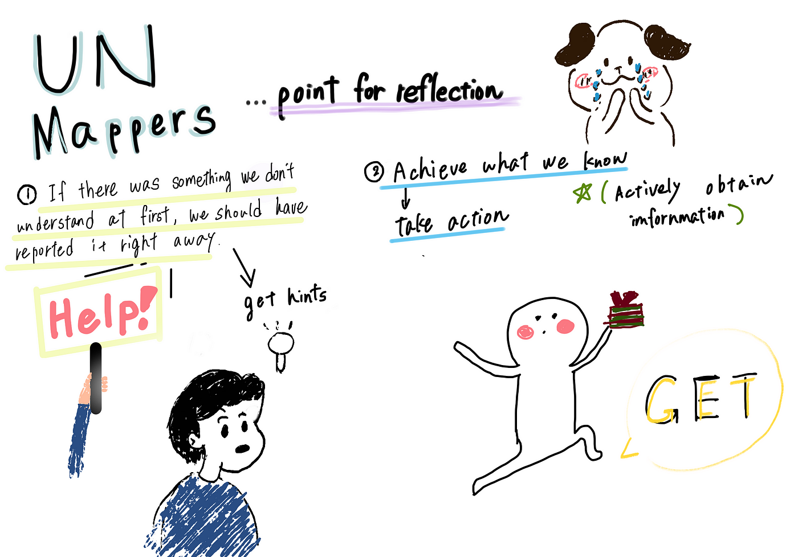

### デザイン部週報（5/28)

こんにちは！三年の福田です。

三月から参加していたUN Mappersの練習が終了しました。

初めてJOSMとOSMを使ってマッピングを行うことができました。

それぞれが担当する動画のグラレコがこちらになります。また、個人的に反省点もグラレコにしてみました。

今回のUN Mappersが始まったのは三月でまだ学校が始まってなく、会議には参加していたが、まだ緊張の意識がなく、最初から何をしているかよくわからない状態で始まったという事実がありました。

その後は学校が始まり、それぞれの時間の関係で、参加できたりできなかったりという状況になりました。終わる直前まで何をしたらいいのかわからない状況でした。その時にわからないということを報告し、やらないといけないことをまずやるべきだったと反省しています。

また、今回のことを経験に、次に取り組むことはこのように直前になって焦るのではなく、時間に余裕を持ち、分かった内容からどんどん進めていくようにします。
