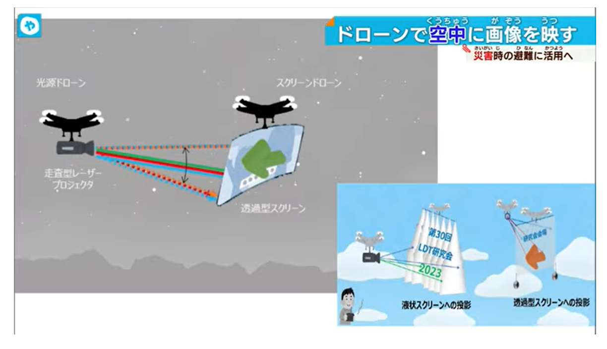
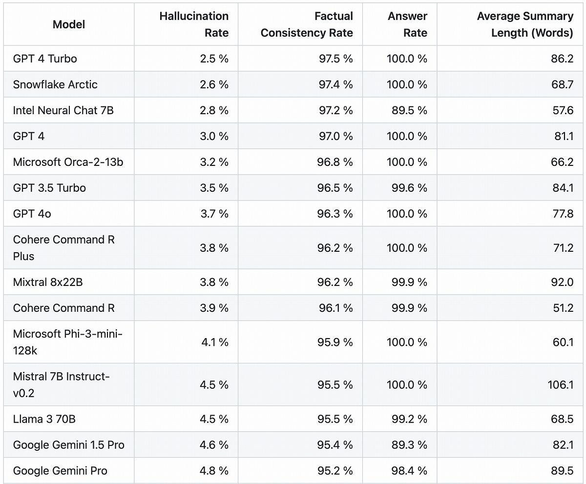
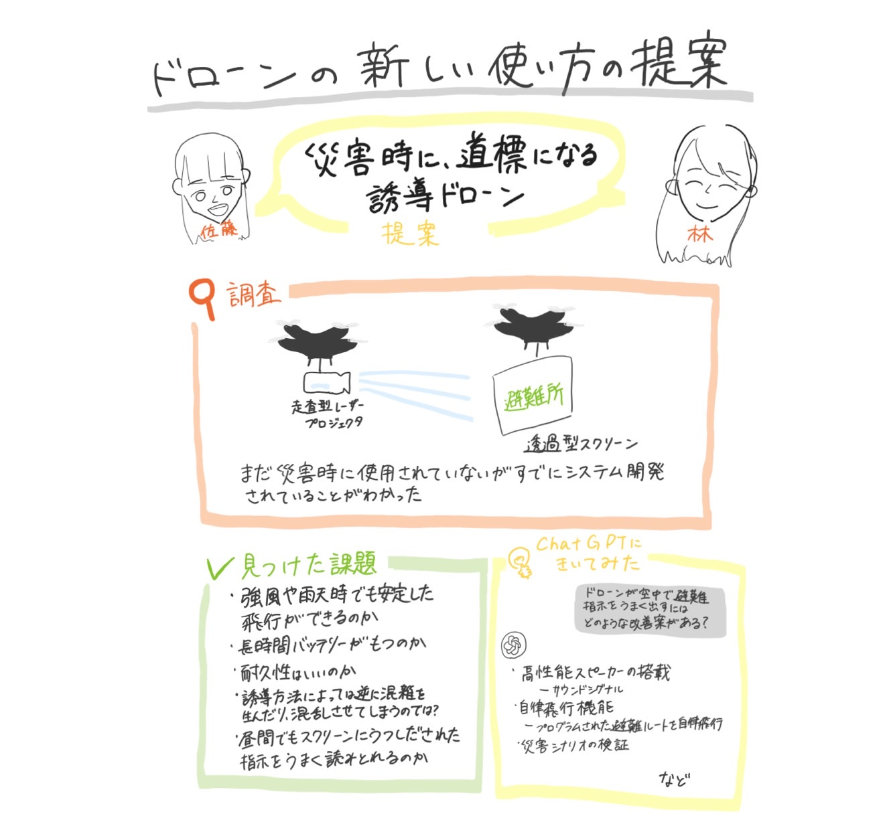

### ドローン部週報5/28

こんにちは、ドローン部3年の佐藤と林です！

今週のドローン部週報は、「災害時に道標になるドローン」をテーマにしました。

産業ドローンの発展は目覚ましく、万博でもエアモビリティーの技術発展が注目されています。そのなかで、災害時にドローンをどのように活用すれば被害を減らせるか、2人でドローンの可能性について考えてみました。

また、今年度ドローン部ではAIをうまく使えるようになることを目標にしているので、AIを週報執筆に一部使用しています。今回も、課題点をChatGPT４に投げてみました。

しかし、一言でドローンといっても種類は多種多様で使用する用途や機能から、得意分野も種類も異なります。その中から、今回は産業用ドローンを中心にとりあげます！

### １．ドローンの定義

ドローンにはさまざまな種類がありますが、その前に、そもそも「ドローン」とされるのはどんなものでしょうか？

一般的には、「3つ以上のプロペラを持ち、無人で飛行するものの一種」をドローンと呼んでいます。また、法律的には100g以上のドローンを「無人航空機」、100g未満のものを「小型無人機」と呼んでいて、それぞれ適用される法律が異なります。

[https://www.kantei.go.jp/jp/singi/kogatamujinki/kanminkyougi_dai8/s1-2.pdf](https://www.kantei.go.jp/jp/singi/kogatamujinki/kanminkyougi_dai8/s1-2.pdf)（首相官邸ホームページより出典5/28）

### ２．総称”ドローン”たちの目的別、内訳

上記で述べたようにドローンには様々な種類があります。正直、混乱したので今回取り上げる産業ドローンがどこに分類されるのか簡単にまとめました！

**・空撮用ドローン**

高性能カメラや、手ぶれ補正機能「ジンバル」搭載のものが多い

**・★産業用ドローン★本日の目玉**

インフラ点検、測量、災害対策、防災、警備、農薬散布、物流、イベントなど、目的によってさまざまな機能がある

・インフラ点検
・測量
・災害対策、防災
・警備
・農業（農薬散布など）
・物流
・イベント

などなど…

**・競技用ドローン**

スピードが早く、すべてのパーツが交換可能

**・軍事用ドローン**

高性能レーダーや赤外線カメラを搭載、敵地を偵察したり、爆弾で敵地を攻撃したりする

**・水中ドローン**

水中撮影できるカメラとLEDライトを搭載、ソナーや魚群探知センサー搭載のものもある

**・FPVドローン**

ドローンカメラの映像を、操縦者がFPVゴーグルなどでリアルタイムに見ながら操縦できる

[ドローンの種類一覧！用途別の特徴、選び方のポイントや軍事用も紹介
この記事では、ドローンの種類について詳しく解説します。まず、ドローンの種類と特徴を一覧表でご紹介し、その後、一般的なドローンとトイドローン、主なドローンメーカーについても紹介します。ドローンを何に活用したいのかを踏まえた上で、最適な種類を選…drone-navigator.com](https://drone-navigator.com/drone-type)

5/28閲覧

### ３．本当にその避難道って安全なの？という疑問

上記の疑問から、災害時の状況を想定し、2人で疑問に思ったことや意見を出し合ってみました。

従来の人流誘導や交通整理など含めて、警備員や消防隊が人力で行うことが主だが、災害時などの緊急事態で行われる避難では、何かしらの制約で現場での人手不足が起こり、避難誘導ができない場合もあるのではないかと考えました。実際に、日ごろからハザードマップなどに記載される避難経路を正確に把握している人は多くはないと仮定しています。また、災害時は、火災や交通網の崩壊など予期せぬ事態で臨機応変な対応が必須で、情報のリアルタイム性も求められるのではないかという意見もでました。

### ４．すでにあった、情報をリアルタイムで現地に届けて道案内してくれる「レーザー空中サインシステム」

紹介するのは、大阪大学研究所の石野正人特任教授、山本和久教授ら研究グループが新規開発した、ドローンとレーザーを用いた「レーザー空中サインシステム」です。可視光半導体レーザー応用システムと呼ばれています。

仕組みとしては、２つ光源ドローンとスクリーンドローンがあり、空中で画像を出して避難指示に活用します。レーザーをドローンに搭載し移動させることで、いつでもどこでも空中映像を映し出せるようになっています。レーザーには高輝度、高彩度、スペックルを有し、LEDではできない視認性を有するため、空中ディスプレイが実現できているそうです。

とても活気的で、音声を使用した誘導アナウンスだけでなく、視覚的な誘導標識が短時間で完成することに驚きました。

[「出口はこちらです！」 災害時の避難誘導に活用 ドローンが空中に避難指示
2023年2月6日 「出口はこちらです！」 災害時の避難誘導に活用 ドローンが空中に避難指示 | 大阪NEWS（テレビ大阪）www.tv-osaka.co.jp](https://www.tv-osaka.co.jp/news/47575/)

5/28閲覧

### ５．課題点をAIにきいてみた

ドローンの発展が目覚ましい一方で、課題も多く存在しました。自分たちで出した以外の視点も含まれていたので、ここに掲載しました。

#### 仕様モデルChatGPT４、以下質問とその回答です

Q：ドローンが空中で避難指示をうまく出すにはどのような改善案がある？

A：ドローンを用いて空中から効果的に避難指示を出すためには、以下のような技術的および運用的な改善が考えられます。

1. **強化された音声システム**:
 — クリアで大音量のスピーカーを装備し、騒音の中でも指示が聞き取れるようにする。
 — 方向性を持たせたスピーカーを使用し、音声が特定の地域や人々に届きやすくする。

2. **視覚的なアシスト**:
 — 映像やテキストメッセージを投影するための小型プロジェクターやLEDパネルをドローンに搭載。
 — ライトや色彩を使って視覚的に目立つサインを提供し、視認性を高める。

3. **多言語サポート**:
 — 異なる言語での避難指示を提供し、多言語コミュニティのニーズに対応。
 — 自動音声認識と翻訳技術を組み合わせることで、必要に応じて言語を切り替える。

4. **リアルタイムデータ処理**:
 — 現場の音声や映像をリアルタイムで分析し、状況に応じた適切な指示を出す。
 — AIを活用して避難の優先順位やルートを動的に更新し、避難効率を最大化する。

5. **耐候性と持続性の向上**:
 — 悪天候にも耐えることができるドローンの設計。
 — 長時間飛行が可能なバッテリー技術の導入。

6. **連携と協調**:
 — 複数のドローンが協調して動作するシステムを開発し、広範囲にわたる情報提供を行う。
 — 緊急対応チームとの連携を強化し、一元的な情報共有と指示伝達を実現。

これらの改善点を実装することで、ドローンはより効果的に避難指示を行い、緊急時の対応を効率化できるようになります。

[ChatGPT - チャットGPT
日本の文化に適応した話し方でユーザーに応答chat.openai.com](https://chat.openai.com/g/g-8sPlJ64Gn-tiyatutogpt)

補足

ChatGPT４を使用しましたが、情報が正確かどうか確認する必要があると感じました。[“Hallucination Leaderboard”](https://github.com/vectara/hallucination-leaderboard)より、各大規模言語モデルのハルシネーション率のランキングです。Hallucination Rateが小さいほどよい。ただし、ハルシネーションの評価方法はこれが絶対的なものでないことには注意が必要とのことです。

[GitHub - vectara/hallucination-leaderboard: Leaderboard Comparing LLM Performance at Producing…
Leaderboard Comparing LLM Performance at Producing Hallucinations when Summarizing Short Documents …github.com](https://github.com/vectara/hallucination-leaderboard)

5/28閲覧

### ６．まとめ、感想

今回の週報執筆を通して、自分たちの疑問を調べてみる以外にも、ドローンの定義や種類、応用方法などの概要をあわせて学ぶことができました。ですが、ネット上の文献を読むなかで、機械的、数値的、技術的なことで理解できない部分が多かったです。大まかなアイディアを出しても、それをどのように具体的な施策まで落とし込んでいけばいいのか、など新しい疑問も出てきました。また、AIを使うことで、文献収集の時間が大きく減ったので、改めてその利便性を実感しましたが、信ぴょう性に欠けるとの指摘もあったので、ChatGPTを参考文献にしていいのか、使い方を学んでいきたいです。

### ７．要約グラレコby林

執筆：佐藤、林
