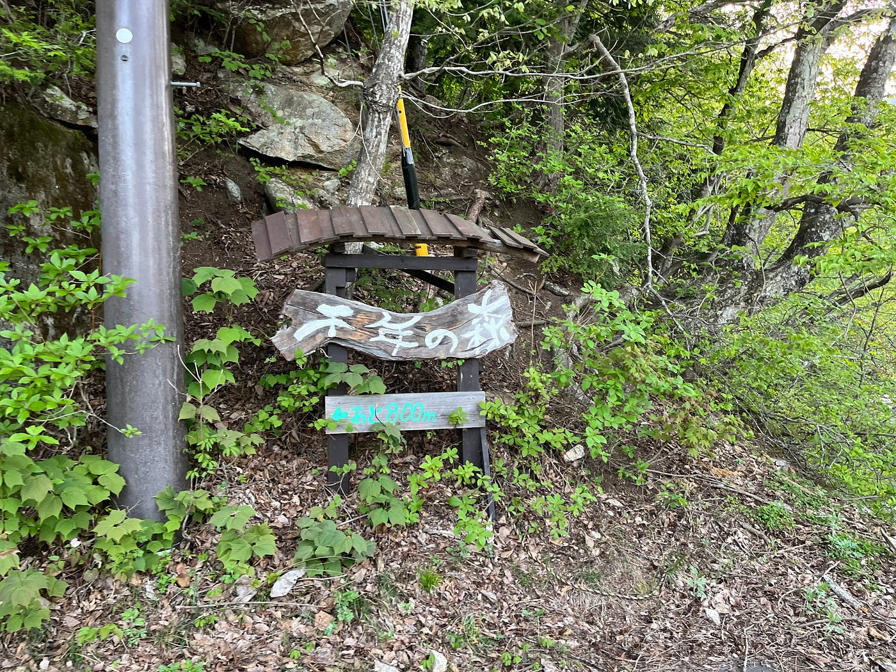
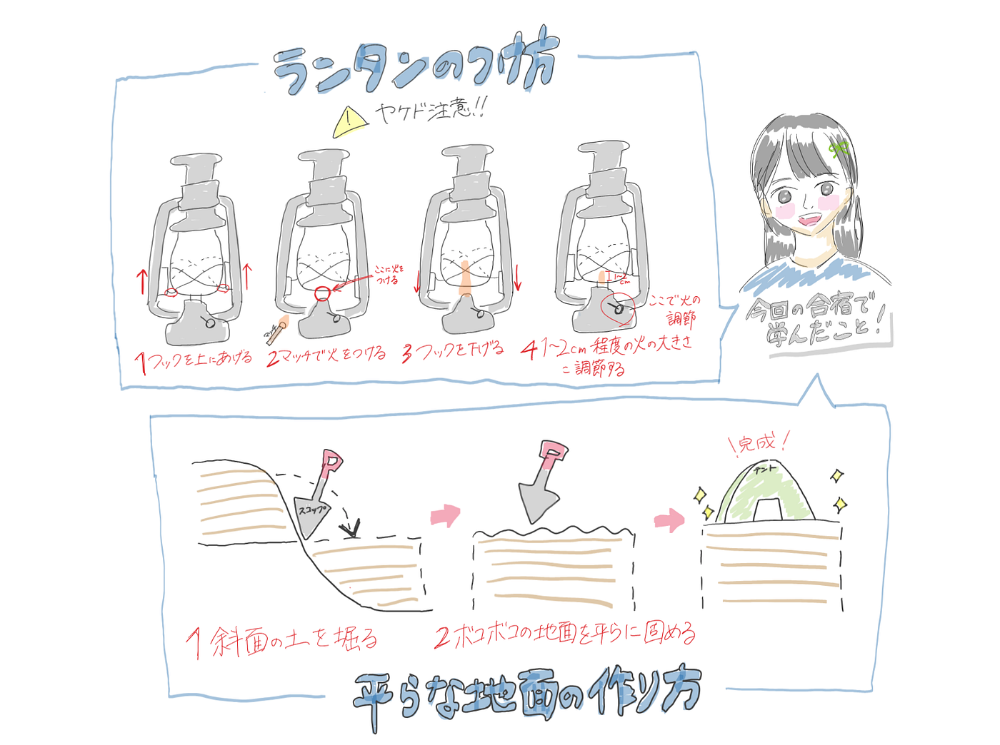
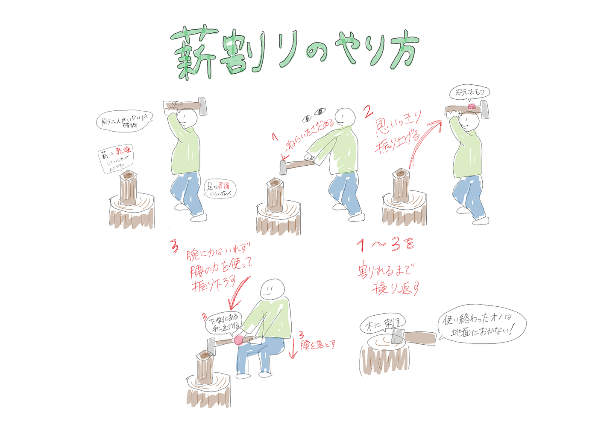
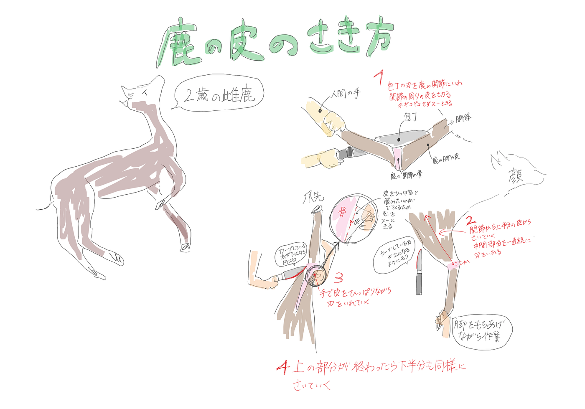

### 長野県でのちょっと変わったGWの過ごし方【古橋研究室2024GW合宿】

こんにちは。3年の林優香里です。

今回は古橋研究室に所属して初めてのゼミ合宿に参加しました。

**開催地は！[千年の森自然学校](https://morikura.com/)！！**

はじめての長野県、そして本格的なキャンプに少し緊張しながら当日を迎えた私ですが、2泊3日のキャンプを終え、日常生活への感謝と大きな成長を実感した機会となりました。

ここから、皆さんと一緒に私が経験した2泊3日を振り返っていきたいと思います。

主な千年の森の自然学校のスケジュールは以下の通りです。

**1日目(2024/5/3)：**各自テントはり、山神様にごあいさつ、ランタン・薪割り・水汲みのやり方指導

**2日目(2024/5/4)：**鹿の解体ショー、山菜どり、そば打ち、夕食づくりのお手伝い

**3日目(2024/5/5)：**朝食づくり、全山清掃

3日間の私の経験を[Re:earth](https://reearth.io/ja/)を使って[まとめました](https://fbjfjfddac.reearth.io)。

以下のリンクから閲覧できます。

[https://fbjfjfddac.reearth.io](https://fbjfjfddac.reearth.io)

そして、Re:earthの中にもある山菜採りと山神ツアーの移動記録はこちらです。[Strava](https://www.strava.com/features)を使い、記録しました。

【上：山菜採り/下：山神ツアー】

[山菜どり - 優香里 林's 4.5 km run
優香里 林 ran 4.5 km on May 3, 2024.www.strava.com](https://www.strava.com/activities/11326494793)

[信濃大町 山神ツアー - 優香里 林's 3.3 km run
優香里 林 ran 3.3 km on May 3, 2024.www.strava.com](https://www.strava.com/activities/11320674861)

今回のキャンプ合宿を通じて、この経験を単に良き思い出として残しておくだけではなく、学んだ知識を自分が振り返るとともにこの記事を読んでくださった方にも共有したいと思いました。そのため、全部ではありませんが、私が初めて学んだ知識を[グラレコ](https://note.street-academy.com/n/nf912f62b0e01)にしてまとめてみました。絵と文だけでは伝わりにくい部分や、曖昧に記録してしまっている部分があるため、間違っている部分があるかもしれませんが、少しでもみなさんの役にたてればいいなと思います。

※鹿の解体方法については絵と文だけでは伝わりにくいため、すべての工程は記録されていませんが、動画も貼っておきます。鹿の血など苦手な人は視聴をおすすめしません>_<!

（合宿、課題を通じて思ったこと）

今回の課題を通じて、初めてRe:earthを使ってストーリーテリングを作り、慣れない操作で意外と時間がかかってしまったことや、グラレコでどうやったらより読み手が見やすく感じるか工夫したりなど、試行錯誤した課題となりました。しかし、今回学んだ知識を無駄にせず、次回はさらにスキルアップして効率よく使用できるようにしたいと感じました。また、反省点として、次回はイベントの記録を写真や動画だけでなく、文字で記録したりして、記憶をさらに鮮明に覚えていられるように努力したいと思いました。最後に、この合宿を経験して、自分の身体的な能力が向上だけでなく、技術面や精神面でも成長できた良い経験となりました。次回の合宿では、今回の経験が生かせるように頑張ります！！
