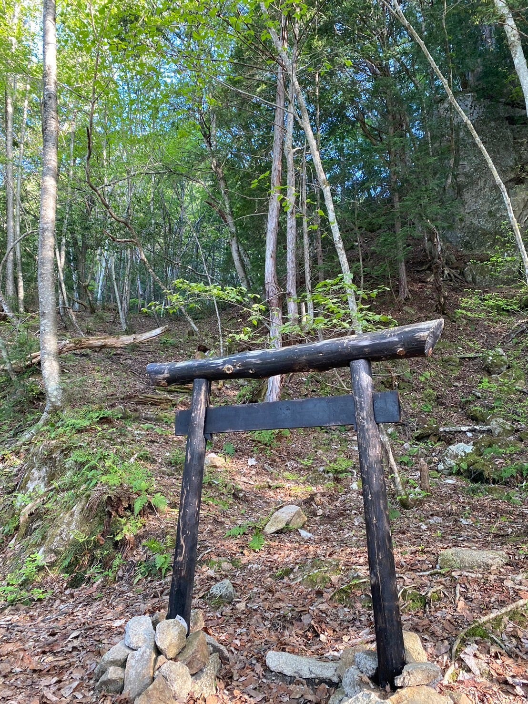
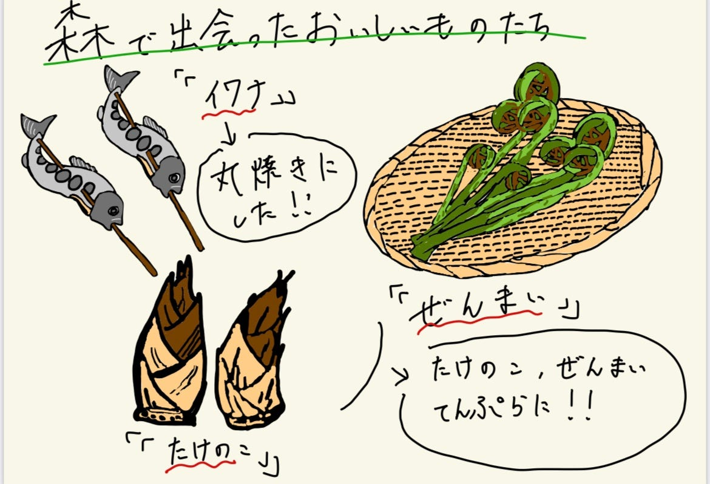

## サバイバルin 長野！

5月のゴールデンウィーク期間に千年の森自然学校に行ってきました！

５月３日 山神様ツアー

５月４日 山菜ツアー、鹿の解体

５月５日 清掃

ゴールデンウィーク期間ということもあり涼しく快適なキャンプをすることができました。

自身初ソロキャンプということもあって、1人用テントの建て方、キャンプサイトの整地など様々なことにチャレンジすることができました。

今回の合宿では、鹿の解体、山菜の収穫や調理などとても貴重な体験をすることができました。

今回の合宿の行動を「[Re Earth](http://dbgjcagijg.reearth.io) 」を用いて記録しました。また、「山神様ツアー」の登山の記録や山菜採集の記録を「[Strava](https://www.strava.com/activities/11326506184)」を活用しました。

[dbgjcagijg.reearth.io](https://dbgjcagijg.reearth.io/)

[山菜取り5/4 | ランニング | Strava](https://www.strava.com/activities/11326506184)

[山神様 | ランニング | Strava](https://www.strava.com/activities/11320678554)

また、今回の合宿をグラレコで表現しました。今回の合宿を通してたくさんの美味しい食べ物に出会ったのでそれを記録しました。なかでも山菜の天ぷらは絶品で、自然の中で活動してたからこそこの感動を味わうことができました。

今回の合宿で終わりではなく、自然の中で生き抜く術を何よりも自然を楽し尽くすことをこれからも実践していきたいです！
