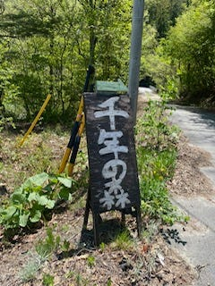
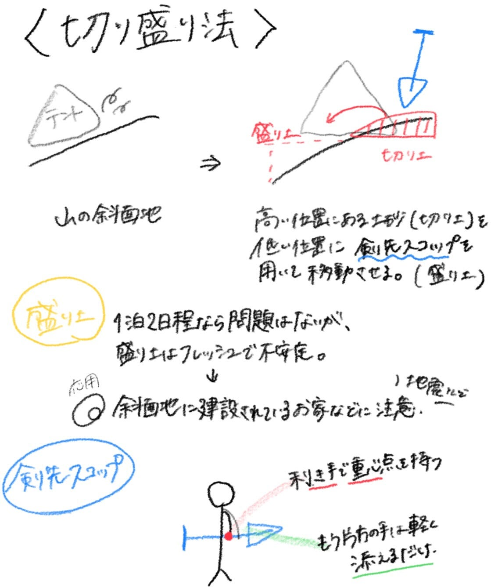
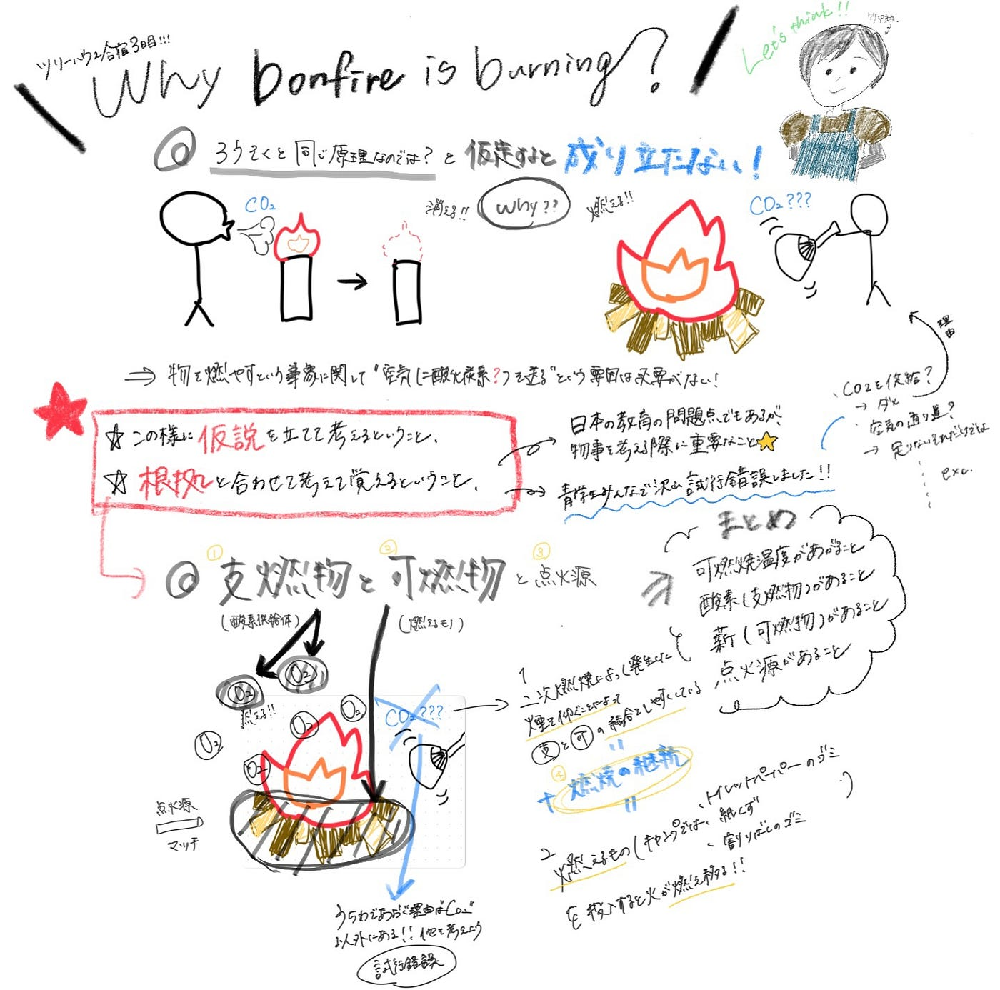
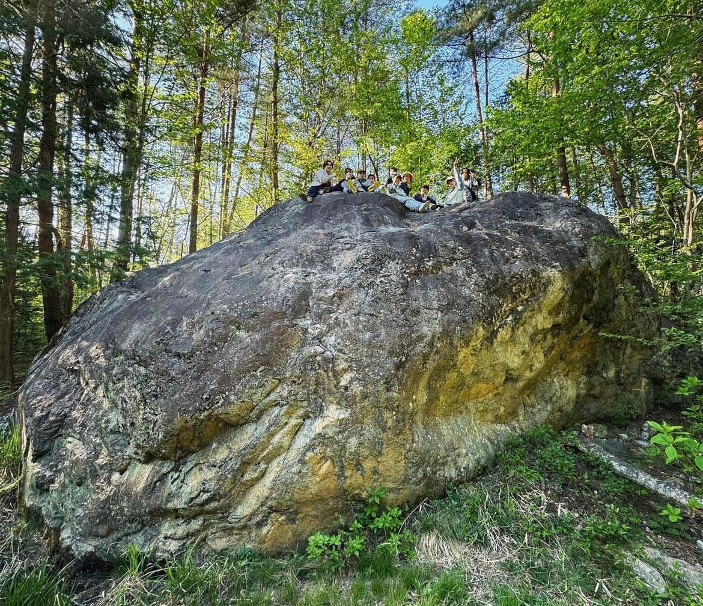

### 私達現代人が忘れてしまった楽しさの連続だった２泊３日

こんにちは。３年生の金澤真優です。

5/2–5/5に、長野県大町市にある「千年の森自然学校」というキャンプ場へ行ってきました。ここでは、人生初めて森の中でテント泊をした私自身がおもしろいなと感じたアウトドア知識を多数紹介します！

### （私的）テント泊 気になる持ち物は？

私は初めてのテント泊で、出発前は持ち物の決定に困りました。

友達と相談して、持っていったものの中から実際にテント泊で必要だったものをご紹介します！！

#### 【必要度★★★】

①テントと寝袋

友達に借りたテントは女子二人がゆったり寝れるサイズなのに持ち運びも非常に楽でよかったです。更に、日中は熱気がテントに籠る為、網戸付きは魅力的です⭐️

しかし、快適で大きすぎると限られた土地にみんなでテントを張る為場所をとってしまい迷惑にもなりますし、斜面を掘る労力も多く奪われてしまうので、サイズ感は重要です。

これから自分に合うテントを探します！

②着替え

必要な分のみ。

※私は濡れたタオルを、昼間テントの上で乾かしていました。

工夫次第で荷物を減らすことができます◎

③軍手

薪割りや山菜集めなどの際に利用しました。

④ティッシュとウェットティシュ

⑤ランプとヘッドライト

森の夜は真っ暗です。必ず持参！

#### 【必要度★ ★】

①雨具

晴れだった為、全く使いませんでした。

②モバイルバッテリー

有難いことに古橋先生が大きいバッテリーを持ってきてくださりました。

#### 【必要度★】

①ランプ・ヘッドライトの替えの電池

私は新品のものを持参した為、二夜では電池は切れませんでした。

### 斜面にテントを張る方法？

いざテントを組み立てようと思っても、山では斜面地がほとんどです。

ところがテントを斜面に固定すると転ってしまったり、斜面の上から崩れた岩が転がってきたり、降水が集ったり、夜を超えるにあたり、危険がたくさんあります。それでは、斜面にはどの様にテントを張ればよいのでしょうか？

### 私たちが尋ねた場所をRe:earth(未完成)にまとめました。

[https://cjcadaddbe.reearth.io](https://cjcadaddbe.reearth.io)

### 歩いた跡のpermalink

[千年の森山神ツアー2024 - KANAZAWA M's 2.4 km walk
KANAZAWA M completed 2.4 km on May 3, 2024.www.strava.com](https://www.strava.com/activities/11325746299)

[山菜ツアー - KANAZAWA M's 2.9 km walk
KANAZAWA M completed 2.9 km on May 3, 2024.www.strava.com](https://www.strava.com/activities/11389711986)

### 【竹中先生】仮説と根拠の火起こし講座

大自然の中で自分でテントを張って寝たり、自分で採った山菜を天ぷらにして食べたり、火起こしに使う薪を割るところから始めたり、自分たちで捌いた鹿をいただいたりしたこの二泊三日間は私にとってなんだか現代や日常を忘れた時間でした。忙しい毎日だからこそ必要な時間で、何もかもが便利な時代だからこそ必要な面倒臭さの連続で、快適すぎる家では体感できない昼と夜の寒暖差も、思っていたよりとても楽しかったです。車出窓を開けて走ると大自然が広がり、風の気持ちいい長野県がもっと好きになりました！！

