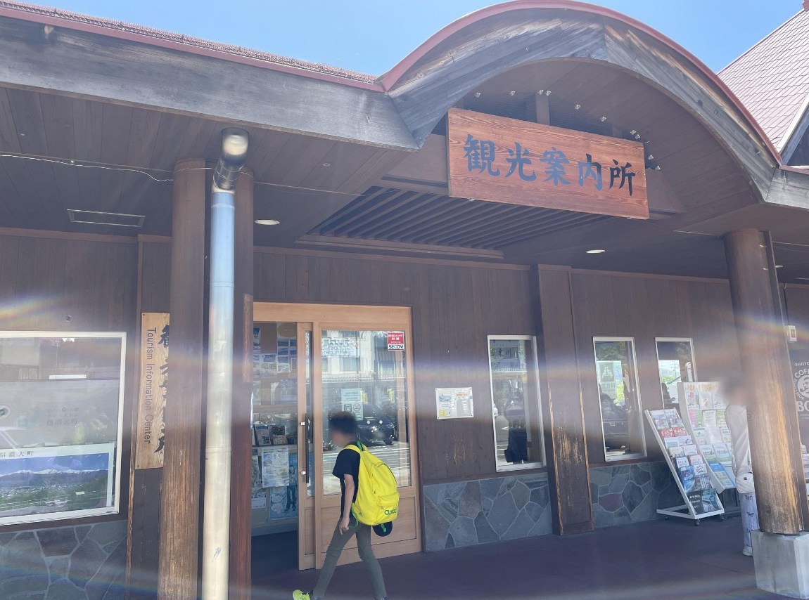
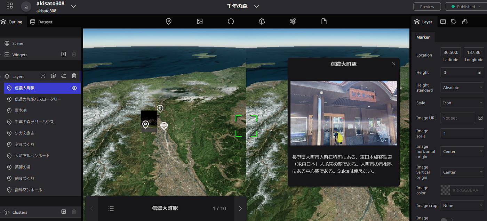
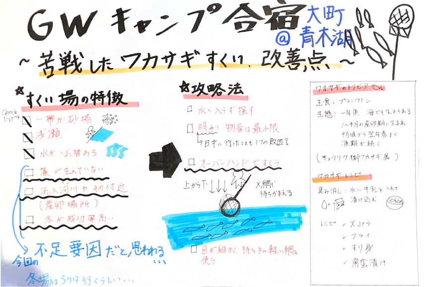

### GWに山をはしご

こんにちは！古橋研３年の佐藤です。

今回は長野県大町「千年の森」で開催された古橋研GW合宿の概要についてまとめています。

私は部活動の関係で、第２日程の午後から参戦したので、シカの解体や山菜取りなどのメインイベントがほぼ終わっていた…それでも、温泉やワカサギ釣りなどを堪能できました！

以下に日程と地図データをまとめています。

#### キャンプ日程

第2日程5/4：信濃大町駅到着→青木湖にてワカサギ釣り→テント設営→夕食準備→夕食→温泉

第３日程5/5：起床→ランニング→朝食づくり→朝食→元社会情報学部の教授による講義→清掃→解散

#### Mapillaryデータ

[Mapillary
Street-level imagery, powered by collaboration and computer vision.www.mapillary.com](https://www.mapillary.com/app/user/sugaraki?lat=36.500217556056&lng=137.86124529330004&z=17&pKey=1503989200523049)

#### ストーリーテリング

また、今回は[Re;Earth](https://jedaddaibh.reearth.io)を用いてストーリーテリングを行いました。下記[リンク](https://jedaddaibh.reearth.io)から閲覧できます。

[https://jedaddaibh.reearth.io](https://jedaddaibh.reearth.io/)

#### 感想

今回のキャンプでは、部活の山行とは違う山の楽しみを堪能しました。参加は叶いませんでしたが、山菜取りやシカの解体など、都心部では滅多に体験できない機会に恵まれたかったです。かつての里山と呼ばれた農村部では日常的な光景や知識かもしれませんが、現代ではそれら伝統的知識の継承が難しくなっていると感じます。また、今後の展開ですが、デジタルマッピングに関連して3次元空間IDについて学んでいるので、それを活用した新しい３D地図など表示できるようにしてみたいです。

#### グラレコ

