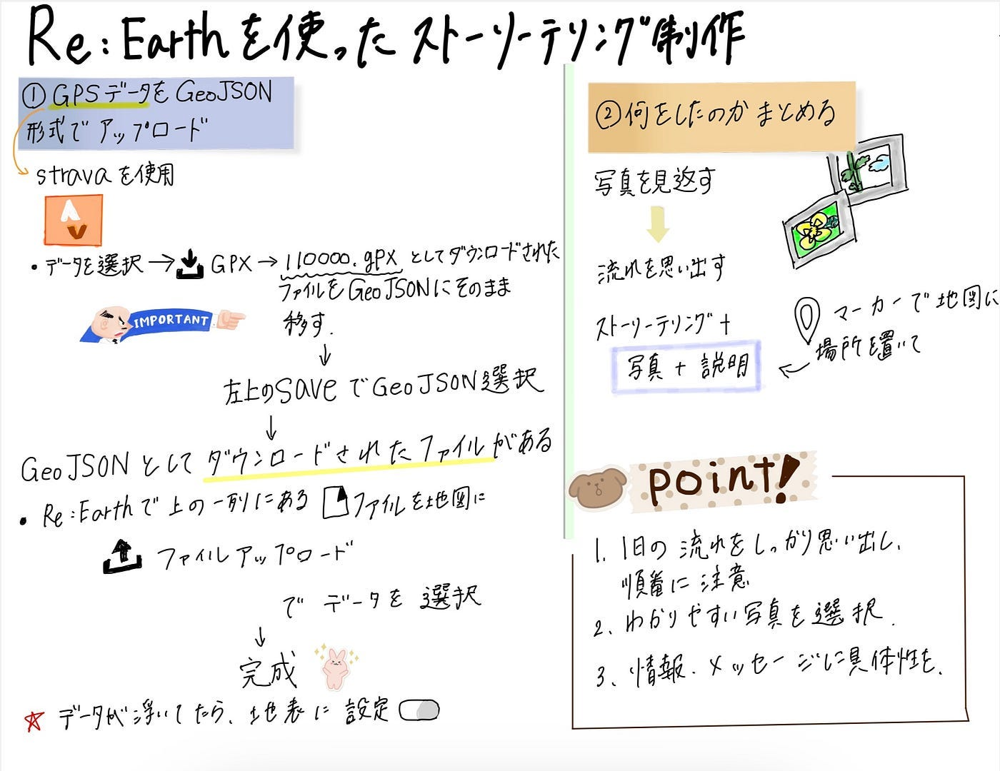

### GW千年の森自然学校のストーリーテリング

こんにちは！三年の福田です。

ゴールデンウィークに長野県にある「[千年の森自然学校](https://morikura.com/)」に行ってきました。

１日目は山神参り、２日目は朝から夜ご飯までの活動の軌道を[strava](https://www.strava.com/?hl=ja-JP)で記録しました。また、それらを写真と共にどこでどのようなことをしたのか思い出しながら、[Re:Earth](https://reearth.io/ja/)を使ってストーリーテリングを作りました。

まず、ストーリーテリング作品はこちらになります。

[Re:Earth](https://jhcjddjjfh.reearth.io)

１日目は山神参りの軌道しかとってなかったが、朝風呂したこと、お蕎麦屋さんが今まで食べた中で一番美味しかったこと、そして初めてテントを建てたこと全部すごく印象に残っていて、１日目も朝からの活動をストーリーテリングにしました。

**１日目のStravaはこちらになります。**

[ツリーハウス合宿 山神まいり - WANG H's 1.0 mi walk
WANG H completed 1.0 mi on May 3, 2024.www.strava.com](https://www.strava.com/activities/11320691052)

山神参りではMapillaryを使って分岐点で撮影をしました。以下がそのデータです。

[スタート地点](https://www.mapillary.com/app/user/kounadayo?lat=36.507505116321&lng=137.79863232551997&z=17&pKey=981567666923044)

[一つ目の分岐点](https://www.mapillary.com/app/user/kounadayo?lat=36.50965791174903&lng=137.80022067365996&z=17&pKey=748395037365694)

[終点](https://www.mapillary.com/app/user/kounadayo?lat=36.510431024528984&lng=137.80359774011004&z=17&pKey=1510218463178764)

**２日目のStravaはこちらになります。**

[ツリーハウス合宿二日目の活動 - WANG H's 1.7 mi walk
WANG H completed 1.7 mi on May 3, 2024.www.strava.com](https://www.strava.com/activities/11326954719)

ツリーハウス合宿だったけど、今回私たちはテントに泊まりました。壊れてたり、不安定なツリーハウスが多かったからだと思います。

今回の合宿では私たちゼミ生だけではなく、長年参加している方とその子供等もいます。特に子供等と遊んだりするのが楽しかったです。まだ載せたことがない写真をまとめてみました。

三日目はStravaで記録しませんでした。朝ごはんを食べてから掃除の分担をして、私は小屋の掃除をしました。すぐ近くに川があってすごく綺麗で涼しかったです。（下の3枚はその時に撮った写真です。）

少し余談になりますが、

１日目に行ったパン屋さんが美味しくてまた三日目に寄ってもらいましたが、残念なことにもうパンが売り切れてました。みんなも行く機会があったら寄ってみてください。「[パン・ド・カンパーニュ信濃大町店](https://maps.app.goo.gl/yVQdh1J1TDvunY6o6)」メープル塩バターパンが美味しかったです。

**最後に**

ストーリーテリングを作るには写真とどのような行動をしたかを思い出すための行動軌道が必要で、これらを元に振り返りをすることができました。ゼミとしてだけではなく、旅行に行った時にStravaで記録して、写真をたくさん撮って、大切な思い出をストーリーテリングにしてみようと思うようになりました。今回Re:earthを初めて使い、地図データの載せ方とストーリーテリングの地図カメラの設定が難しく感じました。もうやり方を覚えたので、忘れないようにします。

**グラレコ**

