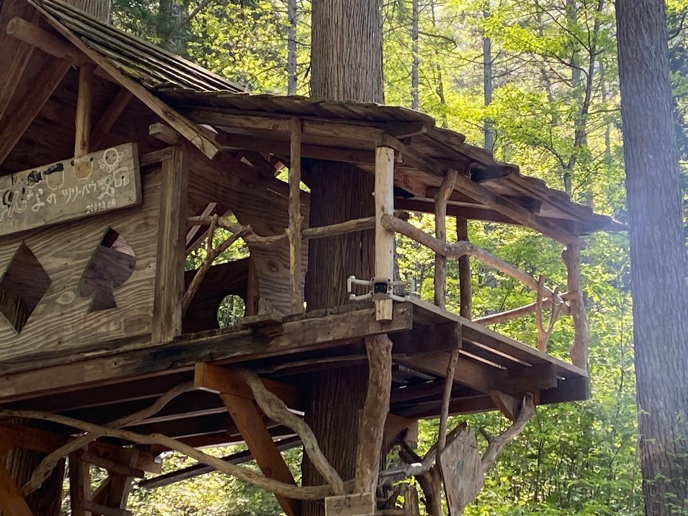
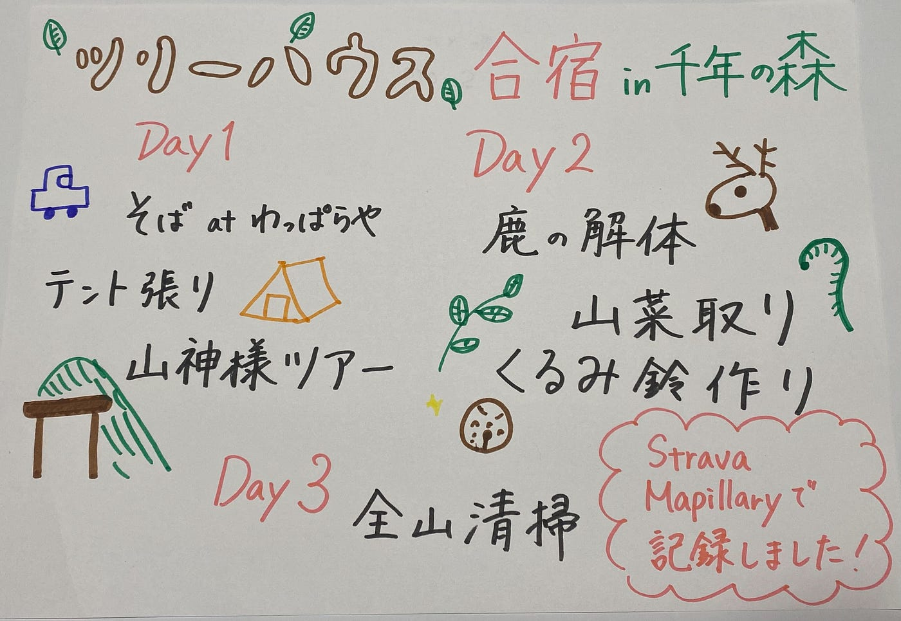

### アウトドア尽くしのGW

### 古橋ゼミツリーハウス合宿2024を振り返る

こんにちは！４年の上原です。

GWの2024年5月3日～5日の2泊3日で[千年の森自然学校](https://www.openstreetmap.org/#map=16/36.5074/137.8016)へキャンプ合宿に行ってきました。

この3日間ずっと喉が枯れており、一度も普通の声で会話することができませんでした。完治に1週間以上かかりました。

合宿の内容は、以前のYouthMappersAGUの週報（2024/5/7)でもお伝えしましたので、概要については[こちら](https://medium.com/furuhashilab/youth週報-5-7-5ab1c8e21d65)をご覧ください。

[はじめての本格的なアウトドアに挑戦してみました（Youth週報）
～千年の森に行ってきました！～medium.com](https://medium.com/furuhashilab/youth%E9%80%B1%E5%A0%B1-5-7-5ab1c8e21d65)

#### 合宿の思い出の記録

ここからは、個人的な内容についてお話ししたいと思います。

> ストーリーテリング

私が体験して印象に残ったアクティビティをストーリーテリングにまとめました。今回は、[Re:Earth](https://reearth.io/ja/)を使用しています。ぜひ[こちらから](https://gceejhbhgi.reearth.io)ご覧いただけますと幸いです。

[https://gceejhbhgi.reearth.io](https://gceejhbhgi.reearth.io)

> Strava

そして、1日目の山神様ツアーと2日目の山菜採りについては、[Strava](https://www.bing.com/ck/a?!&&p=79f133fb5238c714JmltdHM9MTcxNzExMzYwMCZpZ3VpZD0xZDA5YWViZi02ODMwLTY1MTktM2FiYy1iZWI4NjllMjY0NjkmaW5zaWQ9NTIzMw&ptn=3&ver=2&hsh=3&fclid=1d09aebf-6830-6519-3abc-beb869e26469&psq=%e3%82%b9%e3%83%88%e3%83%a9%e3%83%90&u=a1aHR0cHM6Ly93d3cuc3RyYXZhLmNvbS8_aGw9amEtanA&ntb=1)で軌跡を記録しました。詳細な情報については以下のリンクからそれぞれご覧いただけます。

[山神様 - 史栞 上's 1.3 mi walk
史栞 上 completed 1.3 mi on May 3, 2024.www.strava.com](https://www.strava.com/activities/11320675702?utm_source=ios_share&utm_medium=social&share_sig=7E1AD3E91715046819&_branch_match_id=1213316772068000053&_branch_referrer=H4sIAAAAAAAAA8soKSkottLXLy4pSixL1EssKNDLyczL1jfMTgt2z3EpyPdKAgCd0tnuIwAAAA%3D%3D&source=post_page-----5ab1c8e21d65--------------------------------)

[山菜採り - 史栞 上's 0.4 mi walk
史栞 上 completed 0.4 mi on May 4, 2024.www.strava.com](https://www.strava.com/activities/11326229246)

> Mapillary

山神様ツアーの際、[Mapillary](https://www.mapillary.com/?locale=ja_JP)で画像を記録しました。

リンゴの尾根の終点（1つ目）と山神様の祠（2つ目）の2地点です。

[Mapillary
Street-level imagery, powered by collaboration and computer vision.www.mapillary.com](https://www.mapillary.com/app/user/SHI__U2?pKey=804296581792629&source=post_page-----f1b4791dacea--------------------------------&lat=36.50965507308699&lng=137.80025843631006&z=17)

[Mapillary
Street-level imagery, powered by collaboration and computer vision.www.mapillary.com](https://www.mapillary.com/app/user/SHI__U2?pKey=853034700050112&source=post_page-----f1b4791dacea--------------------------------&lat=36.510497007796815&lng=137.80376037972064&z=17.787804218758602)

#### 最後に

大自然の中での3日間は、都会暮らしに慣れていた私にとって毎日がとても新鮮でした。1人テント泊や火起こしなど初めての体験をたくさんさせていただきました。行くまでもドキドキだったし、着いてからもずっと緊張していましたが、暮らしに慣れて自分の成長を実感するにつれて楽しくなっていきました！

もし今後行く機会があれば、万全の体調でのぞみたいです。

