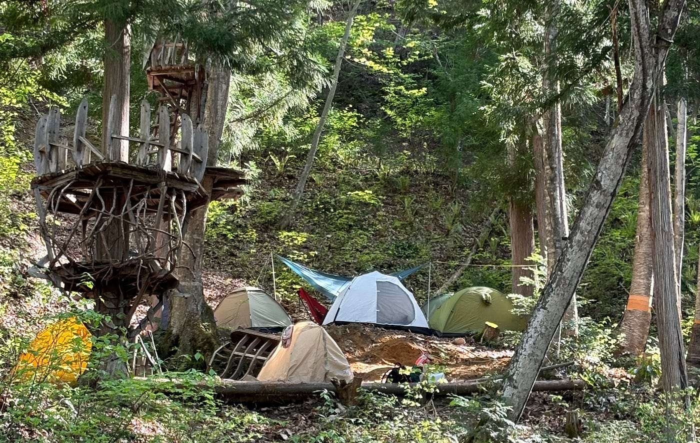
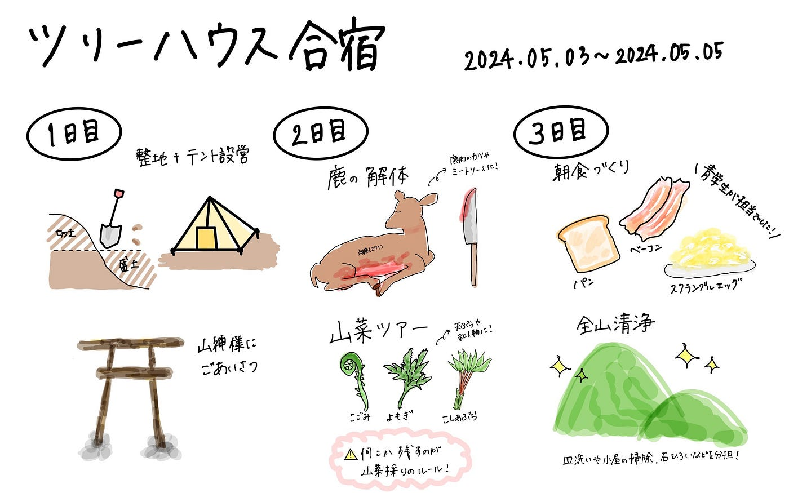

## 初めてのサバイバル生活in 長野

こんにちは！3年の末木です。

今回はゴールデンウィークに行ったツリーハウス合宿の報告をさせていただきます！

合宿は長野県の大町市にある[千年の森自然学校](http://morikura.com/wp/)で行われました。

はじめての古橋研究室の合宿ではじめてのキャンプで色々不安もあったのですが、全力で楽しみ、日々のあたりまえに感謝した2泊3日でした。それと同時に自然の中で生き延びる術を学び、成長できた合宿でした。

> 2泊3日は以下の日程で行われました。

- 1日目(5/3)：テント張り・山神ツアー・ランタン，水汲み，薪割りの体験

- 2日目(5/4)：鹿の解体・山菜ツアー・蕎麦打ち体験

- 3日目(5/5)：朝食作り・全山清掃

山神ツアーや山菜ツアーは慣れない山道をたくさん歩いたため、日頃使わない筋肉を使い、日常生活でどれだけインフラに頼っているのか実感しました。ただ、慣れない経験をした後だからこそ、外で食べる食事がよりおいしく感じ、自然に感謝することができました。特に食事に関しては、焚火を起こして、そこでパンを焼いたり、お湯を沸かしたり、自分たちで採った山菜や解体した鹿を調理して食べたりしたため、自給自足を肌で感じ、スーパーで簡単に食材が手に入ることから忘れていた植物や動物の命やガスや電気のありがたみを身をもって感じました。

この3日間、いろんな経験がはじめてで刺激的でしたが、自分の無力さを実感し、自然の中で生き抜くための力を身につけることもできました。今回の経験をただの経験で終わらせず、インフラの整った日常を過ごしながらもその豊かな生活の背景に目を向けることを忘れずに過ごしていきたいです。

> 3日間のストーリーテリングを[Re:Earth](https://reearth.io/)を使ってまとめました。

以下のリンクから閲覧できます。

[https://afbcahiifa.reearth.io](https://afbcahiifa.reearth.io)

山神ツアーと山菜ツアーに関しては軌跡を[Strava](https://www.strava.com/)を使って記録しました。

山神ツアー

[千年の森自然学校 山神ツアー - 理子 末's 8.1 km walk
理子 末 completed 8.1 km on May 3, 2024.www.strava.com](https://www.strava.com/activities/11320674870)

山菜ツアー

[山菜ツアー - 理子 末's 3.8 km walk
理子 末 completed 3.8 km on May 4, 2024.www.strava.com](https://www.strava.com/activities/11326495433)

山神ツアーでは[Mapillary](https://www.mapillary.com/?locale=ja_JP)で撮影も行いました。

以下がMapillaryで撮った山神様の鳥居です。

[Mapillary
Street-level imagery, powered by collaboration and computer vision.www.mapillary.com](https://www.mapillary.com/app/?pKey=1185270782514183)

グラレコ（ツリーハウス合宿の一連の流れをまとめてみました！）

