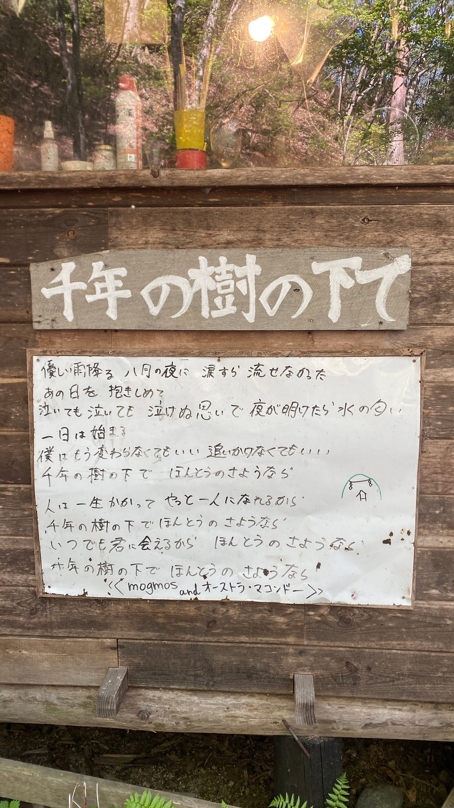
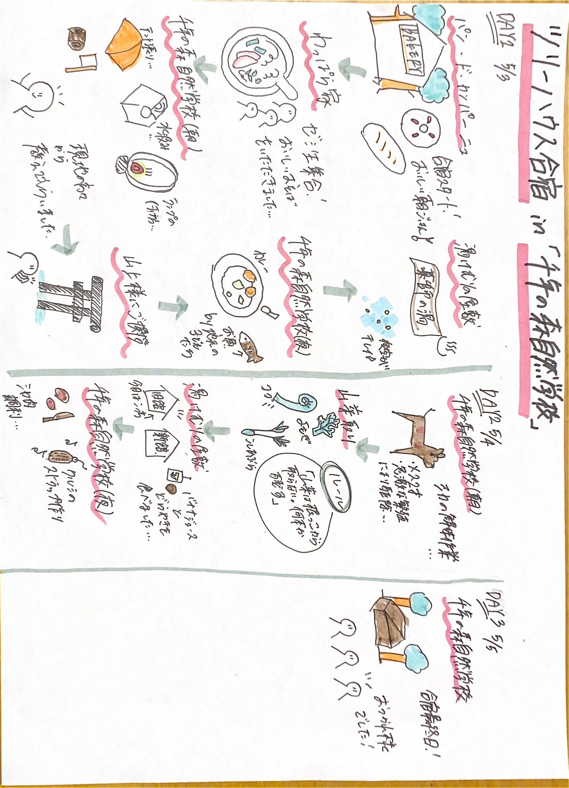

### 自給自足サバイバル生活

こんにちは！3年の滝沢です！
私は、2024/5/3–5/5に長野県大町市にある「千年の森自然学校」でツリーハウス合宿に参加してきました。

今回は合宿の活動記録をStravaで、合宿1日目の活動記録の写真をMapillaryで、ストーリーテリングをRe:earthで作成しました。

#### **[Strava]**

合宿1日目の山神様へご挨拶したときのルートと、合宿2日目の活動ルート(山菜採り含む)をStravaで記録しました。

１日目のStrava記録は↓こちらです。

[山上様 - 滝沢 未's 0.8 mi bike ride
滝沢 未 rode 0.8 mi on May 3, 2024.www.strava.com](https://www.strava.com/activities/11320838854)

２日目のStrava記録は↓こちらです。

[山菜とりルート - 滝沢 未's 1.4 mi bike ride
滝沢 未 rode 1.4 mi on May 3, 2024.www.strava.com](https://www.strava.com/activities/11327053758)

#### **[Mapillary]**

合宿1日目に山神様にご挨拶をしに行ったときに、Mapillaryを使用しGPS付きの写真を撮影しました。その写真データは↓こちらです。

[Mapillary
Street-level imagery, powered by collaboration and computer vision.www.mapillary.com](https://www.mapillary.com/app/?pKey=459819583089083)

[Mapillary
Street-level imagery, powered by collaboration and computer vision.www.mapillary.com](https://www.mapillary.com/app/?pKey=1129372811617164)

[Mapillary
Street-level imagery, powered by collaboration and computer vision.www.mapillary.com](https://www.mapillary.com/app/?pKey=364140836254197)

[Mapillary
Street-level imagery, powered by collaboration and computer vision.www.mapillary.com](https://www.mapillary.com/app/?pKey=1530881170829158)

#### **[Re:earth]**

ツリーハウス合宿のストーリーテリングは**[↓こちら**](https://debicfgccb.reearth.io)です。

[https://debicfgccb.reearth.io](https://debicfgccb.reearth.io/)

#### **[ツリーハウス合宿グラレコ]**

Re:earthを元にツリーハウス合宿の細かな内容を以下↓グラレコにまとめました。

#### **[ツリーハウス合宿に参加した感想]**

私は今回で、人生初めてほぼ自給自足のキャンプに参加しました。このキャンプで苦労したことと良かったことの2点について述べます。

まず、苦労したこととして、水を使うために重たいタンクを持って山を登らなければならず、水汲みの大変さを知ることができました。普段、水道の蛇口をひねれば水が出てきたり、水を飲みたければペットボトルを買えばいいなど、どんな状況でも簡単に水が手に入る生活をしていた私にとって、キャンプでの生活は非日常的でした。また、電気が通っていないことも私にとって衝撃的で、お風呂に入れなかったり、ヒーターがないので寒い中寝なければならなかったり、携帯が充電できなかったりと、普段の生活では感じることのない不便さを経験しました。しかし、これらの経験を通して、電気、水道、ガスが使える現代の生活のありがたさを実感することができました。今、私が気軽に水を飲めているのは、洗濯ができるのは、照明が使えているのは決して当たり前のことではないということを思い知らされました。

次に良かったことは、サバイバル術を学ぶことができたという点です。電気、水道、ガスの使えない状況に立たされたとき、例えば災害が起こった際の避難生活などで役立ちそうなことを学ぶことができました。テントで寝泊まりする、照明が使えないときに火をおこす、食料調達のために鹿を解体する（生涯この状況に立ち会うことはほぼないと思いますが…）、山菜を取るなど、いざというときに生かすことのできるスキルを身に付けることができました。災害時の避難先では、今回学んだことを活かして、学生である私が率先して行動したいと思いました。

以上のことから、ライフラインがほとんど通っていない状況に初めは不安を感じましたが、3日間楽しみながら合宿を終えることができました。次回、またこのようなキャンプに参加できる機会があれば、ぜひ参加したいと思います。

#### **[最後に]**

このキャンプ場には大人だけでなく、小さい子どももたくさん参加していました。「小さいうちから子どもには自然の中で育ってほしいと思っているので、毎回子どもを参加させています」とおっしゃっていた保護者の方がいらっしゃいました。それを聞いて、私は「確かにこんな大自然の中で小さい頃から自然を感じられたら良い経験になるだろうな。私も小さいときにここに来られていたらよかったのに…」と思いました。だから、将来私の子どもも、確実にこのようなキャンプに参加させようと決意しました。

この記事を見ているそこのあなた、お子さんがいらっしゃる場合は、ぜひ一緒に「千年の森自然学校」へ行かれてみてはいかがでしょうか？そして、私のような学生の皆さん、将来お子さんを連れて行ってみてはいかがでしょうか？そのためにはまず「千年の森自然学校」のキャンプに参加してみてください。かわいい子どもたちと優しいスタッフの方々があなたを待っています（温かいご飯も）。そしてもしかすると私にも出会うかもしれませんね…‽その時は同じキャンプ仲間としてよろしくお願いします…
