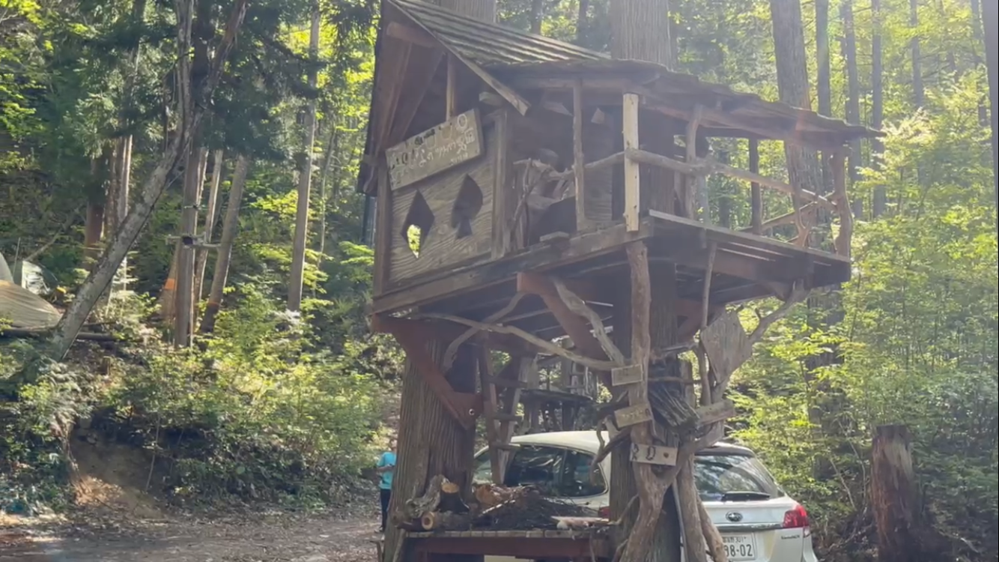
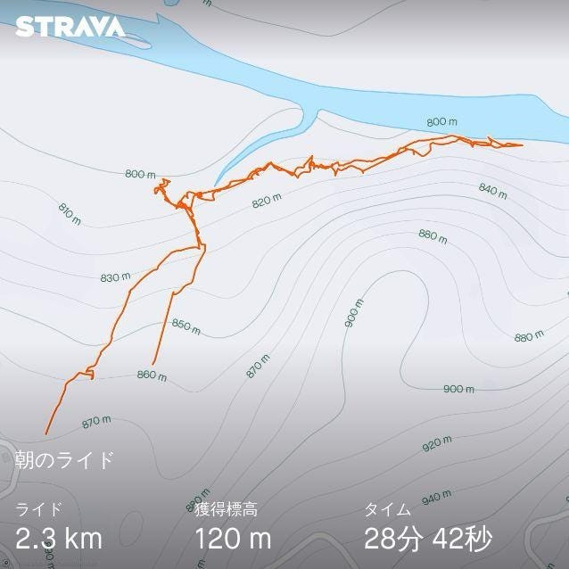
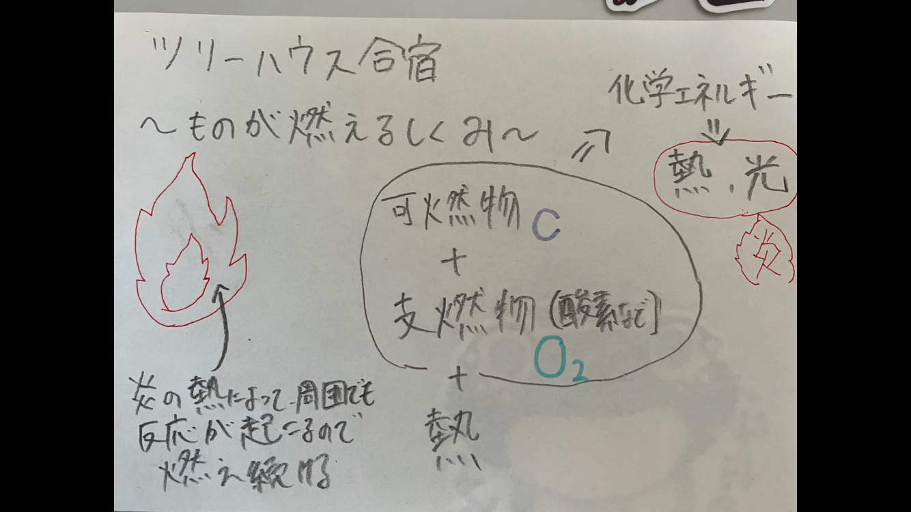

### GWは長野で修行してました

#### **古橋研究室ツリーハウス合宿 in[千年の森自然学校**](https://morikura.com/contact.html)

おはようございます。古橋研究室４年の深水です。

GW中に参加したツリーハウス合宿について記します。

ゼミ内サークルとしての記事も書いているので、ぜひご覧ください。

[千年の森自然学校でアウトドア体験（V＆F週報）
お疲れ様です。深水です。medium.com](https://medium.com/furuhashilab/%E5%8D%83%E5%B9%B4%E3%81%AE%E6%A3%AE%E8%87%AA%E7%84%B6%E5%AD%A6%E6%A0%A1%E3%81%A7%E3%82%A2%E3%82%A6%E3%83%88%E3%83%89%E3%82%A2%E4%BD%93%E9%A8%93-v-f%E9%80%B1%E5%A0%B1-263a0710a4b9)

> **[STRAVA**](https://www.strava.com/?hl=ja-JP)の記録

> [Re:Earth](https://reearth.io/ja/)を用いたストーリーテリング

[https://behafdhjbd.reearth.io](https://behafdhjbd.reearth.io)

> 感想

三日間のサバイバル生活を終えて、日常的にインフラ設備を利用できることや、室内で暮らせることへの感謝が生まれました。

合宿中に一番しんどかったのは夜の寒さで、寒がりな自分はテントの中で震えながら夜を明かしました。最後の夜に関しては、寒さを紛らわせるためにコンビニで買ったお酒を飲みながら眠りにつきました。

これからの人生でしんどい思いをしても、この三日間よりはマシだと思って乗り越えることができそうです。

> グラレコ

最後の日に聞いた、火が燃える仕組みについてのお話をまとめてみました。

