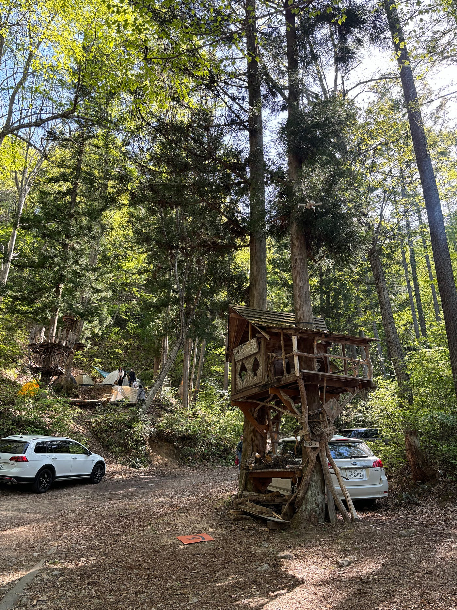

### 挑戦の連続：千年の森で過ごしたGWゼミ合宿体験記

#### 古橋研究室ツリーハウス合宿in千年の森自然学校

古橋研究室3年の古内です。

今回私は、GW中に長野県大町市にある「[千年の森自然学校](https://www.openstreetmap.org/#map=16/36.5074/137.8016)」にて行われたツリーハウス合宿に参加しました。

ツリーハウス合宿の主なスケジュールは以下の通りです。

**1日目(5/3)：**各自テント準備、山神様ツアー、ランタン・薪割り・水汲みのやり方指導

**2日目(5/4)：**鹿の解体ショー、山菜どり、ワカサギ釣り、夕食づくりのお手伝い

**3日目(5/5)：**朝食づくり、全山清掃

今回は[Re:Earth](https://reearth.io/ja/)を使用し、ツリーハウス合宿で印象に残ったアクティビティを[ストーリーテリング](https://bhfdifjfij.reearth.io)にまとめました。

また、山上様ツアーと山菜どりの軌跡をStravaにて記録しました。

[https://strava.app.link/4KBR7CZq6Jb](https://strava.app.link/4KBR7CZq6Jb)

[https://strava.app.link/GpZpgv0q6Jb](https://strava.app.link/GpZpgv0q6Jb)

この合宿は、山登りやキャンプなど、アウトドアアクティビティを経験したことのない私にとってとても厳しく、学びの多い経験となりました。

個人的に最も印象に残っているのはアブに足を刺され、その腫れによって歩けなくなったことです。虫除けスプレーを大量に塗布したことで慢心し、足首の空いたズボンを履いていた結果、両足首合わせて9箇所をアブに刺されました。３日目には自力で歩くこともできなくなり、帰りの各駅で車椅子をお借りし、移動しました。何事も準備不足というものは自分の首を絞め、さらに周りの人に迷惑をかけてしまうのだと痛感しました。

このような、普段の生活では得られない多くの経験は今後様々なことに挑戦するたびに思い起こされ、教訓となると信じています。
