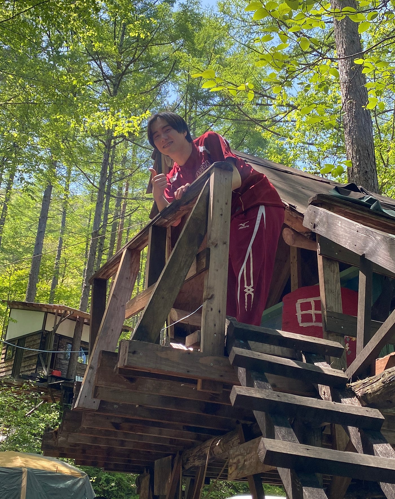
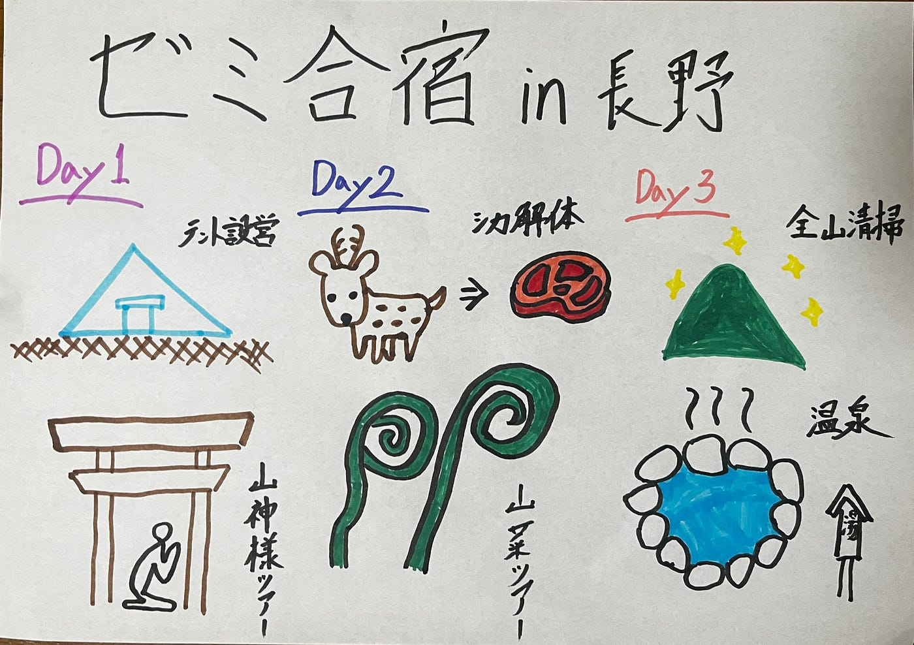

### サバイバルモード全開のゼミ合宿

こんにちは。３年の高井健太郎です。

５月３日～５日の３日間で[長野県の信濃大町](https://www.city.omachi.nagano.jp/?d=202406)にある[千年の森自然学校](https://kanko-omachi.gr.jp/spot/deepforest/)に、ゼミ合宿へ行ってきました！

自分たちでテントの設営場所を整備するところから始めるような本格的なキャンプは初めてだったので苦労しましたが、同じ日程で遊びに来ていた子供たちとたくさん遊ぶことができ、とても楽しかったです。

> ストーリーテリング

[Re:Earth](https://reearth.io/ja/service/cloud/)を使って、合宿の思い出をまとめたストーリーテリングを作成しました。[こちら](https://ebigiiciba.reearth.io)からご覧ください。

> Strava

３日の山神様ツアーと４日の山菜採りの際、[Strava](https://www.strava.com/dashboard)を用いて移動の軌跡を記録しました。以下のリンクからご覧ください！

[山神様ツアー - 健太郎 高's 2.8 km walk
健太郎 高 completed 2.8 km on May 3, 2024.www.strava.com](https://www.strava.com/activities/11320677967)

[山菜採り - 健太郎 高's 3.2 km walk
健太郎 高 completed 3.2 km on May 4, 2024.www.strava.com](https://www.strava.com/activities/11326472960)

> Mapillary

山神様ツアーの際、[Mapillary](https://www.mapillary.com/?locale=ja_JP)で360度の画像データをアップロードしました。以下のリンクからご覧ください。

[Mapillary
Street-level imagery, powered by collaboration and computer vision.www.mapillary.com](https://www.mapillary.com/app/?pKey=357689937282974&lat=36.509583263425&lng=137.80023483658&z=1.5&focus=photo&x=0.5064693654498866&y=0.511374061647121&zoom=0)

[Mapillary
Street-level imagery, powered by collaboration and computer vision.www.mapillary.com](https://www.mapillary.com/app/user/takaken?pKey=1160712128615639&lat=36.510409112123014&lng=137.80363102456&z=17.018705802978676&focus=photo)

> 感想

今回のゼミ合宿で、日々の生活がいかに便利で充実しているかを実感しました。鹿の解体や山菜採りといった経験は、普段都会で過ごしていると絶対に体験しないので、貴重な経験をさせてもらったなと感謝しています。

子どもたちと鬼ごっこや海賊船ごっこで山を駆け回ったのもいい思い出です。

> グラレコ

