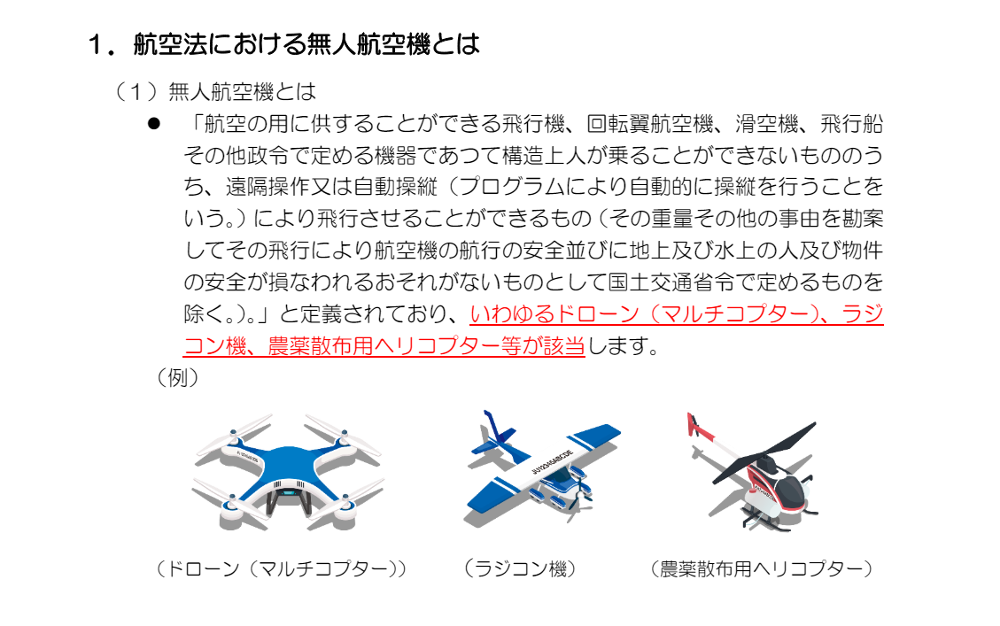
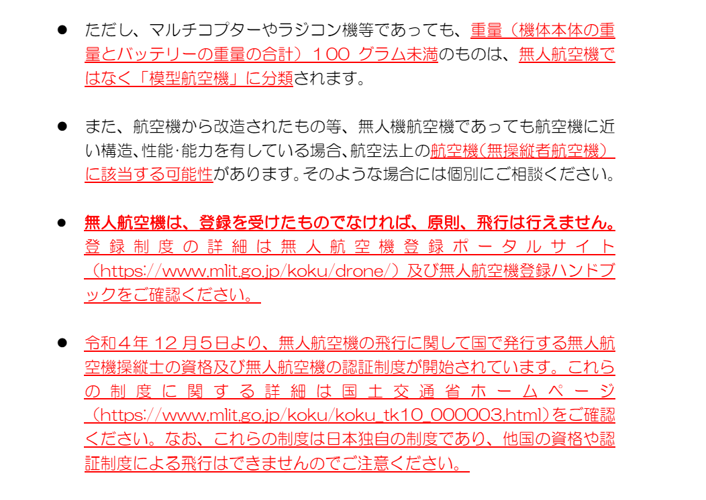
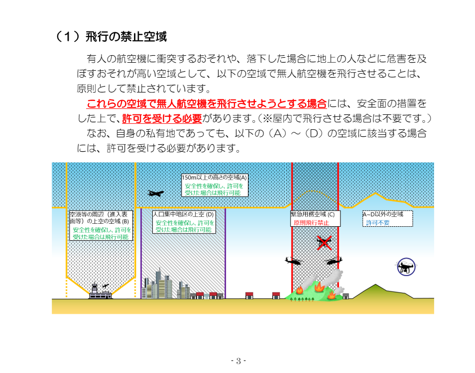
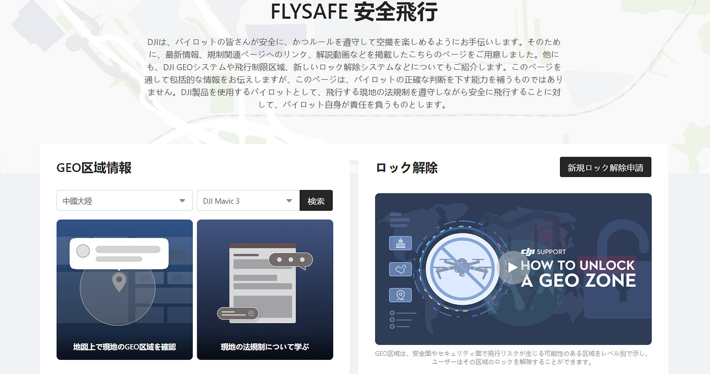
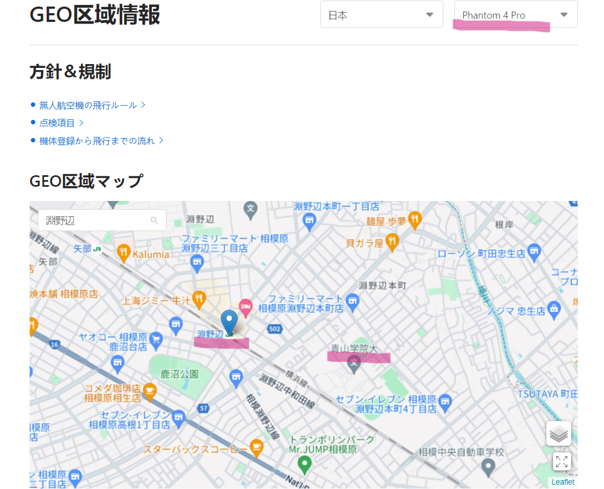
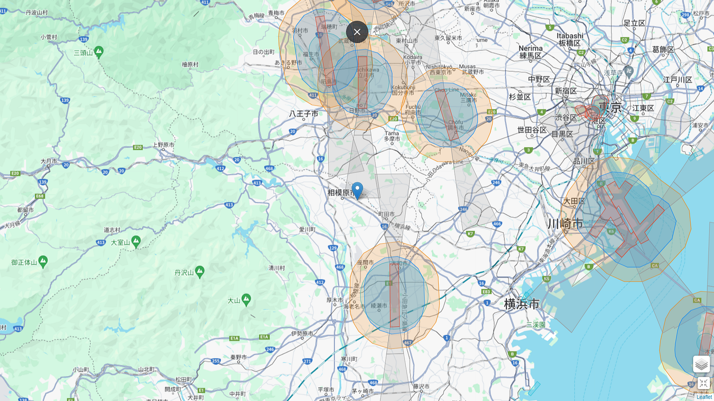
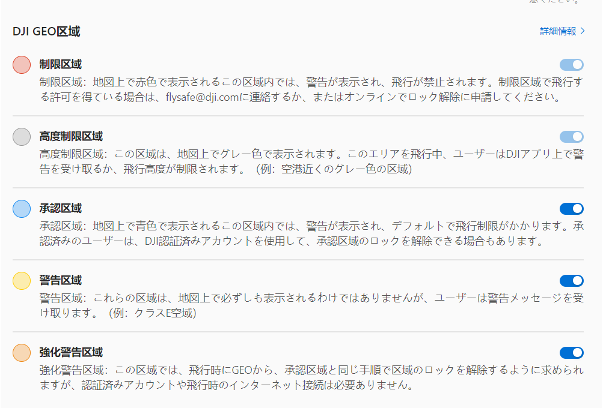
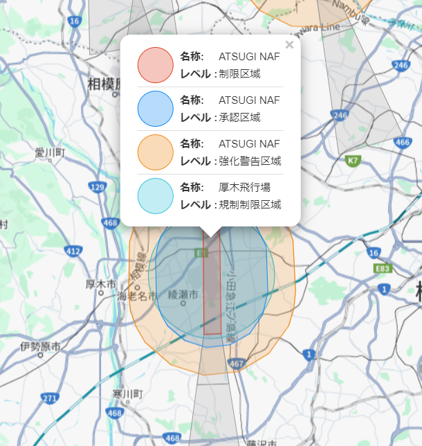
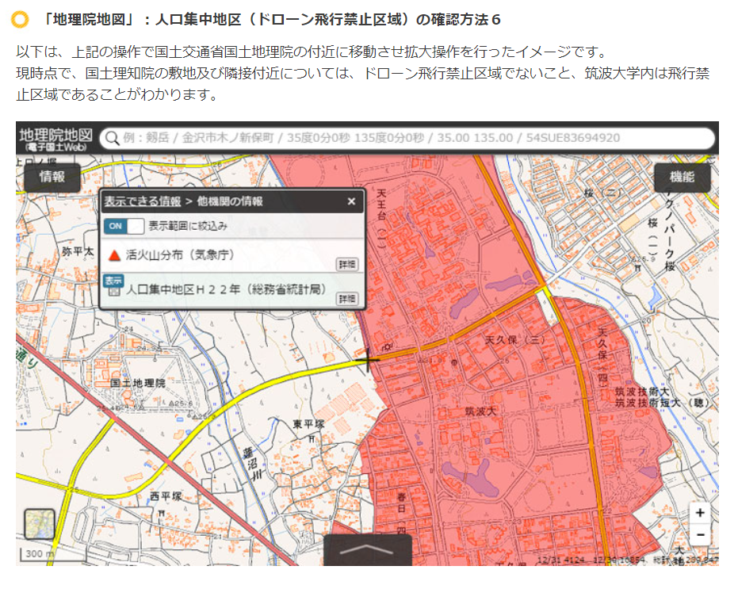
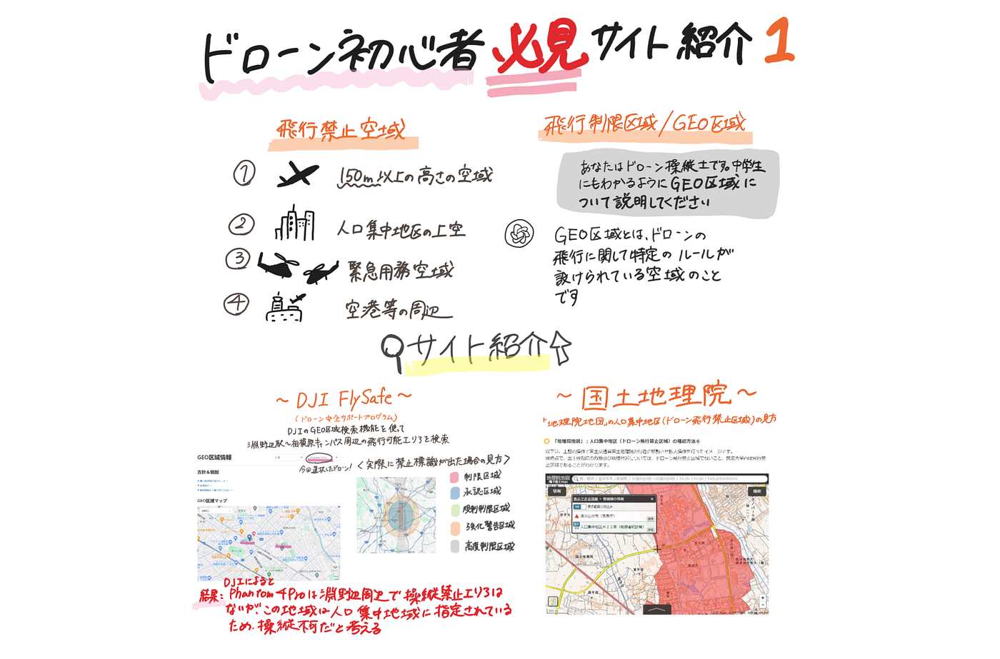

### ドローン初心者へ必見サイト① 6/11ドローン部週報

こんにちは、ドローン部3年佐藤と林です！

今回は、実際にドローンを飛ばすとき、事前に確認すべき注意事項や手続きについて調べてまとめました。

今回の週報も前回と引き続き[ChatGPT4](https://chat.openai.com/g/g-MbKNhN3QX-ri-ben-yu-gpt)を補助として使用しています。

### 飛ばすときの注意点

機体を飛ばすときは、機種によって法的な手続きが必要な場合があります。

#### 国土交通省の公式ウェブサイトより

下記のリンクから、手続き方法などが解説されているサイトにアクセスしました。

[航空：無人航空機（ドローン・ラジコン機等）の飛行ルール - 国土交通省
国土交通省のウェブサイトです。政策、報道発表資料、統計情報、各種申請手続きに関する情報などを掲載しています。www.mlit.go.jp](https://www.mlit.go.jp/koku/koku_tk10_000003.html)

### 申請が必要な機種の種類

#### 結論：【航空法】100g以上の機体は許可が必要

野外で空撮や点検のために飛行させるドローンは１００ｇ以上ある場合が多いので注意が必要です。 また、ドローンに限らず、ラジコン機、農薬散布用ヘリコプター等も１００ｇ以上であれば、対象となります。 そのため飛行許可申請が必要です。

出典: 国土交通省 航空局, 「無人航空機（ドローン、ラジコン機等）の安全な飛行のためのガイドライン」, 2023年. 無断転載を禁ず。 国土交通省 航空[https://www.mlit.go.jp/common/001303818.pdf](https://www.mlit.go.jp/common/001303818.pdf) ,2024/06/08閲覧

確認すべきことは**機種の分類**と**飛行可能エリアの確認**だとわかりました！

#### [ChatGPT4](https://chatgpt.com/share/e320923e-f7ef-4616-9eb7-e1cf6cabb12a)はどう答えるか

質問：ドローンを飛ばしてみたいんだけど、事前に確認すべき注意事項や手続きがあれば教えてください

回答：ドローンを飛ばす際には、いくつかの法律や規制が適用されるため、注意が必要です。日本でドローンを安全に運用するための主なポイントを以下にまとめました：

**1. **飛行禁止区域の確認**：**
 — 空港周辺や自衛隊・米軍基地の周辺など、ドローンの飛行が禁止されているエリアがあります。
 — 人口密集地域や他の航空機の飛行ルート上にも制限があるため、飛行する地域のルールを確認しましょう。

2. **飛行許可と届出**：
 — 国土交通省の地方航空局に、飛行計画に基づく届出が必要な場合があります。
 — 飛行禁止区域での飛行や夜間飛行、人の頭上など特定の条件下での飛行は許可が必要になることがあります。

3. **ドローンの登録**：
 — 重量が200グラム以上のドローンの場合、国土交通省に登録し、ドローンに登録番号を表示する必要があります。

4. **保険の加入**：
 — ドローンの運用による事故に備えて、第三者賠償責任保険に加入することを検討しましょう。

5. **操縦者の技能**：
 — ドローン操縦技能証明の取得が推奨される場合もあります。技能証明を取得することで、安全な操縦方法やルールを理解できます。

6. **プライバシーの尊重**：
 — 個人のプライバシーや肖像権を侵害しないように注意しましょう。無断で人の家や私有地を撮影することは法律違反になり得ます。

これらの基本的なガイドラインを確認し、準備を整えた上で安全にドローンを飛ばすことを楽しんでください！

（仕様モデルChatGPT4、閲覧日2024/06/08）

ということなので、手始めに自分たちで空域について調べてみました。これらは**[GEO区域**](https://support.dji.com/help/content?customId=ja-jp03400006761&spaceId=34&re=JP&lang=ja)と呼ばれています。

#### 用語解説：そもそもGEO区域とは（DJIより提唱）

[飛行制限区域/GEO区域について
「リリース時間：2023年2月20日」飛行制限区域/GEO区域の関連情報を紹介します。support.dji.com](https://support.dji.com/help/content?customId=ja-jp03400006761&spaceId=34&re=JP&lang=ja)

#### **[ChatGPT4](https://chatgpt.com/share/bd0e3b96-814a-4841-ba7b-dffdd07378f8)の回答**

質問；あなたはドローン操縦士です。中学生にもわかるようにGEO区域について説明してください。

回答：**GEO区域とは、ドローンの飛行に関して特定のルールが設けられている空域のこと**です。この区域内でドローンを飛ばす場合、飛行する前に特別な手続きが必要になったり、完全に飛行が禁止されている場所もあります。この制度は、安全を確保し、空の交通や重要な場所を守るために設けられています。

たとえば、空港の近くや軍事施設の周辺では、飛行機やヘリコプターとの衝突を避けるため、ドローンの飛行が制限されたり禁止されています。また、人が多く集まるイベントの場所や国の重要な施設の近くでも、同様に飛行が制限されることがあります。

ドローンを飛ばす前には、その地域がGEO区域に含まれていないかを確認し、必要な場合は許可を取得することが大切です。これによって、自分だけでなく他の人々や物への危険を防ぎ、安全にドローンを楽しむことができます。

### 方法①DJI FlySafeを使ってGEO区域を検索

[ドローンマップアプリ6選！飛行禁止エリアのチェックに必須！ | ドローンスクールナビ
ドローンの飛行禁止エリアを簡単に確認できる方法があれば良いのに… 飛行禁止エリアはアプリで簡単に確認できますよ！おすすめアプリをご紹介します。 ドローンを飛ばす際には、さまざまな法律や規制が関わります。…drone-school-navi.com](https://drone-school-navi.com/column/drone-regulation-noflyzone-map/)

#### アプリやWebサイトから手軽にアクセス可能

今回はこの中から、一番おすすめされていた**[DJI FlySafe**](https://fly-safe.dji.com/home)を選びました！

スマホ対応アプリはないので、[Webサイト](https://fly-safe.dji.com/home)からアクセスします。最初に会員登録が必要です。

[DJI FlySafe
Edit descriptionfly-safe.dji.com](https://fly-safe.dji.com/home)

出典：[https://fly-safe.dji.com/home](https://fly-safe.dji.com/home) , 閲覧日2024/06/08

#### 補足資料

実際に調べるときに参考にしたサイトは下にあるDJI JAPAN 株式会社さんの公式ＨＰから引用しています。

DJI JAPAN 株式会社さんの企業情報に関しては、公式サイトの以下のリンクから確認できます：**[DJI About Us**](https://www.dji.com/company?site=brandsite&from=footer)

[About Us — DJI
Creativity is at the heart of every dream. Every idea, every groundbreaking leap that changes our world starts with the…www.dji.com](https://www.dji.com/jp/company?site=brandsite&from=footer)

出典：[https://www.dji.com/jp/company?site=brandsite&from=footer](https://www.dji.com/jp/company?site=brandsite&from=footer) , 閲覧日2024/06

#### その他地域を検索

全画面モード

#### 補足情報：色別で見る名称レベル

色ごとでエリアがわかりやすく可視化されています！

クリックすると細かい内訳と補足情報を閲覧できます。

### 方法②国土地理院「地理院地図」の人口集中地区（ドローン飛行禁止区域）の見方

[国土地理院「地理院地図」の人口集中地区（ドローン飛行禁止区域）の見方
国土地理院の地理院地図で総務省統計局の人口集中地区（ドローン飛行禁止区域）を確認することができます。本ページでは、地理院地図で人口集中地区（ドローン飛行禁止区域）の使い方を説明しています。drone.tsukuba.co.jp](https://drone.tsukuba.co.jp/gsi-map-chiriinchizu.html)

都市部はほぼ壊滅なのでは．．．？

次回にまとめます！

### まとめ

今回は、出典やコピーライトの書き方に注意し、自分たちで調べてみました。ChatGPTに資料を送って、「コピーライトを書いて」と指示文を送れば、記入例を参照できるはずなので、今後試してみます。出典やコピーライトは、論文執筆やレポートでも頻繁に使用する記載方法なので、理解を深めたいです。

また、政府系機関の資料が読みづらくて苦戦していましたが、単語の意味や背景知識を学ぶことで、少しずつ解消できています。正確な資料ほど初めは読みにくく感じるので、今から慣れていこうと思います！

並びに、自分たちの週報は文章が長くなりがちなので、①結論ファースト、②グラレコでシンプルに可視化を意識しています。

### グラレコ

