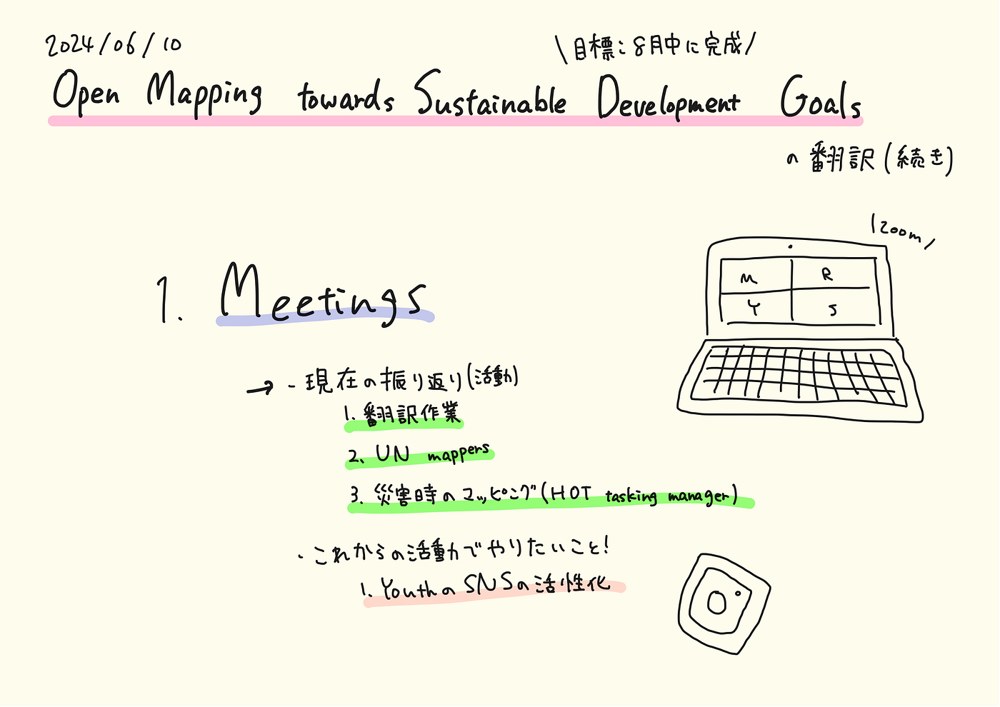

### Youth 週報6/11

こんにちは！3年の林です。

今週のYouthの活動は、

[Open Mapping towards Sustainable Development Goals](https://link.springer.com/book/10.1007/978-3-031-05182-1)の翻訳作業でした。

去年の活動からの引き継ぎで今週は380ページのうちの55ページからの翻訳作業をYouthのメンバーで手分けして行いました。

[翻訳文](https://github.com/furuhashilab/Open-Mapping-towards-Sustainable-Development-Goals/issues/1)

まだまだ残りがたくさんあるのですが、8月中の完成を目標にしています。

また、ミーティングを行い、今後のYouthでの活動をどのようにやっていくか話し合いました。

話し合いでは、まず、現在の活動を振り返りました。

現在私たちが行なっている主な活動は、

・[Open Mapping towards Sustainable Development Goals](https://link.springer.com/book/10.1007/978-3-031-05182-1)の翻訳作業

・UN mappers

・災害が発生した際のマッピング(HOT tasking manager)

を行なっています。

これらの活動を振り返った上で、これからの活動でやりたいこととして、

・YouthのSNSの活性化

が挙げられ、次回のミーティングまでにその他のやりたいことを各自で考えてくるということになりました。

今後、Youthの活動を行う上で、みんなで意見を出し合って、より良い活動を行なって行きたいです！！

今回のグラレコはこちらです。

