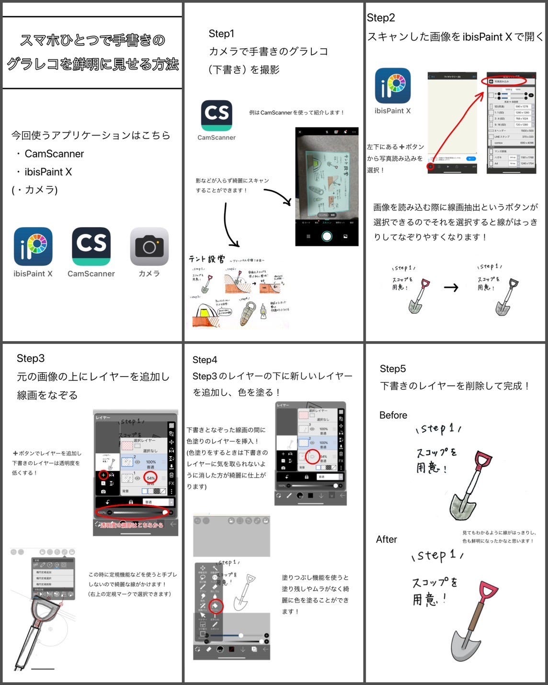
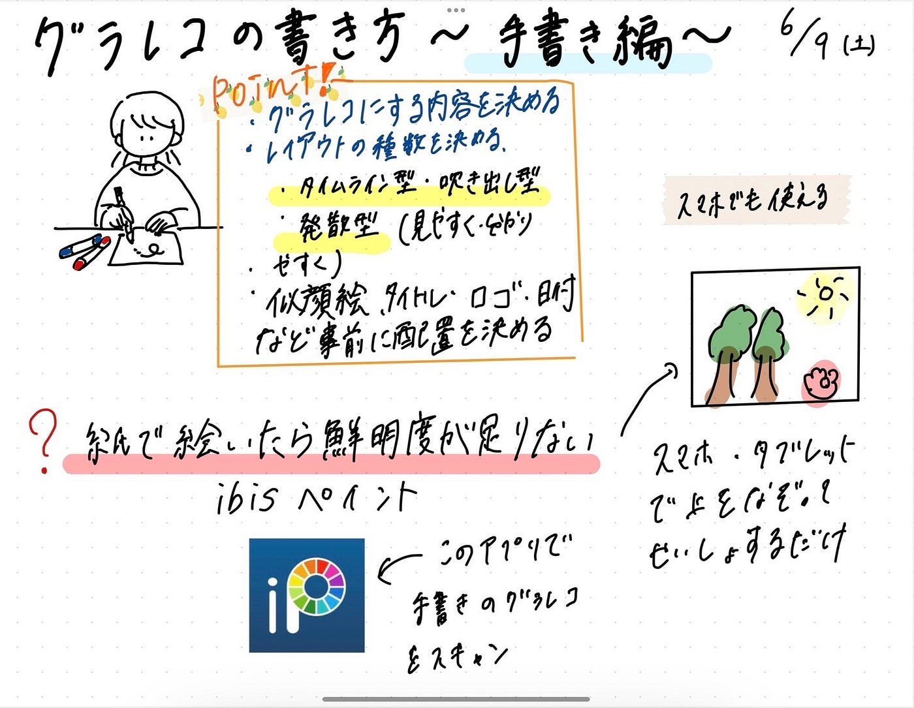

### **グラレコの書き方~手書き編~**

こんにちは！
デザイン部3年の滝沢です！
今回は、グラレコの書き方、手書き編について週報を書きます。

私は普段、紙に書いたグラレコをスキャンしていますが同じデザイン部のメンバーに、”アプリケーションを用いてグラレコをより鮮明に見せる方法”を教えてもらったのでここで紹介します。

**[スマホひとつで手書きのグラレコを鮮明に見せる方法]**

使うアプリケーション
• CamScanner
• ibisPaint X
（・カメラ）

Step1
カメラで手書きのグラレコ
（下書き）を撮影
↓
Step2
スキャンした画像をibisPaint Xで開く
↓
Step3
元の画像の上にレイヤーを追加し
線画をなぞる
↓
Step4
Step3のレイヤーの下に新しいレイヤーを追加し、色を塗る！
↓
Step5
下書きのレイヤーを削除して完成！

詳しくは↓こちら

動画でも説明しています↓
[https://github.com/rikoioii/graphicrecording/issues/1](https://github.com/rikoioii/graphicrecording/issues/1)

