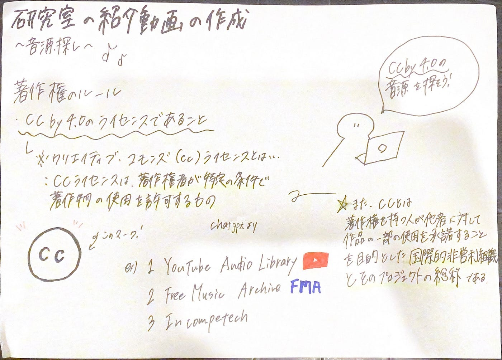

## 紹介動画用の音源探し 〜V&F週報〜

お疲れ様です。４年の深水です。

V&Fの活動として、研究室の紹介動画に使えそうな音源を探したので紹介します！

まず、インターネット上の音源を利用する際に注意すべきなのが著作権の問題です。

古橋研究室の成果物には基本的に[CC BY 4.0](https://creativecommons.org/licenses/by/4.0/deed.ja) のライセンスを付与する決まりなので、使用する音源もそれと同等のライセンスを持っている必要があります。

しかし今回は練習なので、「著作権フリーの音源」の中で使えそうなものを各自で探してもらいました。

**深水**

曲：[https://www.youtube.com/watch?v=nWyi_3w6dXM&ab_channel=DOVA-SYNDROMEYouTubeOfficial](https://www.youtube.com/watch?v=nWyi_3w6dXM&ab_channel=DOVA-SYNDROMEYouTubeOfficial)

ライセンス：[https://dova-s.jp/_contents/license/](https://dova-s.jp/_contents/license/)

**高井**

曲：[https://on.soundcloud.com/tviuhGv8fKdAMJiG9](https://on.soundcloud.com/tviuhGv8fKdAMJiG9)

ライセンス: [https://www.liqwydmusic.com/how-to-use](https://www.liqwydmusic.com/how-to-use)

**古内**

曲：[https://youtu.be/5b_zJz1D228?si=t1wBA0NFQv9V6500](https://youtu.be/5b_zJz1D228?si=t1wBA0NFQv9V6500)

ライセンス：[https://ikson.com/usage-policy](https://ikson.com/usage-policy)

**滝沢**

曲：[https://x.gd/Kw5CS](https://x.gd/Kw5CS)

ライセンス表記なし

**福田**

曲：[https://on.soundcloud.com/b2dNGQxbt3r12SZq5](https://on.soundcloud.com/b2dNGQxbt3r12SZq5)

ライセンス表記なし

今回、古橋教授おすすめの[soundcloud](https://soundcloud.com/discover)を使って音源を探してくれたメンバーが多かったです。

ただ、soundcloudでは作者が第三者による使用を制限できるのですが、作者がライセンスの表記を行なっていないことが多い印象を受けました。

グラレコ

