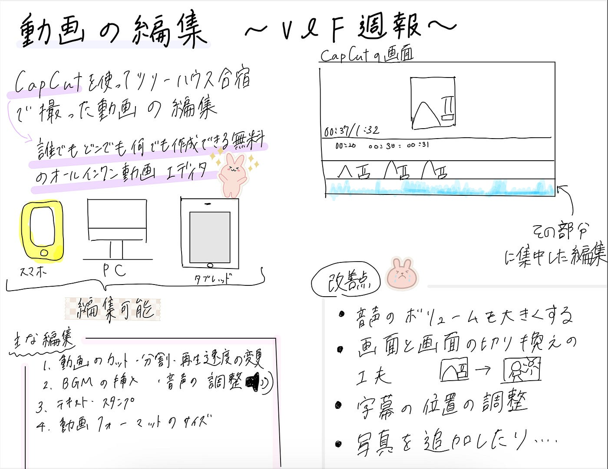

### [e](https://youtu.be/ZkqIBfKCSUI?si=kNCR-Faw8880thxe)V＆F週報(6/18)

お疲れ様です。3年の高井健太郎です。

今週のV&Fでは、こうなが[千年の森自然学校](https://kanko-omachi.gr.jp/spot/deepforest/)でのツリーハウス合宿の振り返り動画を作成してくれたので、その動画をみた感想を一人ひとりまとめてみました。

こうなが作成してくれた動画がこちらです。

使用した編集アプリは[CapCut](https://www.capcut.com/ja-jp/)です。

> 感想

高井:字幕の色使いが場面によって変わっていて視聴者が飽きないような工夫がされているなと感じた。BGMとナレーションのボリュームを調整すればさらに良くなると思う。

深水:BGMが場面によって変わったり、音声のナレーションが入ってたりしてすごくいいなと思った。

古内: 字幕とナレーションを組み合わせながら、時系列に沿って動画が作成されており、視聴者の興味を途切れさせないようになっていて良いと思った。

滝沢:動画編集未経験なため、こうなの編集力にびっくりしました。自分もこれから動画編集できるようにスキルを身に付けていきたいです。

> こうなのコメント

どんな音楽にして動画と合わせた方がいいのか、字幕は見やすくする、音声説明はどこで入れるかを調整しながらつくりました。
まだ試しで作ったもので、画面と画面の切り替わりが上手く出来てなくて、編集をする必要があると感じてます。そして、音声も途中で聞にくい部分があったので変えるようにします。
わかりやすい動画になるように編集をしていきます。

グラレコ

