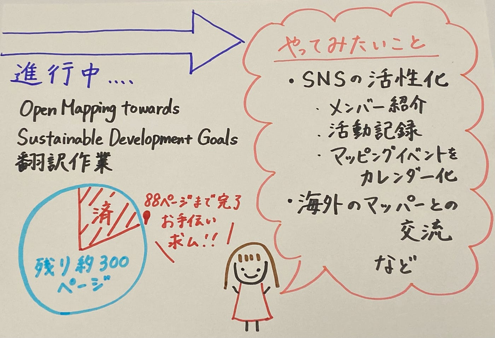

### 【Youth週報6/18】今後やってみたいこと-ブレインストーミング

こんにちは！今週のYouthMappersAGUの活動について報告します。

### 翻訳作業

前回に引き続き、**[Open Mapping towards Sustainable Development Goals**](https://link.springer.com/book/10.1007/978-3-031-05182-1?fbclid=IwAR0mxXoILYo2Ar1akXx7F3QDRs6TqVAv7CIYDUPNo6YihQb4pQ0NFWNFV_g)の和訳を分担して行いました。今回の作業で、冊子の66ページ（PDFでいうと88ページ）まで作業が完了しました。

和訳作業用のドキュメントは以下２つです。いずれも[古橋研究室のGoogleドライブ](https://drive.google.com/drive/folders/1Qp1IYP81VfWuVNOYUUY5OyY2pMRHmxDu?usp=drive_link)に保管しています。

- [和訳ドキュメントNO.1（該当範囲：表紙～p.48）](https://docs.google.com/document/d/1uzMHH_kgOVBqApk8GRstgEWOJP9Lu21yuC02AIBHXK8/edit?usp=sharing)

- [和訳ドキュメントNO.2（該当範囲：p.48~66）](https://docs.google.com/document/d/1VzGQH5hoJxFmPfjj2ewLI5OykGSKhXJNB0dlXJM64Zo/edit#heading=h.yiroxird1sb2)

バックアップはGitHubの[こちらのIssue](https://github.com/furuhashilab/Open-Mapping-towards-Sustainable-Development-Goals/issues/1)にまとめてあります。

#### **提案**

現在YouthMappersAGUのメンバー6名で作業を進めていますが、全体の4分の1弱しか完了していません。完成目標が2024年夏であることを考えると、部員の負担がかなり大きくなってしまうのではないかと懸念しています。

そこで、ゼミ内サークル関係なく、皆さんに和訳を手伝っていただけたら…！と考えています！ゼミ生の皆さんいかがでしょうか？

### 2024年でやってみたいこと

6月14日（金）22:30から行ったミーティングで、2024年の活動でやってみたいことを出し合いました。以下のような案が出ました。

- YouthのSNSを活性化、特にInstagramに力を入れたい
例）メンバー紹介、活動記録etc. を二言語（日・英）で発信する

- 古橋研究室としてもインスタ運営
例）ゼミ活動の様子を学生向けに発信し、ゼミ選びの参考にしてもらう

- SNSを活用して、世界のマッピングイベントをカレンダー化して宣伝
→参加したら週報にまとめたり、各SNSでレポートしたりする

- Tasking Managerでノルマを定める（要検討）

- 海外のYouthMappersとの交流（古橋ゼミ主催のマッパソン開催など）

前期は、翻訳作業に集中し、後期から本格的に取り組むことができればいいなと考えています。詳細について、次回以降のミーティングで話し合っていきます。

※YouthMappersAGUの各ツール（Googleアカウント等）は現在引き継ぎ中です。

### ご報告

YouthMappersAGUの昨年の活動が認められ、Open Mapping Women Awards 2024にて、YouthMappers of the Year賞を受賞しました。

古橋先生をはじめ多くの方々より多大な助言やご協力を賜りましたこと、厚く感謝を申し上げます。本年も一層力を尽くしてまいります。

[【地球社会共生学部】上原史栞さん、YouthMappers AGU（吉田航さん、上原史栞さん、石井南帆さん、滝沢未広さん、林優香里さん、金澤真優さん）が "Open Mapping Women…
2024年3月11日（月）、Humanitarian OpenStreetMap TeamおよびOpen Mapping Hubが主催する"Open Mapping Women Awards…www.aoyama.ac.jp](https://www.aoyama.ac.jp/faculty112/2024/news_20240531)

### グラレコ

