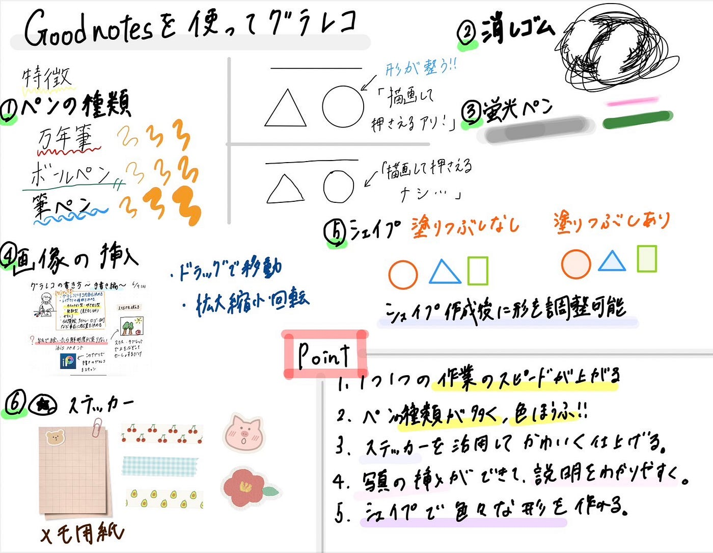
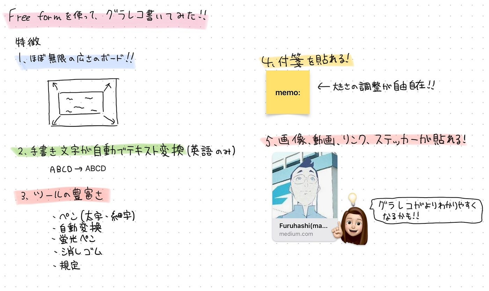

## グラレコの描き方~デジタル編~ デザイン週報(6/18)

こんにちは！3年の末木です。

今週のデザイン班の活動は先週に引き続きグラレコの描き方について伝授し合いました！

今週はデジタル編ということで、iPadで人気のノートアプリ[Goodnotes](https://www.goodnotes.com/)と先週のゼミ内で紹介のあった[フリーボード](https://support.apple.com/ja-jp/guide/ipad/ipad9c59637d/ipados)との比較を行いました！

それぞれのポイントは以下の通りです。

【Goodnotes】

- 一つ一つの作業スピードが上がる

- ペンや色の種類が豊富

- ステッカーを用いてかわいく仕上げることができる

- 写真の挿入ができ、説明をわかりやすくできる

- シェイプで様々な形を作れる

【フリーボード】

- ほぼ無限の広さのボード

- 手書きの文字が自動でテキスト変換（英語のみ）

- 通常のペンをはじめ蛍光ペンや定規、テキスト自動変換などの手書きツールの豊富さ

- 付箋を貼れる

- 画像のみならず、動画やリンク、ステッカーが貼れる

このようにそれぞれによいポイントがあることがお分かりいただけたでしょうか？

それぞれの注意点にも少し触れてみようかと思います。

【Goodnotes】

- 無料で使える機能には限り（作れるノートは3冊までなど）があり、基本的には課金が必要

- iOS版とWindows版、Android版で仕様が若干異なる（詳細は[こちら](https://www.goodnotes.com/jp/pricing)）

【フリーボード】

- 書き出しがPDFのみで画像として書き出すにはスクリーショットするしかない

- iOSでしか使えない

それぞれの注意点を確認して利用してみてください！

どちらもiPadとApple Pencilの相性がよく、この２つを持っていればグラレコ作成はかなり簡単に綺麗にできるので今後も活用していきたいです。ただ、持っていない人向けのデジタルでのグラレコの描き方についてはまだ触れられていないので、今後パソコンなどを用いて簡単かつ綺麗なグラレコが描けるツールを探していきたいです。

特徴をグラレコでまとめました。

