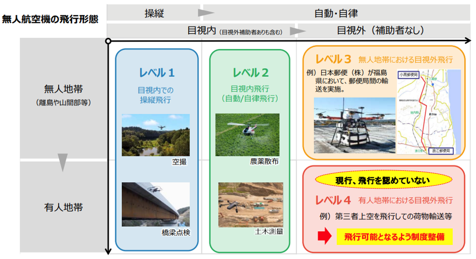
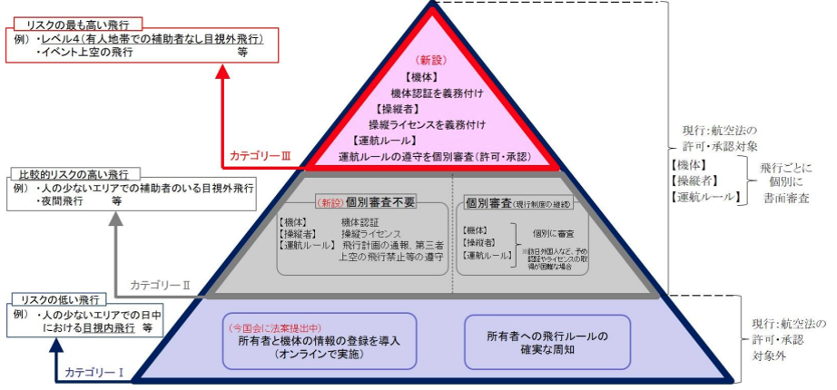
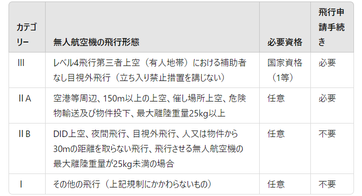
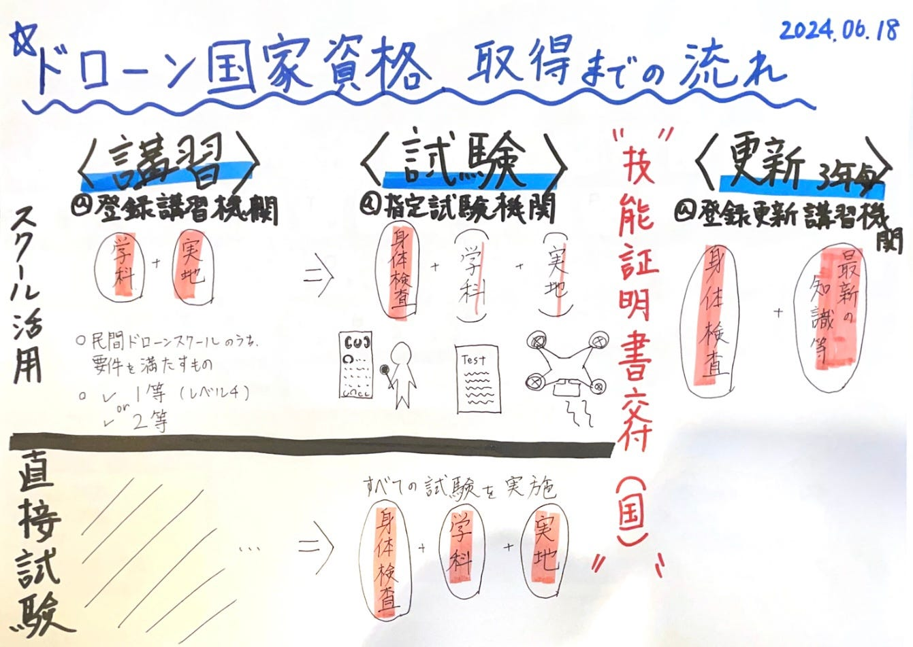

### ドローン国家資格とは？ドローン部週報6/18

こんにちは、ドローン部の佐藤と林です！

今回は、ドローン国家資格についてまとめています！

### ドローン国家資格とは？

2022年12月5日から施行された改正航空法により、「無人航空機の操縦者技能証明制度（操縦ライセンス制度）」が開始されました。これは、第三者上空での補助者なし目視外飛行（レベル4飛行）を実現するために創設された制度のひとつで、国が認めた国家資格です。この制度はドローン飛行の安全性と効率性を向上させ、産業や経済、社会に大きな変革をもたらすことが期待されています。

#### ドローン飛行のレベル

ドローン飛行にはレベル1からレベル4までの規定が設けられています。以前まではレベル3までの飛行しか認められていませんでしたが、レベル4の飛行が可能となったことで、より高度な運用が実現できるように変化しました！レベル4飛行は、特に有人地帯における補助者なしの目視外飛行を含むもので、これにより都市部でのドローン配送やインフラ点検などが可能になります。

図1 ドローンが飛行可能な条件と飛行レベル
出典：「無人航空機に係る制度検討の経緯について」国土交通省
[https://www.mlit.go.jp/common/001351989.pdf](https://www.mlit.go.jp/common/001351989.pdf) p4.2024.06.18閲覧

図2 飛行レベルごとの条件
出典：「無人航空機に係る制度検討の経緯について」国土交通省
[https://www.mlit.go.jp/common/001351989.pdf](https://www.mlit.go.jp/common/001351989.pdf) p10.2024.06.18閲覧

### 国家資格と民間資格

操縦ライセンスには国家ライセンス（一等資格・二等資格）と民間ライセンスがあり、無人航空機の飛行形態はリスク毎にカテゴリー分けされています。以下に、国家資格と民間資格の違いについて詳しく説明します。

#### カテゴリーごとの飛行形態と必要資格

出典：[国土交通省. (2022). 小型無人機の飛行レベル. 国土交通省無人航空機レベル４飛行ポータルサイト.https://www.mlit.go.jp/common/001351989.pdf](https://www.mlit.go.jp/common/001351989.pdf)2024.06.18閲覧

カテゴリー3に分類されるレベル4飛行、つまり有人地帯における補助者なしの目視外飛行を行う場合、「一等無人航空機操縦士」を保有し、さらに許可・承認を取ることが必須です。

カテゴリー2に分類される飛行は、飛行時に立ち入り禁止措置を講じた場所で行う特定飛行を指し、以下のように細分化されます：

- **カテゴリー2A**：空港周辺、上空150m以上の飛行、催し場所上空、危険物輸送、物件投下、最大離陸重量25kg以上の飛行。

- **カテゴリー2B**：DID(人口密集地帯)上空、夜間飛行、目視外飛行、人や物件から30mの距離を取らない飛行。

ちなみに、承認・申請を必要としない飛行可能距離は、高度150m未満、目視できる範囲(100m～300m程度）が目安です！

**国家資格や民間ライセンスの保有者に対して飛行申請の一部が免除される**メリットがあります。

#### 国家資格と民間資格の違い

操縦ライセンス制度ですが、自動車のように「免許を持っていないと運転できない」というわけではないようです。対象とされるのはレベル4と呼ばれる“特定飛行”のみでした。その他の飛行は対象外ですが、「ライセンスがないとドローンを飛ばせない」ことはありません。運行ルールに従って個人でドローンを飛ばすことは許可されているので、この点は注意が必要です。

また、2022年12月5日以前は、民間ライセンスのみが操縦技能証明の役割を果たしていましたが、国家ライセンスが創設されたからといって、既存の民間ライセンス制度が無効になることもありません。_**国家ライセンスの二等資格と民間ライセンスとの違いは申請の有無の部分だけ_**のため、レベル4飛行の予定がなく、国土交通省への申請で特に問題がない場合は、民間ライセンスだけでも十分飛行が可能です。

また、民間ライセンスの保有者は一部の学科と実地の講習が免除され、大幅に負担が軽減されることもメリットです！

### 国家ライセンス取得までの流れ

ドローンの国家ライセンス（一等資格・二等資格）における「無人航空機操縦者技能証明書」取得方法には2つのパターンがありました！

1. 登録講習機関で講習を受けてから、指定試験機関で学科試験を受験する。
2. 指定試験機関で直接試験を受ける。

#### 1.登録講習機関での講習

登録講習機関での講習は、学科と実地の両方が含まれます。学科では航空法や飛行理論、気象、無人航空機の構造・機能などの知識を学びます。実地では、飛行操作や緊急時の対応、飛行計画の立案といった実技を習得します。講習を修了すると、指定試験機関で学科試験を受けることができます。

#### →指定試験機関での試験

指定試験機関での試験は、学科試験と実技試験の2つに分かれます。学科試験では、航空法や飛行理論、無人航空機の構造・機能についての知識が問われます。実技試験では、飛行操作の正確さや緊急時の対応能力が評価されます。試験に合格すると、無人航空機操縦者技能証明書が発行されます。

#### 2.直接試験を受ける場合

既に充分な知識と技能を持っている場合は、講習を受けずに直接試験を受けることも可能です。この場合も、学科試験と実技試験に合格することで、無人航空機操縦者技能証明書を取得することができます。

### まとめ

ドローンの国家資格である「無人航空機の操縦者技能証明制度」は、2022年12月5日に施行された改正航空法によって開始されました。これにより、レベル4飛行が可能となり、産業や経済、社会に大きな変革をもたらすことが期待されています。操縦ライセンスには国家ライセンスと民間ライセンスがあり、飛行形態に応じて必要な資格が異なります。国家ライセンスの取得方法には、登録講習機関での講習を受けてから試験を受ける方法と、直接試験を受ける方法の2つがあります。

国家資格を取得することで、より高度な飛行が可能になり、飛行申請を一部省けるというメリットがありました！

### グラレコ

