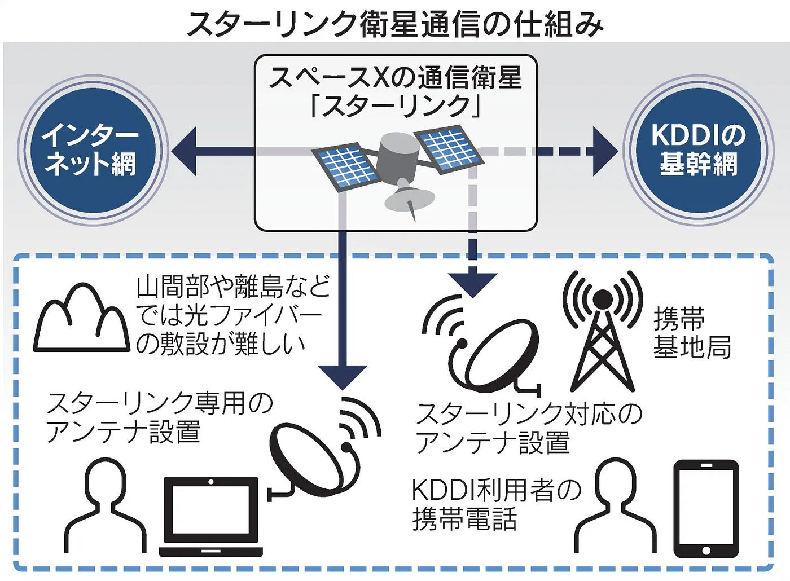
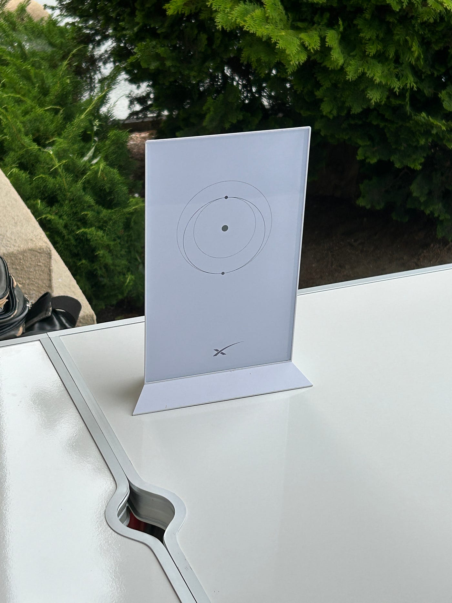
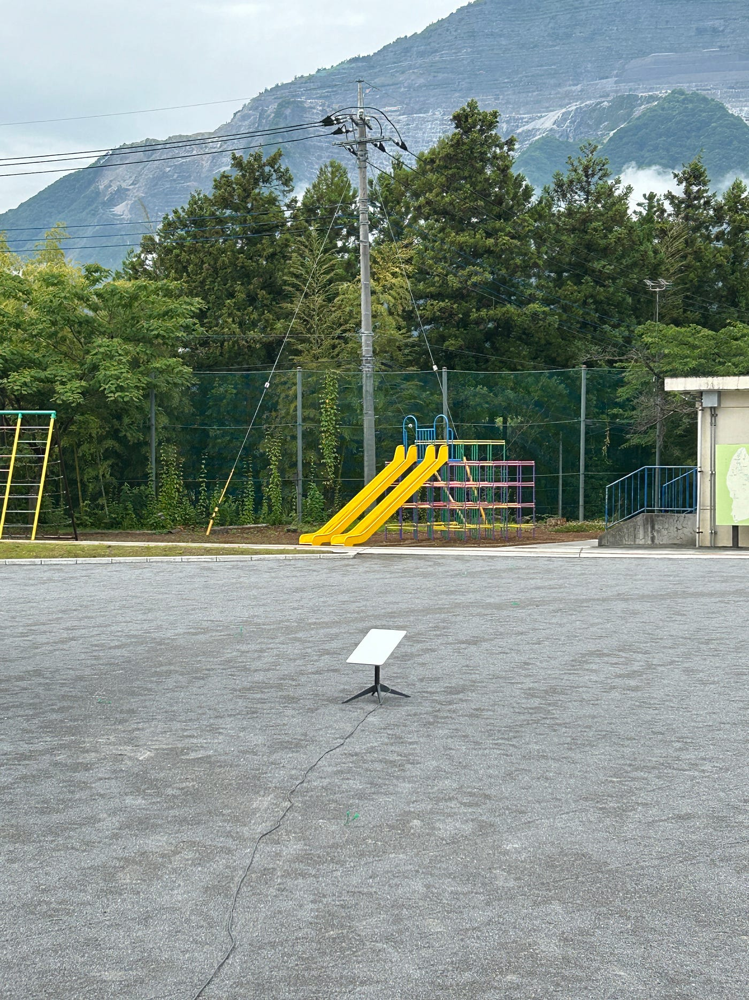
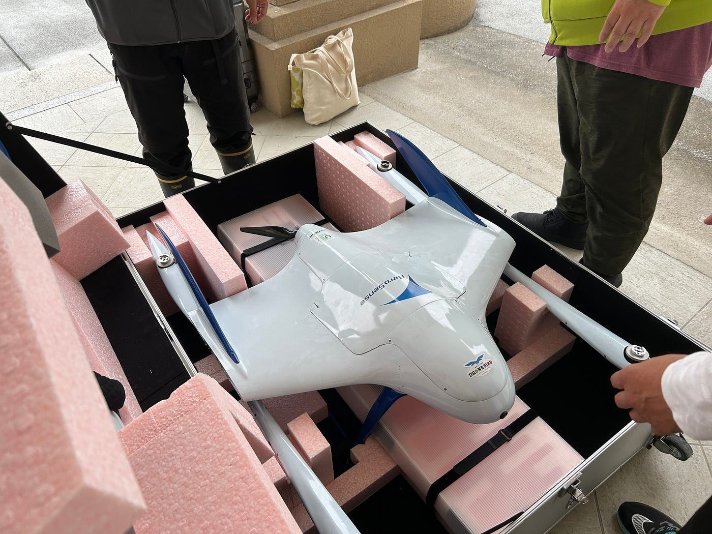
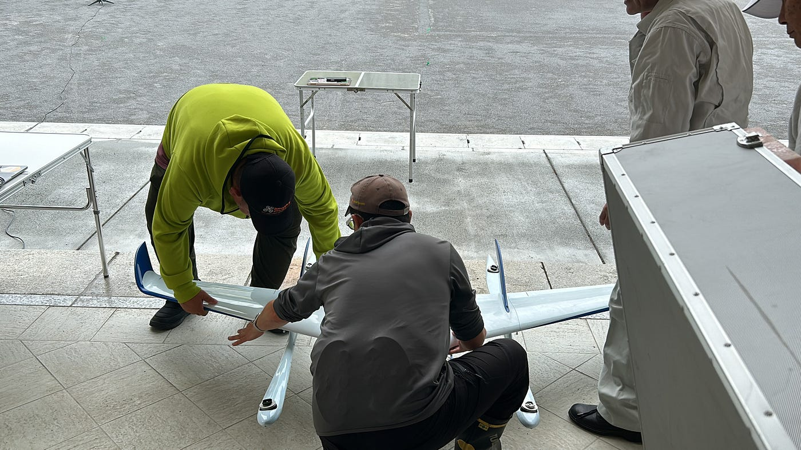
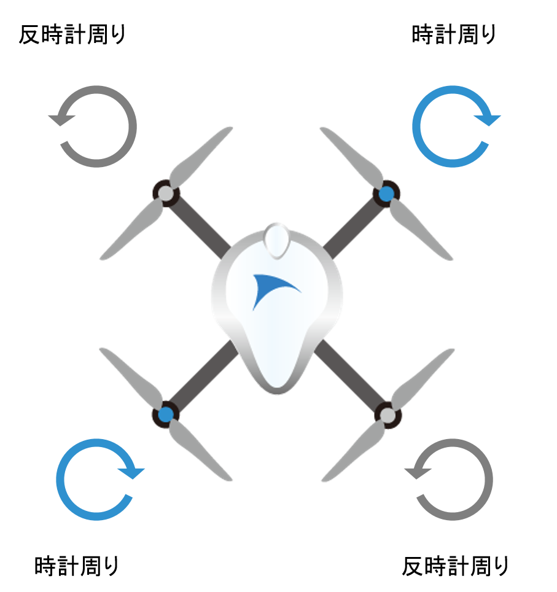
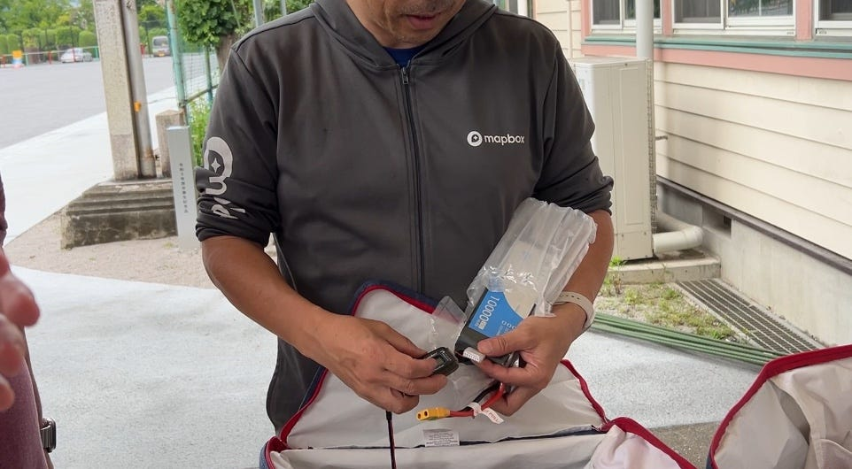
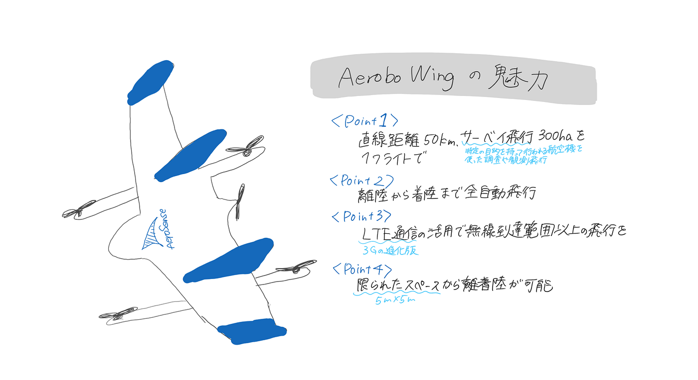

### 横瀬町でドローンの防災飛行訓練に参加！ (ドローン部週報 6/25)

こんにちは。ドローン部3年の林と佐藤です。

2024年6月16日に行われた、**[DRONEBIRD](https://dronebird.org/)の横瀬町災害時初動訓練**に参加してきました！

開催場所:横瀬小学校

[横瀬町立横瀬小学校 - Bing Maps
〒368-0072埼玉県秩父郡横瀬町横瀬4556·Elementary schoolwww.bing.com](https://www.bing.com/maps?osid=abda1843-f9d6-49e9-8400-cf05a9c805be&cp=35.988476~139.095819&lvl=16&pi=0&v=2&sV=2&form=S00027)

#### 当日(2024/06/16)のスケジュール

8:00 Starlink/AeroboWingdroneセッティング

10:30 横瀬町災害時初動訓練開始

10:50 AeroboWing drone 片づけ

11:00 EBee飛行練習

11:30 片付け・撤収

#### **1. [Starlink ](https://www.starlink.com/jp)セッティング**

Starlinkとは…アメリカのカリフォルニア州ホーソンに本社を構える航空宇宙メーカー「スペースX」が展開・提供する画期的な衛星通信サービス。

★現在、24人同時接続しても、ストレスなくインターネットを使えることが判明！（2024/6/8実施）

#### 2.[AeroboWing](https://aerosense.co.jp/en/products/drone/as-vt01.html)セッティング

【手順説明】

①箱から機体を取り出す。

②翼をつける。

③ペラを装着。

※ペラの付け方

1.つけている位置が正しいか確認（黒は黒、シルバーはシルバーに）

2.ネジを押しながら時計回りに回す

3.プロペラを反時計回りに（カチッとハマる感触がある）

※ペラの外し方

1.ねじを押さえつけながら反時計回りに回す

2.ボッチを上にあげる

3.プロペラを反時計回りに回す

※対極線上に同じ種類のペラを装着する。

‼️4枚のペラはどこにでも装着できてしまうため、気をつける‼️

④バッテリーの残量を確認・バッテリー装着

※軽く持ち上げてバッテリーの位置を確認し、機体のバランスを確かめる

⑤キャリビレーション

◎エアスピードセンサー

→速度を検出するピトー管に無風状態と風を吹きかけた状態を試し、安全を確認する

〇磁気センサー

→6パターンの機体の向きを水平方向に反時計回りに回して確認する

⑥飛行ルートを設定

⑦SDカード・カメラのキャップを外す

⑧最後のセンサーチェック

★機体を持ち上げて前に5歩、後ろに5歩（同じスピード感で）

⑨リモコン操作をし、飛行準備

通常はスタビライズモードに設定

アームドして逆ハの字にしてペラが動くか確認

▲ペラが動かず、固定翼モードにした時の動き方に異常あり▲

【原因】

・[スロットル](https://fushimi.blog/life/hobby/drone-bible/drive/unlocking-the-power-of-throttle%E2%86%92-a-comprehensive-guide-to-drone-ascent-and-descent/)が下方向に入ってしまっている

・[プロポ](https://ryo-drone.com/proportional-basic-operation-mode)のキャリビレーションをすべきではという判断に、、

3．[EBee](https://www.geosurf.net/wp/wp-content/uploads/2018/10/eBee-X-J_lw.pdf) drone飛行

▲途中で飛行ルートミス発生▲

【原因】

進行方向はあっていたが、高度がちがったのでは？

[グランドセンサー](https://note.com/drone_biz_lab/n/nc4e8aa4c1ac1)をOFFにしておくべきではないかという提案

【感想】

防災飛行訓練に参加し、自分はドローン操縦や操縦までの設定ができないが、やり方さえわかっていれば、災害時に、ドローンの機体の不良や操作ミスがあったときに、それに気づき、アドバイスできる存在になれるのではないかと感じました。また、ペラの装着は難しく、自分がただただ下手だっただけかもしれませんが、握力の弱い人はなおさら難しいと感じました。そのため、一度やってみないと初心者には難しいと思います。避難訓練とは違い、ドローンの操縦はネットの知識だけで学ぶころは難しく、有識者から直接学ぶことが一番効率がいいと感じます。そのため、次回も参加し、知識を忘れないようにしたいと思いました。

グラレコ

