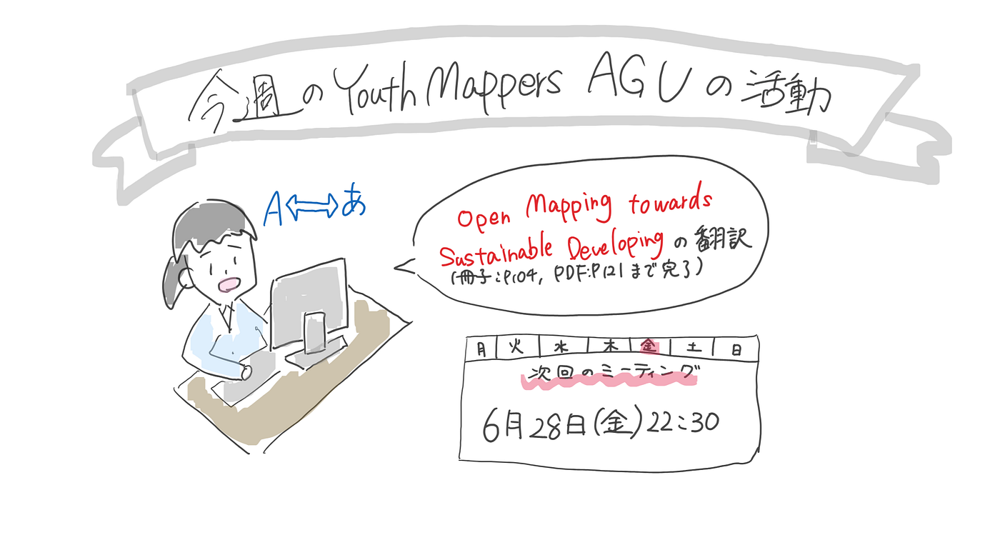

### 【Youth 週報 6/25】今週もOpen Mapping towards Sustainable DevelopmentGoals の翻訳活動をやりました！

こんにちは。今週のYouthMappersAGUの活動は林が代表して報告します。

今週も、**[Open Mapping towards Sustainable Development Goals**](https://link.springer.com/book/10.1007/978-3-031-05182-1?fbclid=IwAR0mxXoILYo2Ar1akXx7F3QDRs6TqVAv7CIYDUPNo6YihQb4pQ0NFWNFV_g)の和訳を分担して行いました。今回の作業では、冊子の104ページ、PDFでは121ページまで作業を進めました。

和訳作業用のドキュメントは以下２つです。（[古橋研究室のGoogleドライブ](https://drive.google.com/drive/folders/1Qp1IYP81VfWuVNOYUUY5OyY2pMRHmxDu?usp=drive_link)に保管）

- [和訳ドキュメント1 （該当範囲：表紙～p.48）](https://docs.google.com/document/d/1uzMHH_kgOVBqApk8GRstgEWOJP9Lu21yuC02AIBHXK8/edit?usp=sharing)

- [和訳ドキュメント2（該当範囲：p.48~104）](https://docs.google.com/document/d/1VzGQH5hoJxFmPfjj2ewLI5OykGSKhXJNB0dlXJM64Zo/edit#heading=h.yiroxird1sb2)

翻訳サイトを使ったりし作業効率をあげ、一人づつの作業分量を増やし、夏までに終わることを目標にしています。

！今週も金曜日にミーティングを行う予定でしたが、メンバー同士で予定が合わず、予定通り行うことができなかったため、来週の金曜日に日程変更しました。来週のミーティングでは、先週話し合ったYouthMappersAGUとしてやりたいことをより具体的にし、計画立てていければいいなと考えています。

グラレコ

