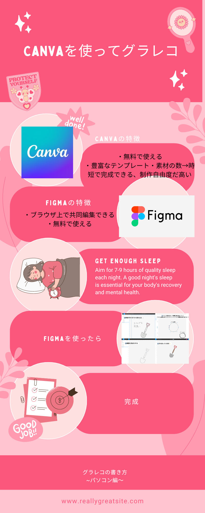
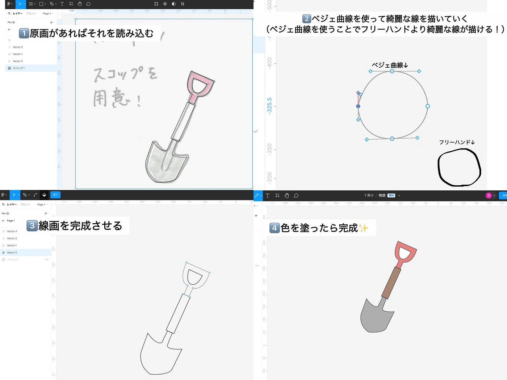
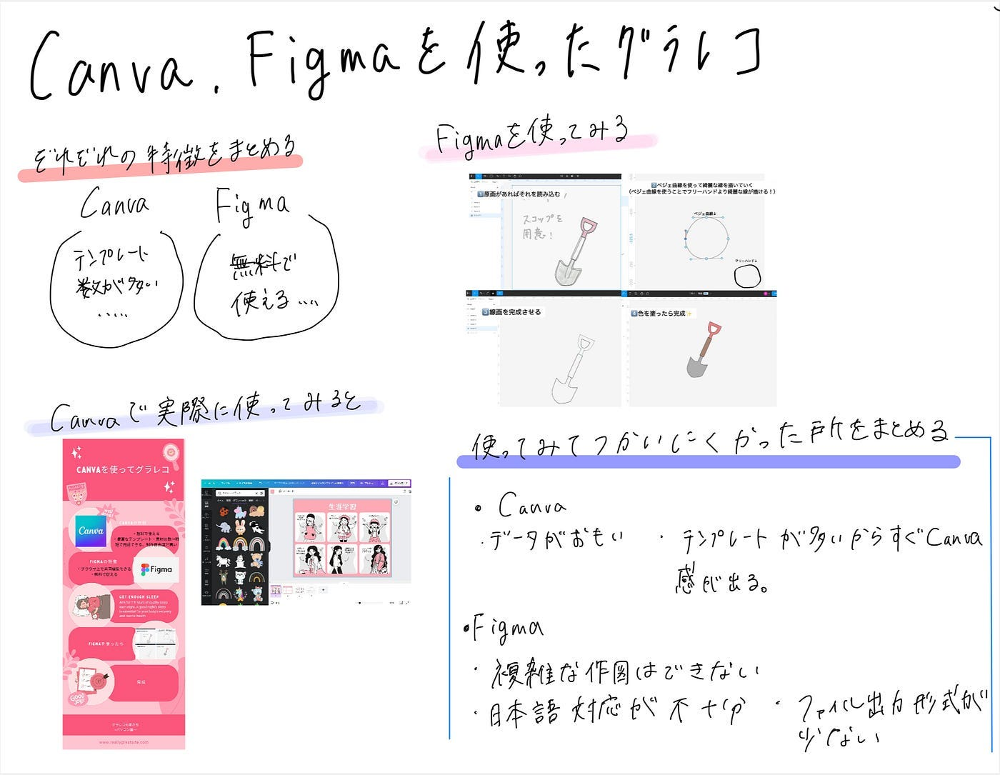

### デザイン部週報 グラレコの書き方〜パソコン〜

こんにちは！三年の福田です。

手書きとiPadを使ったグラレコの書き方を前二回でまとめることができました。今回はパソコンを使ったグラレコがどのようにできるかをみんなで考え、[Canva](https://www.canva.com/ja_jp/)と[Figma](https://www.figma.com/ja-jp/)を使ったグラレコの作り方をまとめてみました。

Canvaの特徴

・無料で使える

・豊富なテンプレート・素材の数→**時短で完成できる、制作自由度だ高い**

・**高度なテクニックや知識は不要**

・パソコン・スマートフォンでデザイン出来る

例）こんな感じにしてできるよ

Figmaの特徴

・ブラウザ上で共同編集できる

・無料で使える

・動作が軽い

・一つのデータ内でバージョン管理ができる

・いちいち保存する必要がない

Figmaを使って描きました↓

ここで、ベジェ曲線ですが、慣れてないと使いづらいと感じることがあるので、[The Bezier Game](https://bezier.method.ac/)を使って練習することができます。

Canvaのデメリット

・データが重く動作が遅くなりやすい

・テンプレートが多いからこそすぐにCanvaとわかる

Figmaのデメリット

・ファイル出力形式が少ない

・日本語対応が不十分

・複雑な作図はできない

まとめ

Canvaを使ったグラレコは私たちが描いてきたグラレコとは多く異なります。時間がないときに、まとめにくい内容の時に使ったり、テンプレートを参考にすることができます。

Figmaは形が決まっているものだったり、図表を作る時に使うと便利です。

グラレコ

