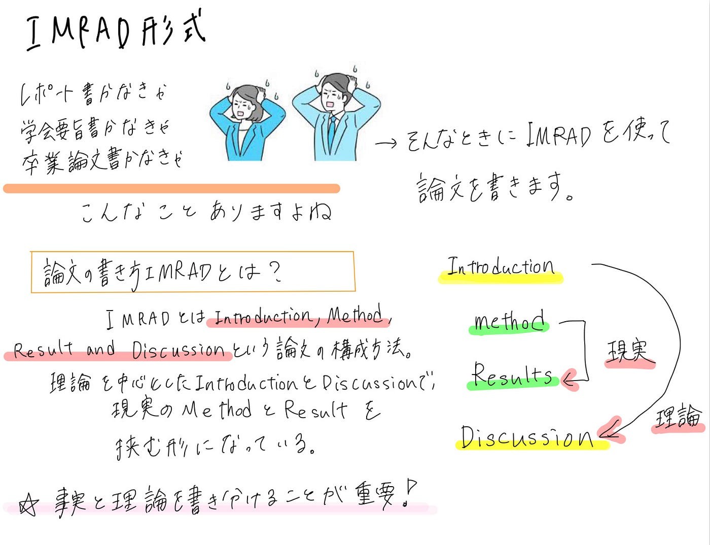

### IMRAD形式の論文構成とは？

V＆F週報

おはようございます。4年の深水です。

今週のV＆Fでは、**IMRAD形式**の論文構成について皆で確認しました。

**IMRAD形式**とは、**Introduction**(序論),**Method**(方法),**Results**(結果),**Discussion**(考察)で構成された論文の形式です。

古橋研究室においてゼミ論や卒論を提出する際には、この形式に従って書く必要があります。

また、研究室のメンバーは夏の中間発表までにIntroduction(序論)を完成させる必要があるので、Introductionの書き方についても深掘りしました。

Introductionは、①**研究テーマ**、②**背景**や**先行研究**、**③研究の意義**や**目的**の３つを含んでいる必要があります**。**

特に**背景や先行研究**の部分はよく詰められるので、自分の研究と関連する論文を[Google Scholar](https://scholar.google.co.jp/schhp?hl=ja)などで検索し、しっかり読み込んでおきましょう！

以上です。
