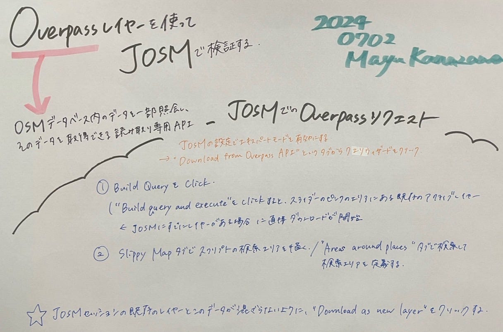
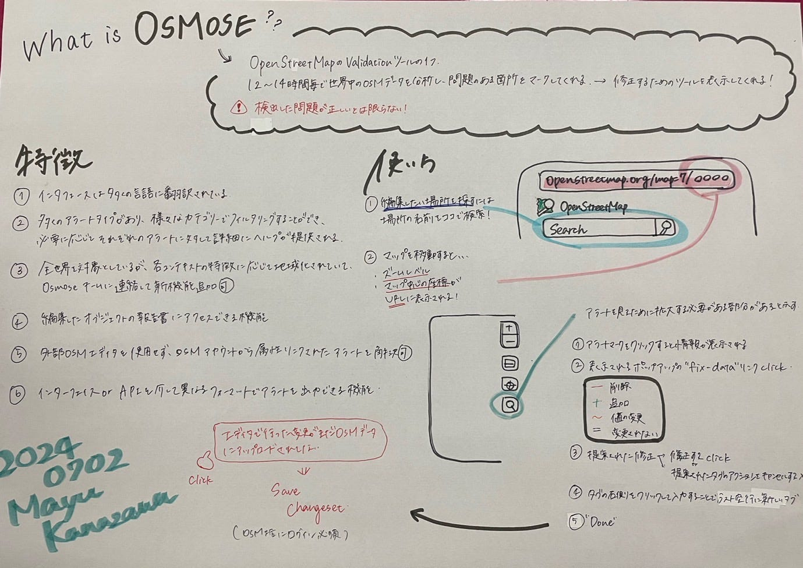

### 【Youth 週報 7/2】今週はハッカソンの準備に取り掛かりました！！

Youthの活動として、今週はハッカソンの準備に取り組みました。今回は伊藤が代表としてまとめます。

【GitHubレポジトリ】

[furuhashilab/Youth_JOSM-Validation (github.com)](https://github.com/furuhashilab/Youth_JOSM-Validation)

【スケジュール】

６月３０日 要約構成案完成
 ７月１日 グラレコ、Medium完成
 ２日 発表

【役割分担】

要約構成案作成 しおりさん、みく

グラレコ まゆ

Medium えいと

【活動内容】

今週の活動は主に要約構成案作成、グラレコ作成、投稿作業に分かれて行いました。Youthは「Osmose」「Overpassレイヤーを使ってJOSMで検証する方法」についての要約作業をしました。

【Overpassレイヤーを使ってJOSMで検証する方法】

JOSMでOverpassリクエストを行う手順を簡単にまとめます。

1. エキスパートモードを有効にする
 — JOSMの設定でエキスパートモードを有効にします。

2. Overpass APIからダウンロード
 — “Download from Overpass API”タブを開き、”クエリウィザード”をクリックします。

3. クエリを構築
 — “Build Query”をクリックします。
 — “Build query and execute”をクリックすると、既存のアクティブレイヤーに直接ダウンロードが開始されます。

4. 検索エリアを定義
 — “Slippy map”タブで検索エリアを描くか、”Areas around places”タブで検索して検索エリアを定義します。

参照 [JOSM Validationハッカソン — Google スライド](https://docs.google.com/presentation/d/16wifjGShyZgdKIZfiC7sjbYI6OMIVisIlJRpeQtFZCE/edit#slide=id.g2e8ac723f4e_0_18)

【Osmoseとは？】

ここでは簡単に「Osmose」についてまとめます。

Osmoseとは、OpenStreetMap（OSM）の検証ツールのひとつです。12〜24時間ごとに世界中のOSMデータを分析し、問題のある箇所をマークします。

特徴として・・・

- 多言語対応 : インターフェースは多くの言語に翻訳されています。
- 多様なアラートタイプ: 様々なカテゴリーに従ってフィルタリングでき、詳細なヘルプが提供されます。

- 地域特化: 各地域の特徴に応じてローカライズされ、Osmoseチームに連絡して新機能を追加することも可能です。

- 編集サポート: 編集したオブジェクトの報告書にアクセス可能で、iDやJOSMのような外部エディタを使用せず、OSMアカウントから直接アラートを解決できます。

- 出力機能: インターフェースやAPIを介して、異なるフォーマットでアラートを出力できます。

Osmoseの使い方として、編集したい場所を探すには場所の名前を検索ボックスに入力するのが一番早く、虫眼鏡の黒い部分はさらに拡大してアラートを見る必要があることを示し、マップを移動するとOsmoseのURLにズームレベルとマップ中心の座標が表示されます。

参照 [osmoseまとめ — Google ドキュメント](https://docs.google.com/document/d/1e2rZhrj_VRQF0VwsNh2tfddJIOwW479eY8yLW1gp2I4/edit)

【グラレコ】

一枚目 Overpassレイヤーを使ってJOSMで検証する方法

二枚目 osmoseについての説明

【感想】

今回のハッカソンへの準備を通して、より難易度の高いことに取り組むことによって、以前よりもOSMへの理解度が増したと感じました。まだまだ分からないことだらけですが、今後も新しいことに取り組むことによって、知識量を増やしていきたいです。(伊藤)

UNのサイトの情報をまとめる際に、専門的な内容だったため、まず文章を理解することに苦労した。その後分かりやすくまとめようと思っても、どの情報が重要なのか直感的に理解するのが難しく、時間がかかった。(しおりさん)
