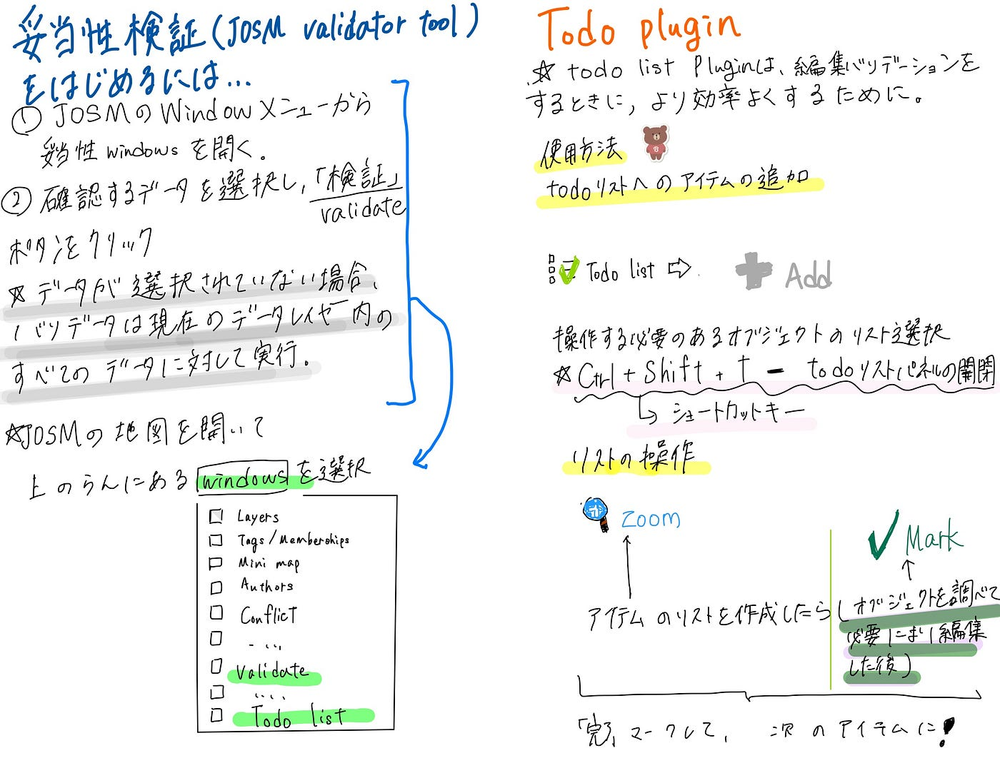

### デザイン部週報(7/2)６月ハッカソンに向けて

こんにちは！デザイン部3年の滝沢です！

今回は、7月2日に実施される６月ハッカソン の成果物について記事を書きます。

**[6月ハッカソンについて]**

成果発表会:7月2日11:00〜

ゴール:Validationを目的とした JOSM の使い方をグラレコでまとめる

グラレコでまとめる内容:

①インストール編 JOSM動作確認、Tasking Manager との連動

②基本操作編 JOSMの基本操作、Building Plugin の使い方、建物の形状修正（直角化、スナップしたノード処理）

③Validation基礎 JOSM validator tool(妥当性検証)、TODO plugin

④Validation応用 Osmose の使い方

詳細:

・ゼミ内サークルごとのチーム作業

・成果物は、それぞれのチームで [古橋研究室GitHub Organization 内](https://github.com/furuhashilab)に公開リポジトリとして整理し公開する。

・Project管理として、GitHub Project と Issues を連携させてタスク管理を行う。

このハッカソンでは、JOSM の使い方をグラレコでまとめる ことを目標に各サークル内で担当を分担しました。デザイン部では、JOSM validator tool(妥当性検証)とTODO pluginについてのグラレコを担当しました。以下グラレコです。

インスール編や基本操作編などのグラレコは、他のサークルが[Githubに公開している](https://github.com/furuhashilab)のでそちらをご覧ください。

**[グラレコについて感想]**

私は普段、JOSMを使用する機会があまりないため操作については初心者でした。しかし、このハッカソンでJOSMのValidation基礎について学ぶことができました。福田と末木が書いてくれたグラレコや、他のゼミ内サークルのメンバーが書いてくれたグラレコを参考にJOSMの操作を実際に行い、使い方を徐々に学んでいきたいと思いました。次回のValidation獲得の機会のために、秋までにJOSMの使い方をマスターできるように頑張りたい。(滝沢)

今回のハッカソンで、今まで知らなかったJOSMの使い方を調べ、学ぶことができた。自分が担当した部分はよく理解することが出来たので、他のグループが担当した部分を、mediumの記事をよく読み、グラレコから理解して、今後の作業で使っていきたい。(福田)

UN Mappers TrainingでValidationについてインプットをしたが、今回はアウトプットができてより理解が深まった。特にTodo pluginに関しては、UN Maps Learning Hubにて目を通してはいたが、使ったことはなく、まとめるのが難しかった。しかし、まとめる作業をしながら理解ができたので、このpluginを使うことでより効率良くValidation作業を進めて行きたいと思った。また、今回のハッカソンでUN Mappers Trainingをただ聞いてるだけではやはり知識が追いつかず、ところどころアウトプットを挟みながら専門知識の英語力も高めていき実践と言葉両方で理解する必要を感じた。(末木)
