### JOSM使い方～基本操作編～ドローン部

こんにちは、ドローン部の佐藤と林です！

ここでは、

**・JOSM基本操作**

**・Building Pluginの使い方**

**・建物の形状修正（直角化、スナップしたノード処理）**

を詳しく説明します。

重要な情報はグラレコに集約させていて、Medium記事はそれ以外も補足した説明になっています。まずは、グラレコを読んでください！

以下が[githubリポジトリ](https://github.com/furuhashilab/Drone_UN-Validation/blob/main/README.md)です！

[Drone_UN-Validation/README.md at main · furuhashilab/Drone_UN-Validation (github.com)](https://github.com/furuhashilab/Drone_UN-Validation/blob/main/README.md)

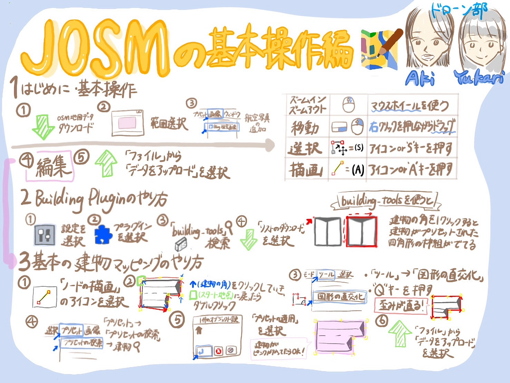

グラレコ:林 原稿:佐藤

### １．基本操作

インストール後、初めて起動する際には、以下の基本設定を行います。

- **地図データのダウンロード**：左上の「ファイル」メニューから「ダウンロード」を選び、編集したい範囲を指定してデータを取得

- **保存場所の設定**：編集した地図データの保存場所を指定

- **プラグインの追加**：必要なプラグインをインストールして、JOSMの機能を拡張

#### **１．１地図データのダウンロード 手順**

方法（概略）

1. JOSMをインストール

1. 建物の描画を行いたい範囲を含む基盤地図情報をダウンロード。

1. ダウンロードをしたデータを解凍し、インポート。

#### 地図の用途とフォーマット

マッピングをする際は、必ず編集対象のデータを読み込んでおきます。必要に応じて参考になる地図（画像）を背面に表示して作業します。JOSMに読み込まれた地図や画像のことを「レイヤ」と呼びます。レイヤは何枚も重ねて表示ができ、リスト上位のものが前面に描画されます。

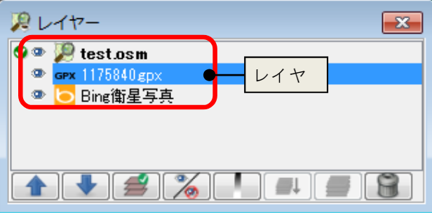

JOSMでは、以下の種類の地図を扱うことができます。

- GPXファイル（_.gpx、_.gpx.gz）

- NMEA-0183ファイル（_.nmea、_.nme、_.nma、_.log、*.txt）

- OSMサーバファイル（_.osm、_.xml）

- Bzip2圧縮したOSMファイル（_.osm.bz2、_.osc.bz）

- Gzip圧縮したOSMファイル（*.osm.gz）

- OSM Changeファイル（_.osc、_.osc.bz2、_.osc.bz、_.osc.gz）

- WMSファイル（*.wms）

- 画像ファイル（*.jpg）

- WMS、TMS

#### **データをダウンロードして読み込む**

地図の編集対象となるOSMファイルや、サーバにアップロードされたGPXファイルをダウンロードします。ダウンロードをするには、以下の手順を行います。

1.ファイルメニューを開く：「ファイル」メニューをクリックします。

2.OSMからダウンロードコマンドを実行：「OSMからダウンロード」コマンドを選択します。

3.ダウンロードダイアログを使用：「ダウンロード」ダイアログが表示されるので、ここで必要なデータを指定してダウンロード

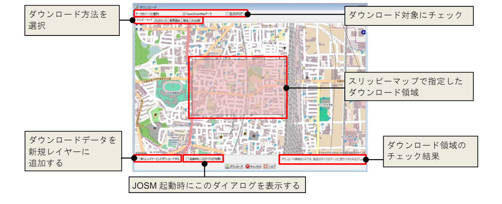

#### 地図上で領域を指定してダウンロードする方法

1.「ファイル／OSMからダウンロード」を実行：「ファイル」メニューから「OSMからダウンロード」を選択→「ダウンロード」ダイアログが表示

2.「スリッピーマップ」をクリックしてタブを表示

3. マップの移動、拡大／縮小：マップを移動させたり、拡大／縮小してダウンロードしたい範囲を表示

4.ダウンロード領域の指定：ダウンロード領域の対角2点をドラッグで指定

5.「ダウンロード」ボタンをクリック：「ダウンロード」ボタンをクリック→指定した対象範囲と交差する範囲のオブジェクトがダウンロードされる

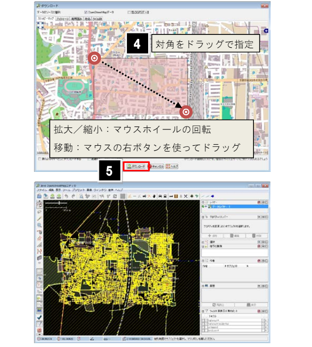

#### 保存したブックマークからダウンロード

よくダウンロードする領域をブックマークとして保存しておくと、簡単に呼び出してダウンロードできます。

1.「ファイル／OSMからダウンロード」を実行：「ファイル」メニューから「OSMからダウンロード」を選択→「ダウンロード」ダイアログが表示される

2.「ブックマーク」タブをクリックして表示

3. 使用したいブックマークの選択

4. 「ダウンロード」ボタンをクリック：ブックマークに登録された領域内のオブジェクトがダウンロードされる

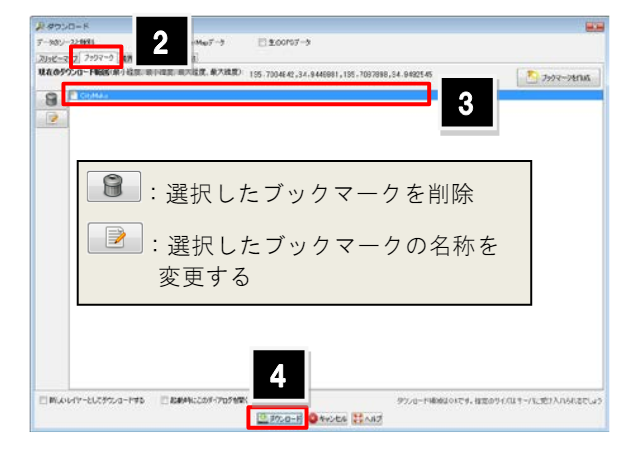

ブックマークを作成する手順は以下のとおりです。

１.「ダウンロード」ダイアログの「スリッピーマップ」タブで、 領域の対角を指定するようにドラッグ

２.「ブックマーク」タブを表示し、「ブックマークを作成」ボタンを クリックします。

３.ブックマークの名称を入力します。

４.「了解」ボタンをクリックします。 ブックマークのリストに追加されます。

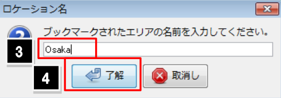

#### 領域の座標値を指定してダウンロードする

１. 「ファイル／OSMからダウンロード」を実行します。「ダウンロード」ダイアログが表示されます。

２.「境界囲み」タブを表示します。

３. 最大／最小の緯度経度を入力します。

４.「ダウンロード」ボタンをクリックします。 指定領域のオブジェクトがダウンロードされます。

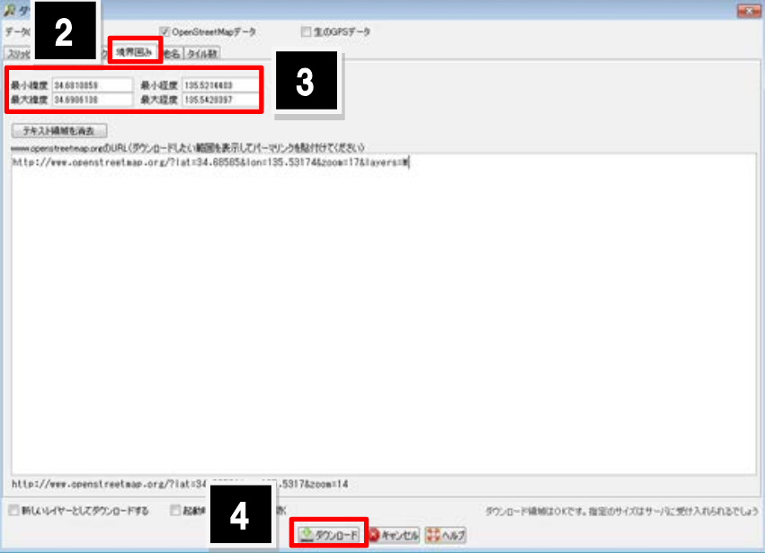

（補足）OpenStreetMap のサイトでダウンロードしたい領域を表示し、「www.openstreetmap.org の URL」欄にそのパーマリンクを貼り付けると、領域 の座標値が自動入力されます。

#### 地名からダウンロード領域を指定する

１.「ファイル／OSMからダウンロード」を実行します。 「ダウンロード」ダイアログが表示されます。

２.「地名」タブを表示します。

３. 検索サーバを選択し、地名の一部を入力します。

４.「検索」ボタンをクリックします。

５.検索結果から、ダウンロードしたい項目を選択します。

６.「ダウンロード」ボタンをクリックします。指定領域のオブジェクトがダウンロードされます。

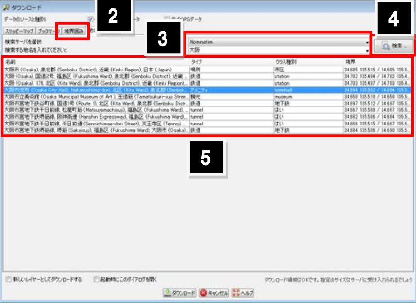

#### ズームレベルやタイル数を指定してダウンロードする

１.「ファイル／OSMからダウンロード」を実行します。 「ダウンロード」ダイアログが表示されます。

２.「タイル数」タブを表示します。

３.ズームレベル、X,Y の座標値を入力します。

４.「ダウンロード」ボタンをクリックします。 指定領域のオブジェクトがダウンロードされます。

（補足）「ダウンロード」ダイアログの右下で「ダウンロード領域は OK です」と表示されていても、ダウンロードするデータ量が多い場合はダウンロー ドに失敗します。ダウンロード領域内のオブジェクト数も考慮して、ダウンロード領域を設定してください。

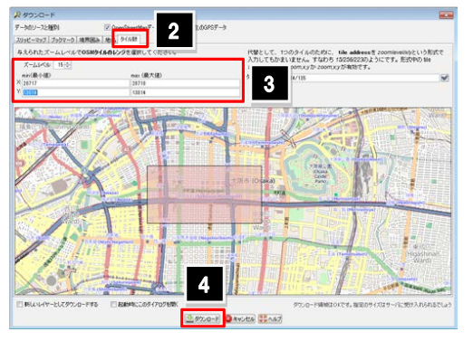

#### 地図を読み込む

ファイルベースの地図データを読み込んでレイヤを追加する方法について説明します。以下のファイル形式を扱うことができます：

- GPX ファイル（_.gpx、_.gpx.gz）

- NMEA-0183 ファイル（_.nmea、_.nme、_.nma、_.log、.txt）

- OSM サーバファイル（_.osm、_.xml）

- Bzip2 圧縮した OSM ファイル（_.osm.bz2、_.osc.bz）

- Gzip 圧縮した OSM ファイル（.osm.gz）

- OSM Change ファイル（_.osc、_.osc.bz2、_.osc.bz、_.osc.gz）

- WMS ファイル（.wms）

- 画像ファイル（.jpg）

手順

1.「ファイル／開く」か（Ctrl+O）コマンドで実行→「開く」ダイアログが表示される

2.ファイルタイプ欄で読み込みたいファイル形式を選択

3.フォルダが保存されたファイルの指定

4.読み込みたいファイルの選択

5.「開く」ボタンをクリック→選択したファイルが読み込まれる

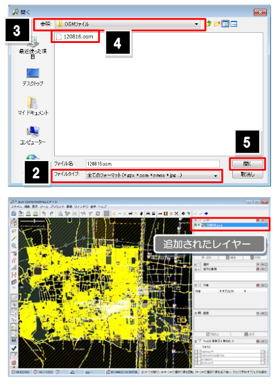

#### 背景画像を読み込む

背景として使用する画像を読み込む方法について説明します。この操作で読み込む画像はインターネットを経由して読み込むため、ネット環境に接続してから行います。

1.ネット環境に接続

2.「画像」メニューを開く

- JOSMのメニューバーから「画像」メニューをクリック

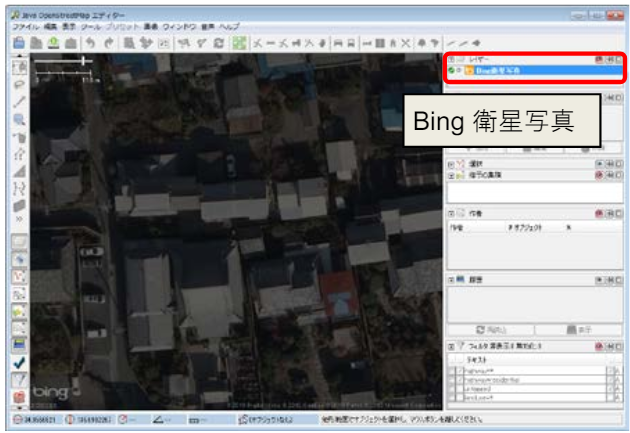

画像の色を薄くするには、「レイヤー一覧」ダイアログで対象のレイヤーを選択し、ボタンをクリックして表示されるスライダーを下に動かします。

画像の情報を参照するには、画像のコンテキストメニューから「タイ ル情報を表示」コマンドを実行します。画像上に、画像の撮影日時などの詳細情報が表示されます。

3.背景画像の選択

使用したい背景画像を選択します。例えば、Bing衛星画像を使用する場合は「画像／Bing衛星画像」を選択します。

これで、背景画像が地図の背面に表示され、編集作業を行う際の参考にすることができます。

#### レイヤを操作する

読み込んだレイヤの設定を行うには、「レイヤー一覧」ダイアログを使用します。ここでは、このダイアログの操作方法について説明します。

1. 「レイヤー一覧」ダイアログを開く：JOSMのメニューバーから「ウィンドウ」→「レイヤー一覧」を選択→「レイヤー一覧」ダイアログが表示

2. レイヤの表示順序を変更：レイヤー一覧内でレイヤをドラッグアンドドロップして表示順序を変更→リストの上位にあるレイヤが前面に描画される

3. レイヤの表示／非表示を切り替える：レイヤー一覧内の各レイヤのチェックボックスをオン／オフにすることで、そのレイヤの表示／非表示を切り替える

4. レイヤの詳細設定：各レイヤを右クリックすると、詳細な設定メニューが表示される→「プロパティ」や「名前を変更」などのオプションが利用できる

5. レイヤの削除：不要なレイヤを削除するには、レイヤー一覧内で対象のレイヤを選択し、「削除」ボタンをクリック

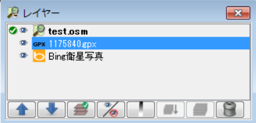

#### レイヤーの種類

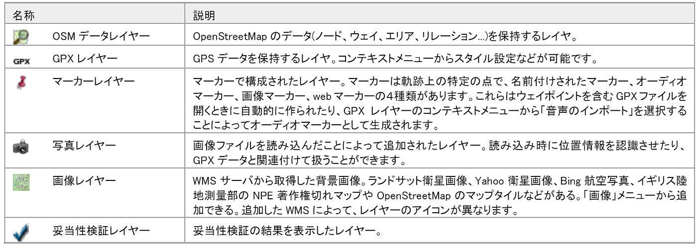

#### サイドボタン

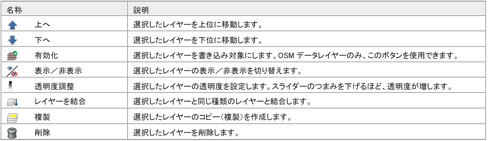

引用：[https://www.yamasita.jp/osm/seminar/140621_KyotoPrefecturalLibrary/JOSM_manual_0929.pdf](https://www.yamasita.jp/osm/seminar/140621_KyotoPrefecturalLibrary/JOSM_manual_0929.pdf)：参照日2024/07/02

#### 1.3. オブジェクトの選択

地図上のオブジェクト（建物、道路、ポイントなど）を選択する方法と、新しいオブジェクトを描画する方法について説明します。

・地図を移動する：マウスの右ボタンを押したままドラッグすると地図の移動ができる。

・地図を拡大/縮小する：マウスのホイールを手前に回転すると縮小、奥に回転する と拡大。または、「表示」メニューの「拡大」（+）「ズームアウト」（‐）コ マンドを実行することでも、拡大／縮小の操作ができる。

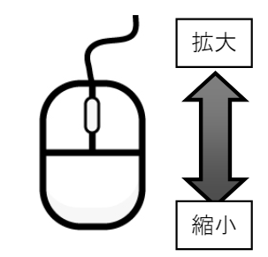

オブジェクトやデータの領域を拡大表示するには、「表示」メニューにある以下のコマンドを使います。

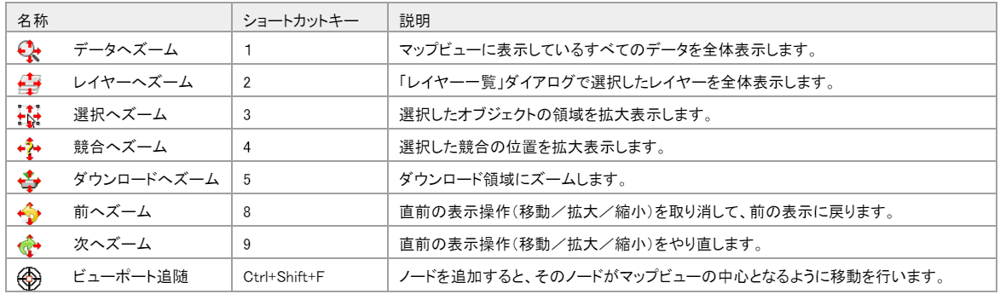

- オブジェクトの選択：左クリックを使用してオブジェクトを選択

※複数のオブジェクトを選択する場合は、Shiftキーを押しながらクリック

- JOSM で表示したウェイやエリア、ノードをワイヤーフレーム表示するには「表示／ワイヤー・フレーム表示」（Ctrl+W）コマ ンドを実行

→ワイヤーフレームで表示すると、地物ごとのスタイル設定が解除され、エリアの場合は塗りつぶしがない 状態になる

#### 属性追加方法

- **属性の追加**：新しい属性を追加する場合は、属性パネルの下部にある「+」ボタンをクリックし、必要な情報を入力する

- **プリセットで属性編集**：プリセットは、各地物に付与するキーの組み合わせを指す。道路であれば道路名称、道路の幅、一方通行かどうかなどの情報をプリセットとして用意されており、属性を付与する手間を軽減することができる。

ここでは、プリセットを利用して駐車場のエリアに属性を追加する方法について説明します。

1. **属性の追加対象となる図形を選択**

**２.「プリセット」メニューにあるコマンドを実行**

メニューバーから「プリセット」メニューを開く→駐車場のプリセットを利用するためには、「プリセット／輸送／自動車／駐車場」コマンドを選択→属性を入力するためのダイアログが表示される

**３.属性を入力**

テキストボックスに必要な属性を入力→「▼」をクリックすると、値の候補をリストから選択して入力することができる

**４.「プリセットの適用」ボタンをクリック**

入力した情報を確認し、「プリセットの適用」ボタンをクリック→これにより、入力した情報が一括で付与

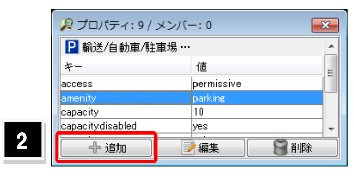

### 2.Building Pluginの使い方

ここでは、Building Pluginの使い方について詳しく説明します。

#### 2.1. プラグインのインストール

Building Pluginを使用するためには、まずプラグインをインストールする必要があります。以下の手順でインストールします。

- **設定メニューの開き方**：JOSMのメニューバーから「編集」→「設定」を選びます。→プラグインをインストールする際は、 画面上部のアイコンから設定アイコンを選択し、 “プラグイン”タブを開いてください。

- **プラグインの選択**：左側のメニューから「プラグイン」を選び、「プラグインリストの更新」をクリックします。

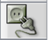

→プラグインのリストが表示されない場合、 “リストのダウンロード”を選択してください。

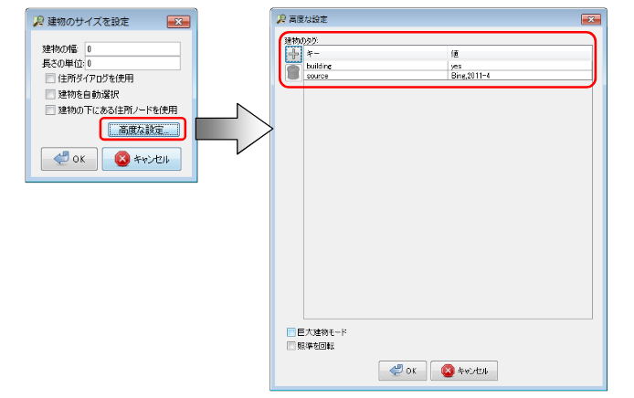

- **インストール**：「Building Tools」を検索してチェックを入れ、「OK」をクリックしてインストールします。→インストールが完了したら、適度なタイミングでJOSMを再起動してプラグインを読み込ませてください。

#### 3.2. プラグインの使用方法

プラグインがインストールされると、ツールバーに建物アイコンが追加されます。このアイコンをクリックしてプラグインを有効にします。

JOSMの上部メニューにある “ツール” をクリックすると、地図上のオブジェクトを編集したり、ラインやシェイプを新しく描く際に便利なツールが大量に表示されます。

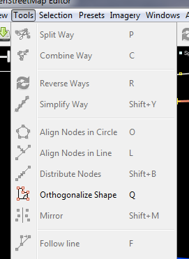

出典：[https://learnosm.org/ja/josm/josm-tools/](https://learnosm.org/ja/josm/josm-tools/)：参照日2024/07/02

- **建物の描画**：地図上で建物の角を順にクリックしていくと、建物の形が描かれます。四角形の建物を描く場合は、4つの角を指定し、最後に最初の点に戻ることで自動的に閉じられます。

- **直線と曲線の描画**：Shiftキーを押しながらクリックすると、直線や曲線を描画することができます。

→以下（補足）内、「面の作図」を参照してください

#### （補足）図形の種類と描画方法

点、線、面とその集合図形を構築することによって、マッピングを行います。 OpenStreetMap で扱う点を「ノード」、線を「ウェイ」、面を「エリア」と呼びます。また、それらの集合体を「リレーション」と言 います。

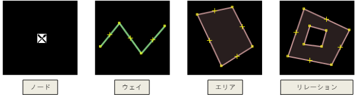

#### ノード（点）

クリックで作図する ノードは、点図形そのものや、線や面の頂点を表現したものです。

１. 他のノードを選択しない状態で編集ツールバーの「編集の開始」（A）を 実行します。マウスポインタの形状が「+」に変わります。

２. 配置位置をクリックします。 ノードが作図されます。

#### 座標値を指定して作図する方法

１.「ツール／ノードを追加」（Shift+D）コマンドを実行します。 「ノードを追加」ダイアログが表示されます。

２.「緯度／経度」タブを表示します。

３. 緯度と経度を入力します。

４.「OK」ボタンをクリックします。 指定した箇所にノードが作図されます。 ノード ウェイ エリア リレーション 緯度経度の間には、スペース、カンマ、セミコロンを 挿入します。

- オブジェクトの描画：ツールバーの描画アイコンをクリックし、地図上でクリックしてノードを追加します。線や多角形を描画する際には、最後のノードをダブルクリックして描画を終了します。

#### ウェイ（線）

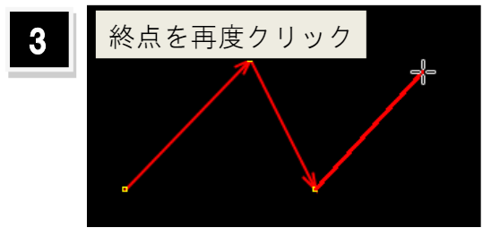

ウェイは線の形状や、面の外形線を表現したものです。

１. 他のノードを選択しない状態で編集ツールバーの「編集の開始」（A）を 実行します。マウスポインタの形状が「+」に変わります。

２. 頂点の位置を順にクリックします。ノードが追加されます。

３. 終点のノードを配置後、再度そのノードをクリックします。 ウェイの作図が完了します。

#### エリア（面）

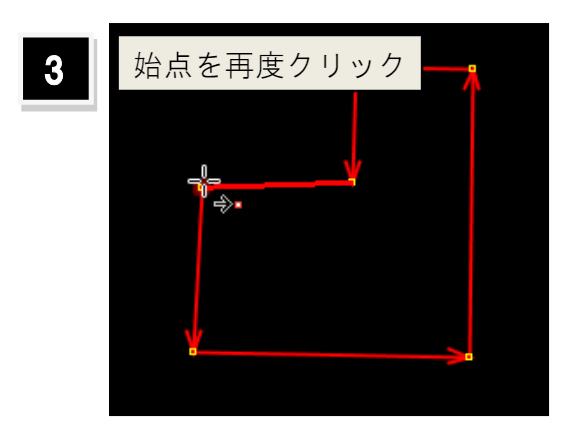

１. 他のノードを選択しない状態で編集ツールバーの「編集の開始」（A）を 実行します。マウスポインタの形状が「+」に変わります。

２. 頂点の位置を順にクリックします。ノードが追加されます。

３. 始点と終点が一致するよう、始点をクリックします。 閉じたウェイが作成されます。

#### 既存の図形をコピーする

既存の図形をコピーして作図を行います。コピー元の図形がもつ情報もすべて 継承してコピーできます。

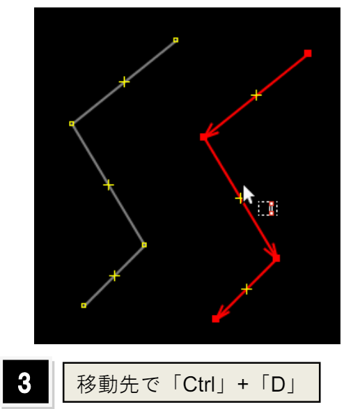

手順：コピー元の図形を選択→コピー先にマウスポインタを配置→「編集／複製」（Ctrl+D）コマンドを実行

図形がコピーされます。

#### 1.4. 属性の編集

選択したオブジェクトの属性を編集する方法を説明します。

- **属性パネル**：画面右側に表示される属性パネルで、オブジェクトの詳細な情報を編集します。例えば、建物の種類、高さ、用途などを入力できます。

属性や地物の種類を指定して選択する場合、「編集／検索」（Ctrl+F）コマンドを使用します。

１.「編集／検索」（Ctrl+F）コマンドを実行→ 「検索」ダイアログが表示される

２. 検索条件を入力

３. 検索された図形に対する処理（選択を置換）を選 択

４.「検索開始」ボタンをクリック→ 検索が開始され、条件に合致した図形（建物）が 選択

#### 2.3. 建物の編集

- **建物の移動**：描画した建物を選択し、ドラッグして位置を調整します。

- **建物の回転**：選択した建物を右クリックし、回転メニューを選びます。

### 3.建物の形状修正（直角化、スナップしたノード処理）

ここでは、建物の形状修正について詳しく説明します。

#### 3.1. 直角化

建物の角を直角にする方法を説明します。

Orthogonalize Shape/図形の直交化: この機能は、建物など、直線と直角で構成されたシェイプを描く際に有用です。この機能を使うことで、対象のオブジェクトの角を直角にすることが可能です。

#### 手順

修正したい建物を選択し、右クリックしてコンテキストメニューを表示します。**「直角化」を選ぶと、選択した建物の角が自動的に直角**に揃います。もしくは、コマンドで、**Shift+Q。**

特に多角形の建物を描くときに、この機能は非常に役立ちます。建物の形状を整えることで、地図データの精度が向上します。

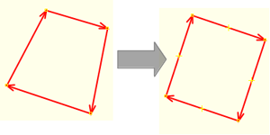

#### 3.2. スナップしたノード処理

スナップしたノードを処理する方法を説明します。

**Align Nodes in Line/ノードを一直線に配列:** この機能は、複数のポイントデータを一直線に並び替えます。大きなラインを直線化する場合は、そのラインを構成するポイントをいくつか選択してからこの機能を使うのがよい。この機能を使うことで、ラインの位置が少し移動することがあります。

- **ノードの結合手順**：複数のノードを選択し、右クリックメニューから「結合」を選びます。これにより、選択したノードが一つに統合され、スナップの処理が行われます。

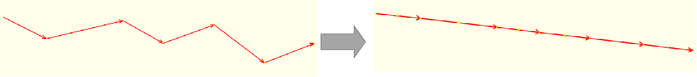

- **使用シナリオ**：複数の線や面が交差する場所で、ノードが正確に位置するようにするために重要です。例えば、道路の交差点や建物の角などでこの機能を活用します。

#### 3.3. その他の形状修正

- **頂点の追加と削除**：建物の形状を微調整するために、頂点の追加や削除が可能です。頂点を追加するには、エッジ上で右クリックし「頂点を追加」を選びます。削除するには、不要な頂点を選択し、右クリックメニューから「頂点を削除」を選びます。

- **形状の調整**：建物の形状をより詳細に調整するために、各頂点をドラッグして位置を変更します。この操作を通じて、より精緻な地図データを作成することができます。
