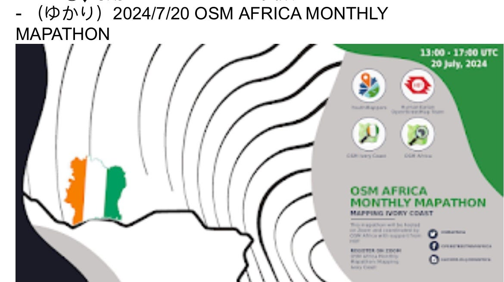
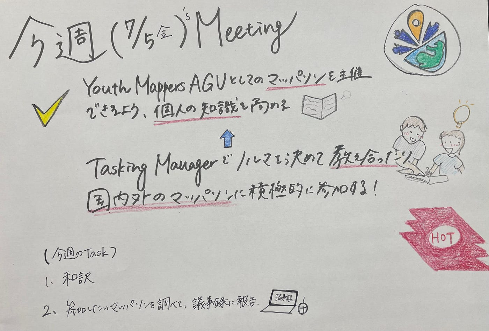
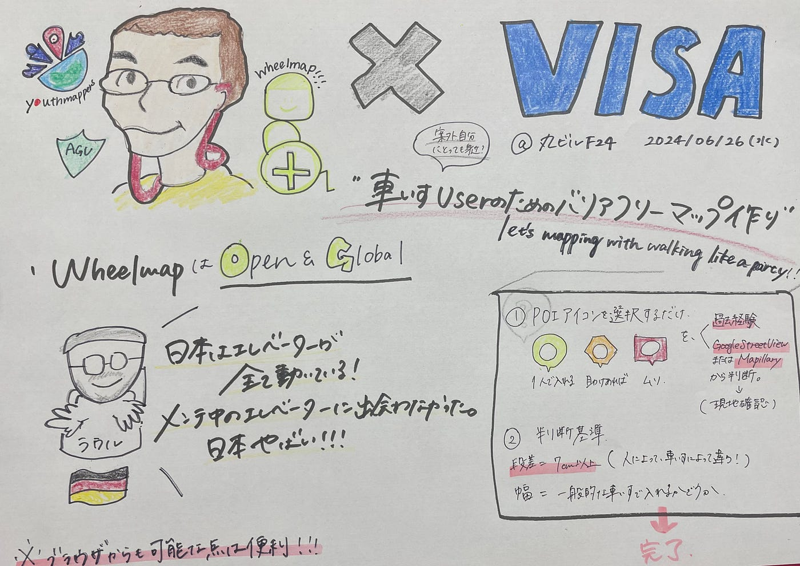
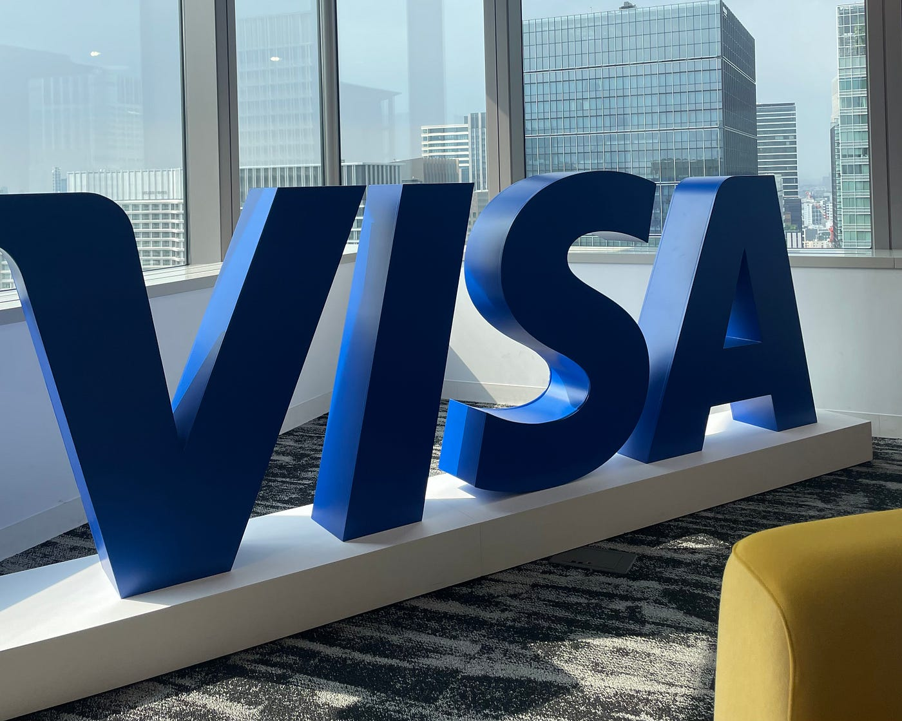
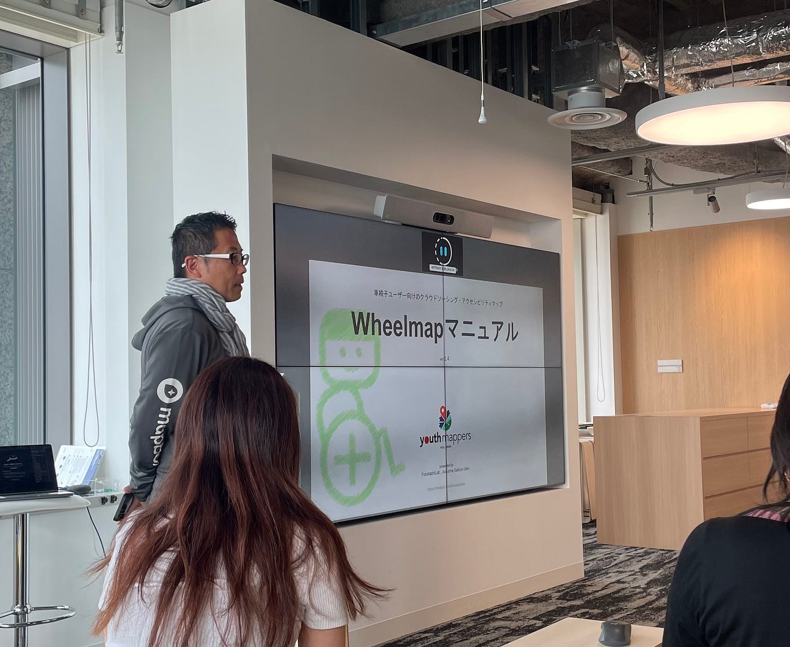

## 7/9週報

こんにちは。

連日の猛暑続きから早くも冬が恋しい金澤です。

**7/5(金) online Meeting会議で決まったこと**

•どのように工夫すれば実現可能かを検討し、やりたいことを個人で提示する

ex) ゆかり

1️⃣世界のマッピングイベントを把握できるように、各自、参加したいイベント情報を共有して、参加した場合はレポートにして内容共有を行う！

2️⃣OSM AFRICA MONTHLY MAPATHONに参加する

•YouthmappersAGUとしてのマッパソンを主催できるように、個人の知識を高める。

そのために、タスキングマネージャーでノルマを決めて教え合ったり、国内外のマッパソンに積極的に参加する。

•今週も和訳を進めること。

**6/26(水) VISA本社にて**

**Wheelmap Mapathonの活動報告**

地図が民主化する現代で、車椅子ユーザー向けの地図を誰でも作れること、世界中人々と協力して作れることはとても重要です。

[https://whe_**elmap.org_**](https://wheelmap.org)

では、ブラウザでも作業閲覧可能なので、

**バリアを知ることでバリアフリーになれる**というドイツ人ラウルさんの願いをか叶えるべく、車椅子で入れるお店、駅、トイレなどを誰でも手軽に記録、確認、更新ができます。

また、古橋教授は**ストイックさより、今より少しよくするを継続する楽しさを訴え、パーティのように街を歩いてマッピングしよう**という言葉のもと、VISAの社員様と共にマッピング作業を実演されました。

↑Wheelmap について説明する古橋先生

とは言え、ドイツ人からみた日本は、エレベーターは全て動いていて、比較的車椅子に優しい国に見えるそうです。新宿などの繁華街では特にアップダウンが激しいと思うので、私自身も積極的にマッピングしていきたいなと思いました。また、マッピングする箇所は自分が日ごろ入りたいと思う場所にあるか、ないかなど、全てに個人差があるので明確にきまりを作らない大切さも学びました。
