### OpenDroneMapとは？【ドローン部週報 2024/07/08】

こんにちは！ドローン部の林と佐藤です。今週はOpenDroneMapについて調べました！

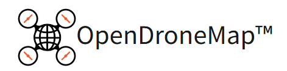

_**WebSite_**:[Drone Mapping Software — OpenDroneMap™](https://www.opendronemap.org/)

_**GitHub_**:[OpenDroneMap/ODM: A command line toolkit to generate maps, point clouds, 3D models and DEMs from drone, balloon or kite images. 📷 (github.com)](https://github.com/OpenDroneMap/ODM)

_**Document/Guide_**:[Welcome to OpenDroneMap’s documentation — OpenDroneMap 3.5.2 documentation](https://docs.opendronemap.org/)

#### OpenDroneMapとは

・航空画像を処理するための[コマンドライン](https://wa3.i-3-i.info/word11158.html)ツールキット。2014年に作成されて以来、オープンソースのドローン画像処理の[デファクトスタンダード](https://wa3.i-3-i.info/word15280.html)となっています。

・ドローンによって撮影された写真から地図や3Dモデルを作成するためのオープンソースウェア。

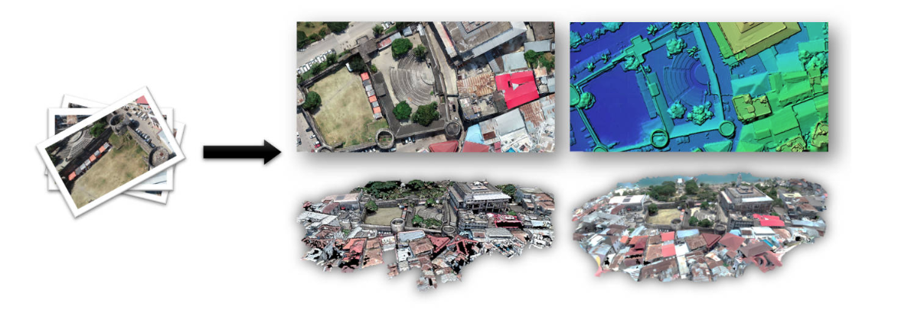

### OpenDroneMapのインストール方法

**【今回はWindowsの場合のみ説明します】**

> (確認事項)

・OpenDroneMap を実行するには、Windows 7 以上が必要

> (推奨事項)

ソフトウェアを実行するための最低限の必要条件 ：

- 2010年以降に製造された[64ビットCPU](https://wa3.i-3-i.info/word18106.html)

- 20GBのディスク容量

- 4 GBの[RAM](https://wa3.i-3-i.info/word1717.html)

上記の仕様では、100〜200枚以下の画像を処理できる(ソフトウェアのメモリが不足する)。

推奨される要件：

- 最新世代のCPU

- 100GBのディスク容量

- 16 GBのRAM

上記により、数百枚の画像を問題なく処理できる。コア数の多いCPUは処理を高速化できますが、グラフィックカード([GPU](https://wa3.i-3-i.info/word12613.html))は現在パフォーマンスに影響を与えないです。より多くの画像を処理するには、処理する必要がある画像の数に比例してディスク容量とRAMを追加します。

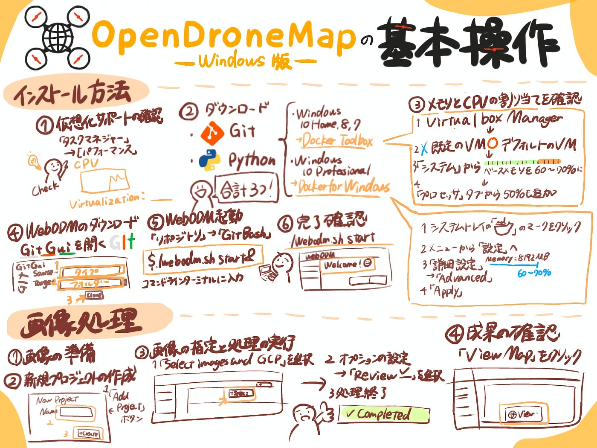

### Step1：インストール

**！ODMの実行には [docker](https://www.docker.com/) を使用することがおすすめ！**

#### ①仮想化サポートの確認

Dockerには、[仮想マシン(VM)](https://wa3.i-3-i.info/word11943.html)を実行できるようにする仮想化と呼ばれるCPUの機能が必要です。機能が有効になっていることを確認。

Windows 8以降で**[タスクマネージャー**](https://wa3.i-3-i.info/word13554.html)を開き(CTRL + SHIFT + ESCを押す)、[**パフォーマンス**]タブに切り替えます。

(**無効**だった場合)

→多くの場合、コンピュータを再起動し、起動中にすぐにF2またはF12を押し、ブートメニューをナビゲートし、仮想化を有効にする設定を変更します。

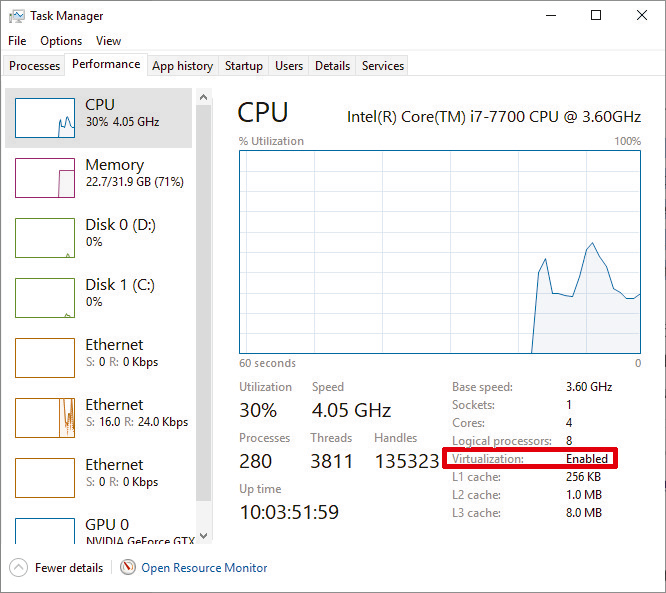

#### ②インストール要件

> ダウンロードするもの１

- _Git_:[https://git-scm.com/downloads](https://git-scm.com/downloads)

- _Python _(最新バージョン 3): [https://www.python.org/downloads/windows/](https://www.python.org/downloads/windows/)

Python 3 の場合は、インストール時に **[Python 3.x を PATH に追加する**] にチェックを入れてください。

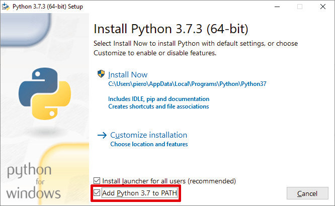

> ダウンロードするもの２

！両方のDockerプログラムをインストールしないでください！

これらは異なるもので、両方インストールすると混乱が生じます。

【Windows 10 Home、Windows 8(任意のバージョン)、またはWindows 7(任意のバージョン)を使用している場合】

Docker Toolbox: [https://github.com/docker/toolbox/releases/download/v18.09.3/DockerToolbox-18.09.3.exe](https://github.com/docker/toolbox/releases/download/v18.09.3/DockerToolbox-18.09.3.exe)

【Windows 10 Professionalまたはそれ以降のバージョンをお使いの場合】

Docker for Windows: [https://download.docker.com/win/stable/Docker%20for%20Windows%20Installer.exe](https://download.docker.com/win/stable/Docker%20for%20Windows%20Installer.exe)

#### ③メモリと CPU の割り当てを確認する

Windows 上の Docker は、VM をバックグラウンドで実行することで機能する。この VM には一定量のメモリが割り当てられており、WebODM は割り当てられたメモリ分しか使用できません。

Docker Toolbox をインストールした場合:

1. **VirtualBoxManager**アプリケーションを開きます

1. **既定の** VM を右クリックし、[**閉じる] (ACPI シャットダウン)** を押してコンピューターを停止します

1. **デフォルトの**VMを右クリックし、[**設定]を押します…**

1. **[システム**]パネルから**[ベースメモリ**]スライダを動かし、使用可能なすべてのメモリの60〜70%を割り当て、オプションで[**プロセッサ**]タブから使用可能なプロセッサの50%も追加します

次に、[**OK]**を押し、**デフォルトの**VMを右クリックして**[開始**]を押します。

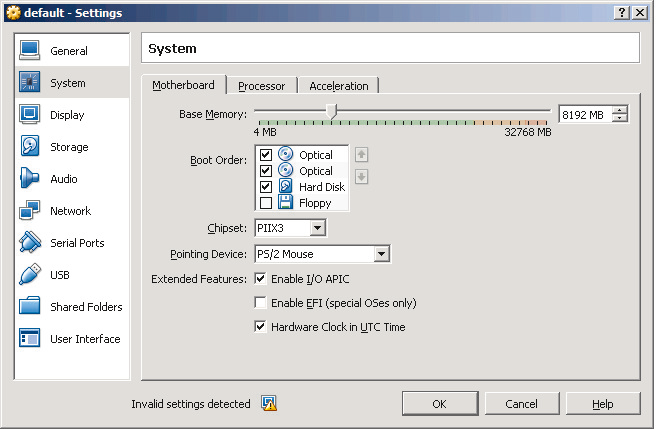

代わりに Docker for Windows をインストールした場合:

1. システムトレイを見て、「白いクジラ」アイコンを右クリックします。

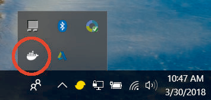

2．メニューから、[**設定]を押します**

3．パネルから [**詳細設定**] をクリックし、スライダーを使用して使用可能なメモリの 60 から 70% を割り当て、使用可能なすべての CPU の半分を使用します。

**4．[適用**] を押します。

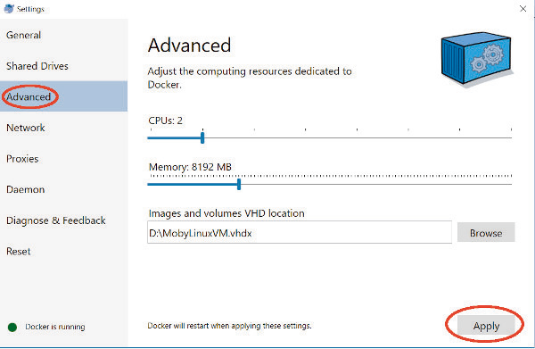

#### ステップ4.WebODMをダウンロード[](https://docs.opendronemap.org/installation/#step-4-download-webodm)

Git と共にインストールされる **Git Gui** プログラムを開きます。

- Git Gui が開いたら、[Clone Existing Repository] オプションをクリックします

- **[ソースの場所**] で、タイプ: [https://github.com/OpenDroneMap/WebODM](https://github.com/OpenDroneMap/WebODM)

- **[ターゲット ディレクトリ**] で [参照] をクリックし、選択したフォルダーに移動します (必要に応じてフォルダーを作成します)。

- **[クローン(Clone**)] を押します。

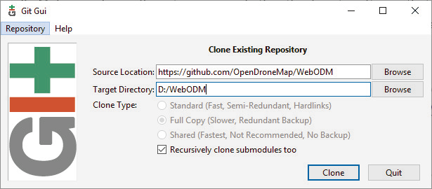

ダウンロードに成功すると、このようなウィンドウが表示されます：

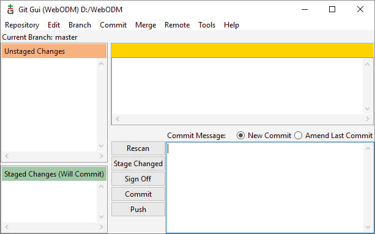

#### ④WebODMを起動する

Git GUI から **[リポジトリ**] メニューに移動し、[**Git Bash**] をクリックします。コマンドライン[ターミナル](https://wa3.i-3-i.info/word12049.html)から次のように入力します。

```shell
$ ./webodm.sh start &
```

この時点で、WebODM、NodeODM、ODMなど、いくつかのコンポーネントがマシンにダウンロードされます。ダウンロード後、次の画面が表示されます。

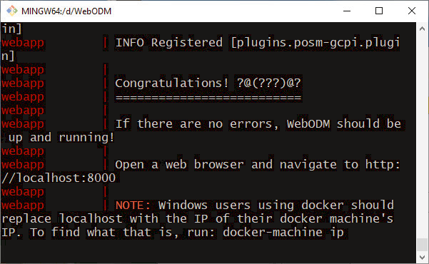

【Docker for Windows を使用している場合】

Web ブラウザーを開いて [http://localhost:8000](http://localhost:8000/)

【Docker Toolbox を使用している場合】

次のように入力して接続先の IP アドレスを見つけます。

```ruby
$ docker-machine ip
```

次のような結果が得られる。

```typescript
192.168.1.100
```

次に[、http://192.168.1.100:8000](http://192.168.1.100:8000/) に接続します(IPアドレスを適切なアドレスに置き換えます)。

### ⑤完了確認

./webodm.sh startを実行してブラウザでWebODMを開くと、ウェルカムメッセージが表示され、最初のユーザーを作成するように求められます。

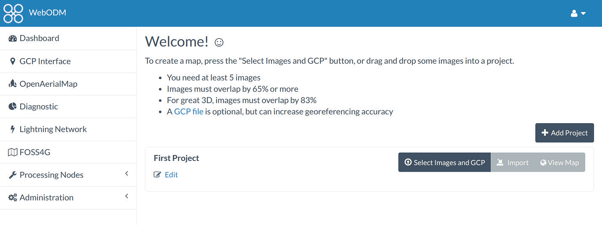

### Step 2： 画像処理

【画像処理の操作についてはこちらのサイトを参考にさせていただきました。[https://qiita.com/T-ubu/items/727f50b978031861ea02](https://qiita.com/T-ubu/items/727f50b978031861ea02)】

#### ① 画像の準備

ドローンの画像でも、航空写真でも処理したい画像を準備します。

- 高度は解像度が高いほうがよいということです。（ルールの範囲内で）

- カメラの角度は、すべての写真で多少の角度（10度）があるほうがよく、Nadir（直下視）ではないほうがよい。

- 理想的には前後に85％以上の[オーバーラップ](https://wa3.i-3-i.info/word11310.html)、サイドに70%以上のオーバーラップがあるとよい。

- フライトの速度は可能な限りゆっくりがよい。

！ジオレファレンスをするときに大切なので、画像の撮影位置があるか、[GCP](https://udemy.benesse.co.jp/development/system/gcp.html)を指定した座標をつかうのか、あるいは座標情報がないもので処理を進めるのかよく確認しておく。

### ②新規プロジェクトの作成

**Add Projectボタン**を押して、New Projectを作ります。今回は、ODM-001という名前で作ってみます。

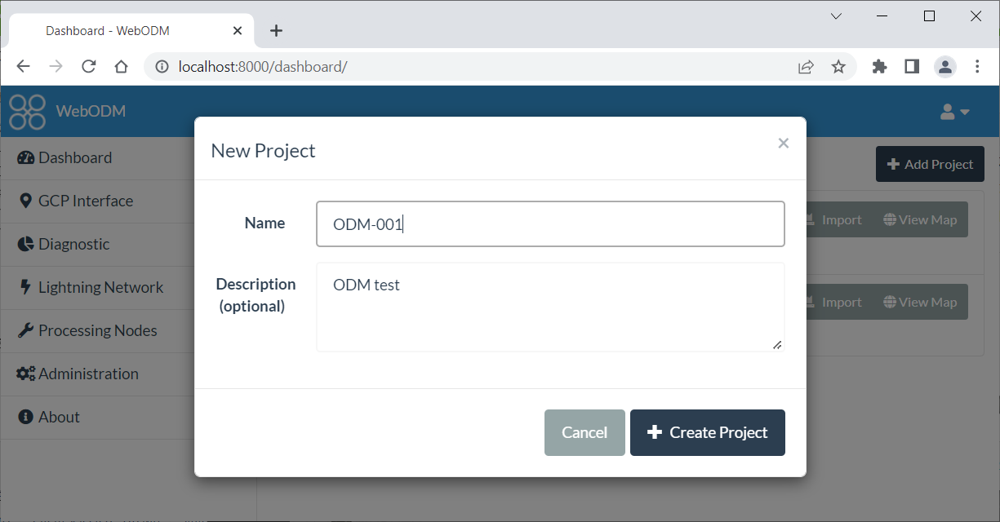

### ③画像の指定と処理の実行

プロジェクトが新たにできるので、**Select images and GCP**を選びます。

そして、画像ファイルを選びます。

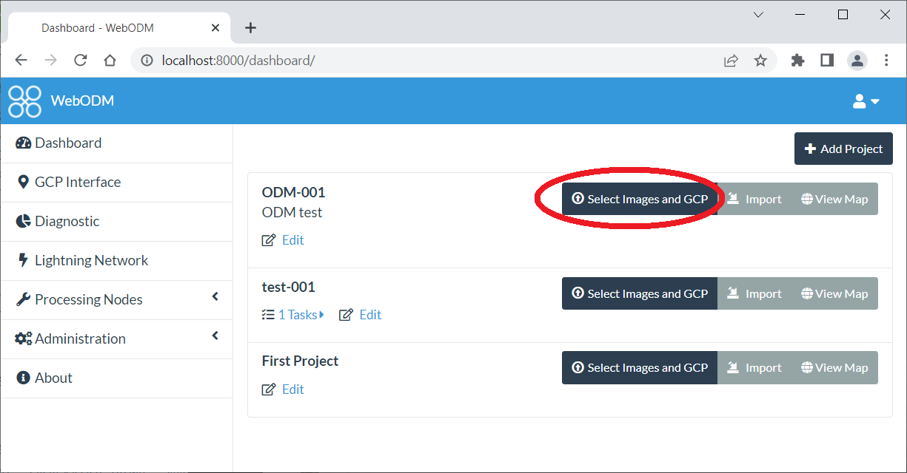

画像を選んだあと、オプションの設定ができます。今回は、データの名前をsample dataにしています。リサイズについては、今回のファイル数ではNoのままでも大丈夫ということなのでそのままにします。設定を確認するためにReviewボタンをおして、そのあとの画面でStart Processingを押します。

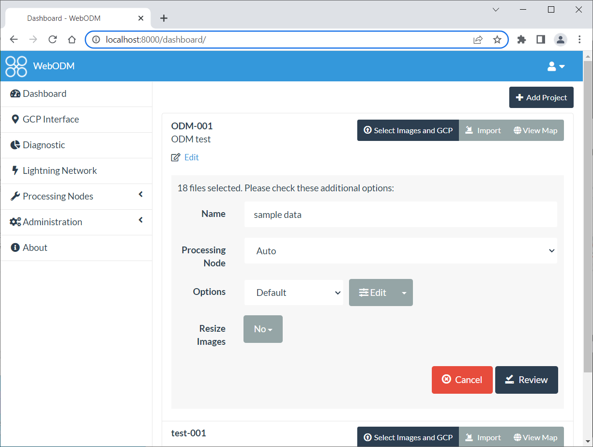

すると処理が始まり、処理が終わると以下のような画面になります。

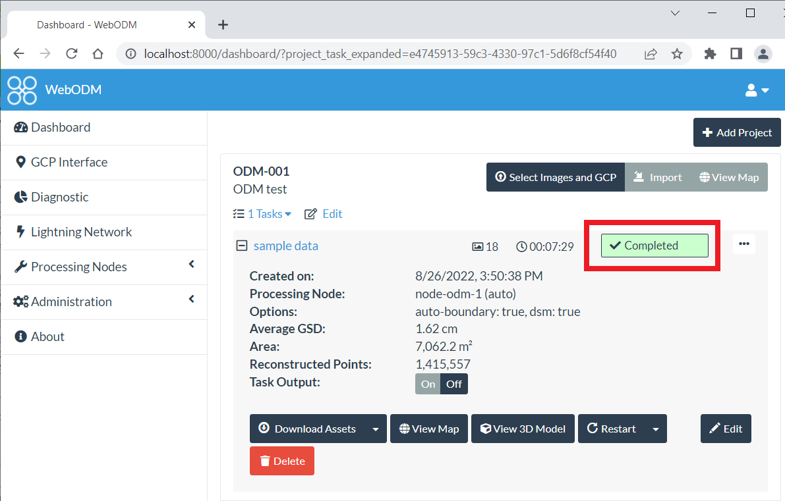

### ③成果の確認

まず**View Map**をクリックしてマップを見ます。右下のボタンで2Dと3Dの切り替えもできます。Georeferenceされた画像になっています。

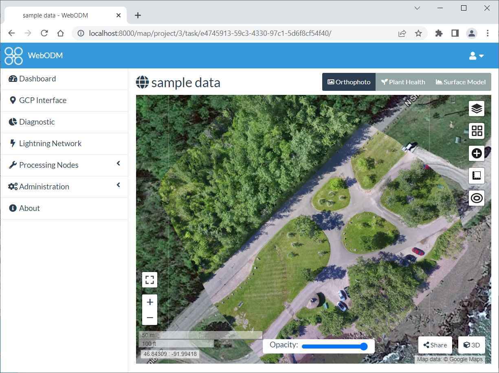

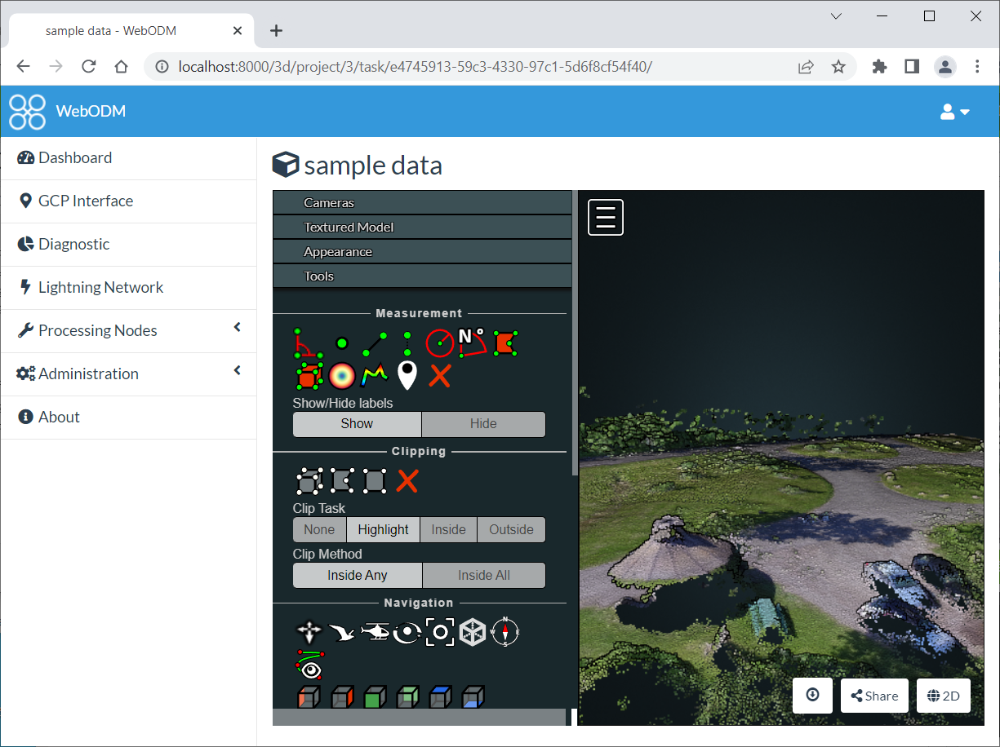
