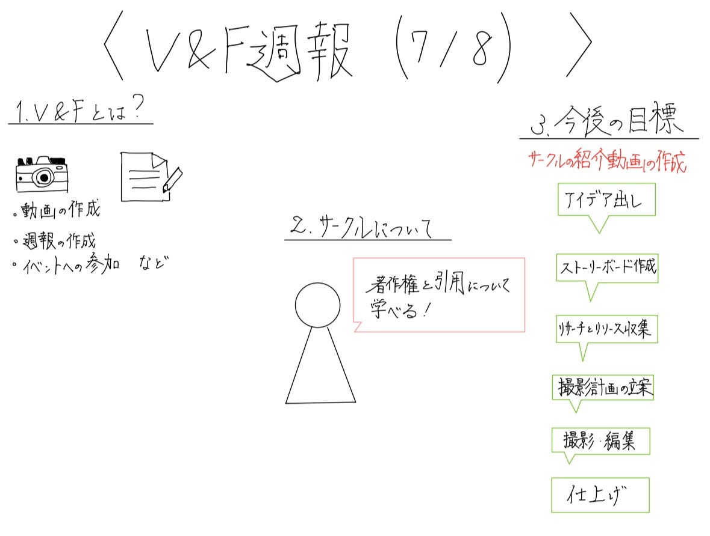

### V＆F週報(7/8)

こんにちは、V＆F三年の滝沢です！

今週は、V＆Fの今後の活動について話し合いました。その結果、V&Fでは今月のハッカソンで行うゼミ紹介動画の作成に加えて、V&Fのみを詳しく紹介する動画を独自で作成することにしました。その上で、どのような内容の動画にするかを考えました。

> **動画の内容**

_**1.サークルの活動内容について、V＆Fとは何か_**

V＆F活動内容「動画の作成、週報の作成、ゼミ関連のイベントへの参加等」

_**2.サークルについて一人一人コメント_**

動画を作成するにあったっての音源の著作権や引用などについて学ぶことができます。動画を作ってみたい人ぜひいらしてください 滝沢

このサークルでは、動画制作に必要な音源や画像の著作権および引用に関する知識を学べます。過去に動画を作成したことがある方はもちろん、未経験でも動画制作に興味のある方におすすめです。古内

個人的には、V＆Fは動画作成に力を入れるゼミ内サークルだと考えています。活動が行われる際に、積極的に写真と動画で記録し、振り返りを行ったり、編集をしていきます。自分なりに動画を編集してみたい、動画や写真を撮ることが好きなのでやってみたいと思う方はぜひ！福田

このサークルでは、動画作成に必要な知識を体現的に学ぶことができます。動画素材や音源などの著作権に関する知識はもちろんのこと、実際の動画編集を通して動画編集ソフトの使用方法も学ぶことができます。インプットに加えてアウトプットも多いサークルなので、たくさんアウトプットしたい学生にはぴったりのサークルです！高井

_**3.サークルの今後の目標_**

「サークルの紹介動画を作る、動画の作成に取り組む」

去年のゼミ紹介動画はこちら⇓です。

去年のゼミ紹介動画

> _**グラレコ_**

