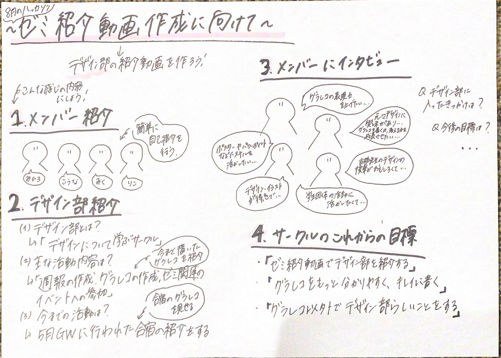

### デザイン部週報 2024/07/09

こんにちは！！ デザイン部3年の林です。

今週の週報は、8月のハッカソンに向けてゼミ紹介動画のデザインをデザイン部で考えてみました。

メンバーみんなで話し合ったところ、まずは、デザイン部の紹介動画を作ろうということになり、紹介動画の構成を考えました。

今の段階では、こんな感じの内容で構成を組んでいます！

1. メンバーの簡単な紹介

1. デザイン部の詳しい紹介（デザイン部とは・主な活動内容・過去の活動履歴）

1. メンバーのインタビュー（デザイン部に入ったきっかけ・今後の目標）

1. デザイン部としての今後の目標

これらの4つの要素でデザイン部の紹介動画を作成しようと考えています。

