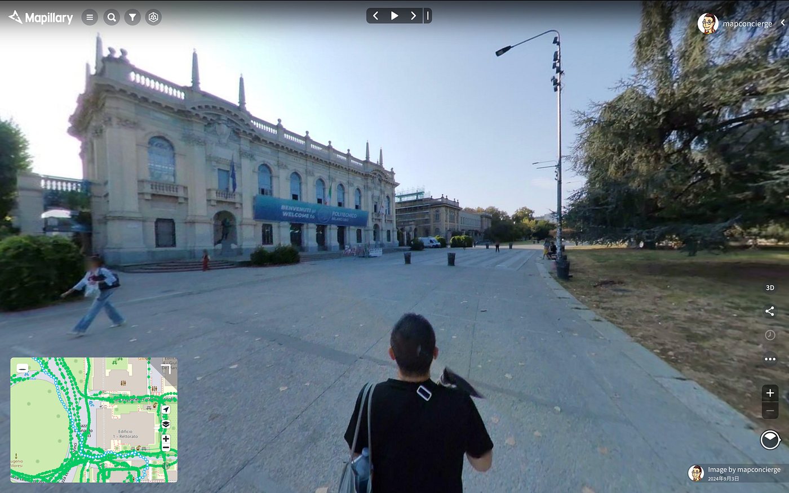
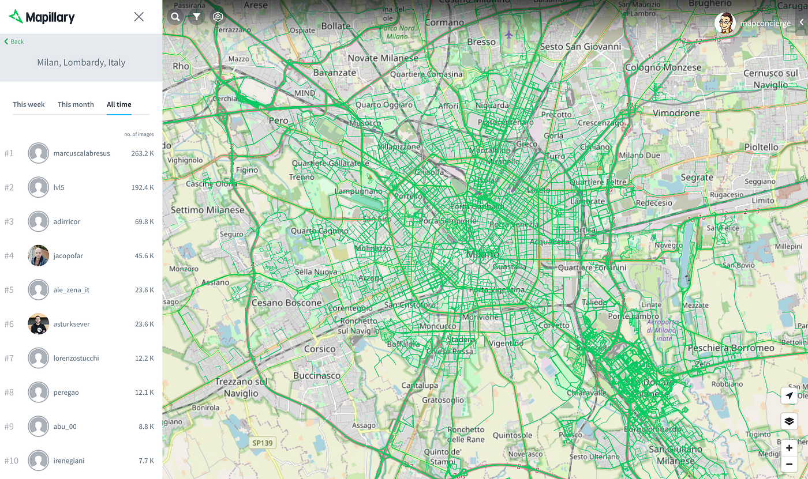
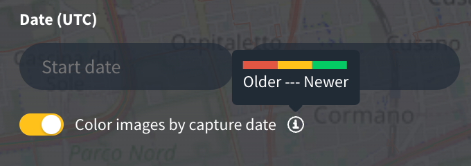
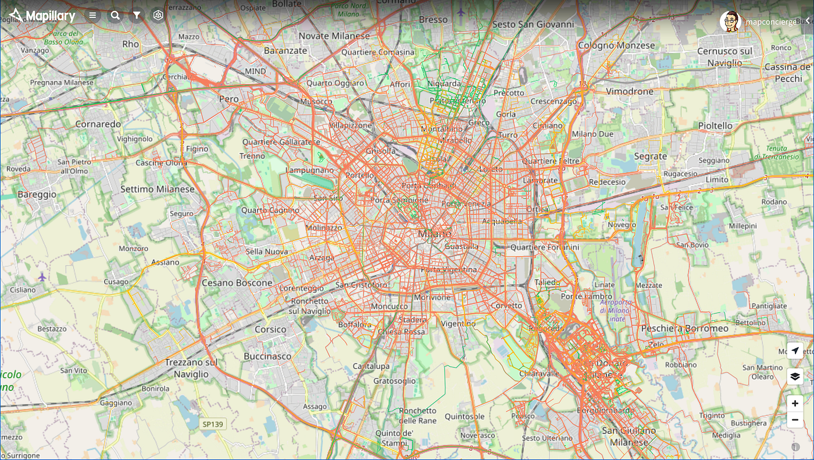

### 日々是好LOG｜サバティカル在外研究

毎日のルーチンをつくろう。

１年間という貴重な時間を自分のやりたいことに全力投球できる機会をいただいたので、健康管理も兼ねてミラノの街を歩きまわり、地理空間情報としての都市のアーカイブをチャレンジしてみようと思う。

現在の宿泊場所からミラノ工科大学までは徒歩で約40分。公共交通機関を乗り継いでも30分以上はかかるので、10分くらいの差で町並みをゆっくり堪能するには、徒歩も悪くない。何より歩くことは健康に良いし、位置情報ゲームのポイントも稼げる。ちなみに初日は電動キックボードを試してみたところ15分くらいで到着できたので急ぐときはこれが最適解だろう。

撮影機材はRICOH THETAのアンバサダーとして[RICHO THETA X](https://blog.ricoh360.com/ja/12740) と一脚を持参してきたので、これを存分に活用してStreet-level Imagery、いわゆるストリートビュー（但し ”STREET VIEW” はGoogleの商標なのでここでは同義語として Street-level Imagery と表現する）データを整備するためにMeta社が展開する [Mapillary](https://www.mapillary.com/?locale=ja_JP) を活用してオープンデータとして公開する。

[RICOH THETA X 内蔵GPS機能のポテンシャル～青山学院大学 古橋教授インタビュー l RICOH360 Blog
RICOH THETA Xは、RICOH THETAシリーズとして初めて、 本体内蔵のGPS機能が搭載されたモデルです。これまでのTHETAでは、スマートフォンのTHETAアプリを経由して取得していた位置情報を、THETA…blog.ricoh360.com](https://blog.ricoh360.com/ja/12740)

2024年9月2日現在、ミラノ市内における Mapillary データのアーカイブ状況は他都市と比べて比較的充実している。これはミラノ工科大学出身のMeta社Mapillaryチーム [asturksever](https://www.linkedin.com/in/asturksever/) を含めて、何人かのガチ勢がミラノを拠点にしていたからであろう。

しかし、現在のデータ鮮度を確認すると、それらのデータが更新されているとは言い難い。ほとんどのデータが最後に撮影されてから１年以上が経過（黄色・オレンジ色）している。ガチ勢として唯一活動を継続されているのは [jacopofar 氏](https://www.openstreetmap.org/user/jacopofar)のみという状況である。

これらの状況を踏まえて、毎日違うルートを歩きながら、ミラノの街の景色を 360°カメラを用いて Mapillary にアーカイブしていく。

そして、ミラノ市内の Mapillaryデータ貢献者として№1を目指す！

[THETA Xの2/10FPSモードを極めし者がMapillaryを制する。
2023年、360ストリートビューを手軽に撮るカメラは RICOH THETA X が断然オススメだ！medium.com](https://medium.com/furuhashilab/theta-x%E3%81%AE2-10fps%E3%83%A2%E3%83%BC%E3%83%89%E3%82%92%E6%A5%B5%E3%82%81%E3%81%97%E8%80%85%E3%81%8Cmapillary%E3%82%92%E5%88%B6%E3%81%99%E3%82%8B-c27e2f95a813)

果たしてどこまでできるか、毎日の通勤が楽しみになってきた。

Ciao!
