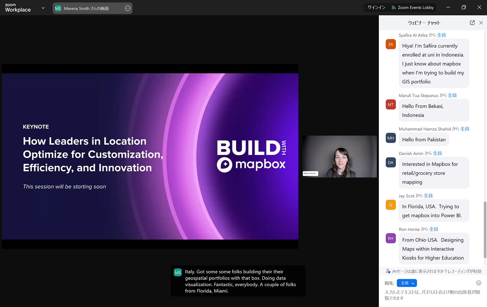
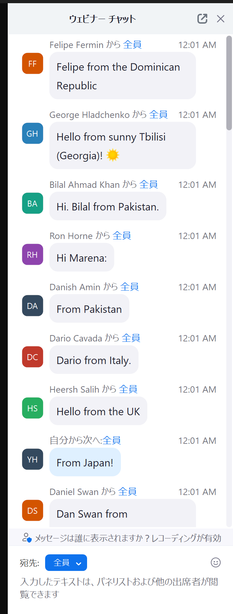
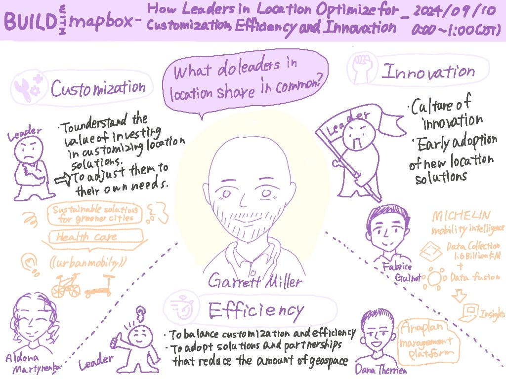
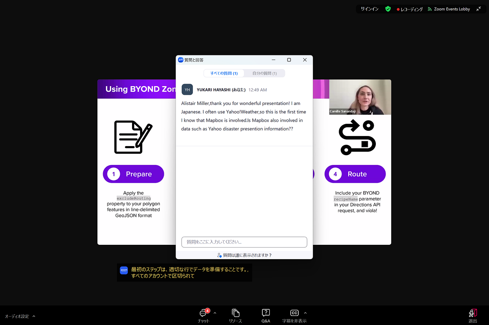
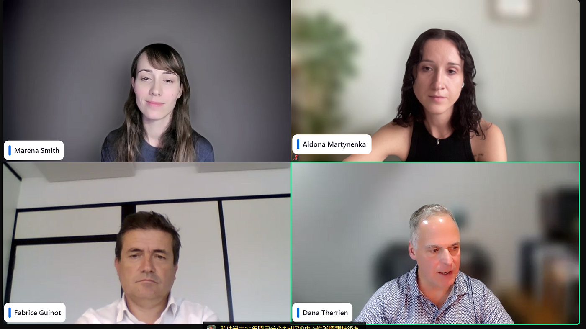
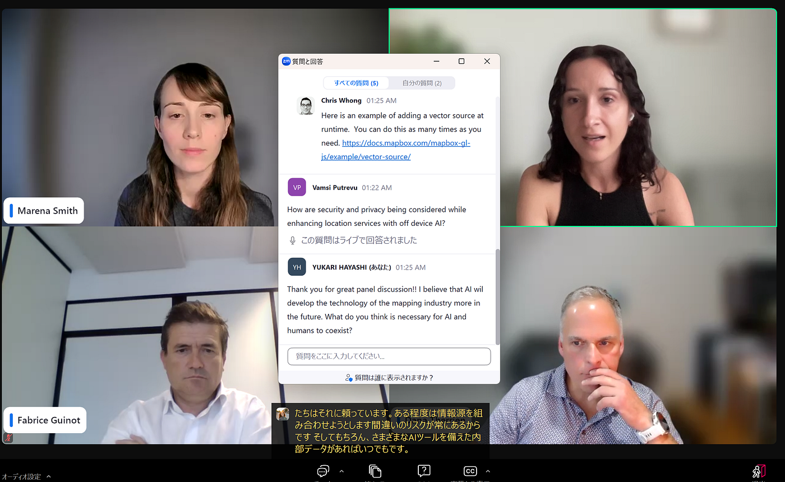
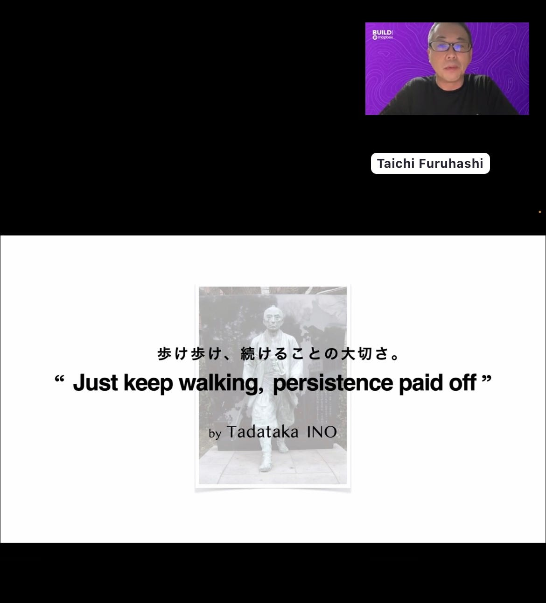
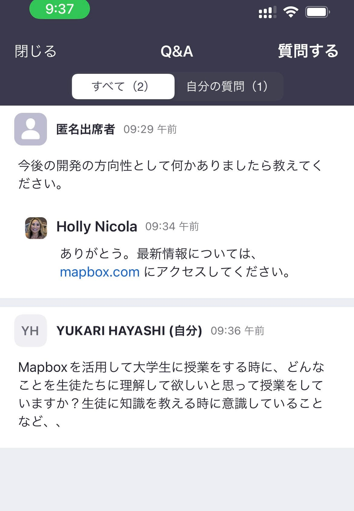
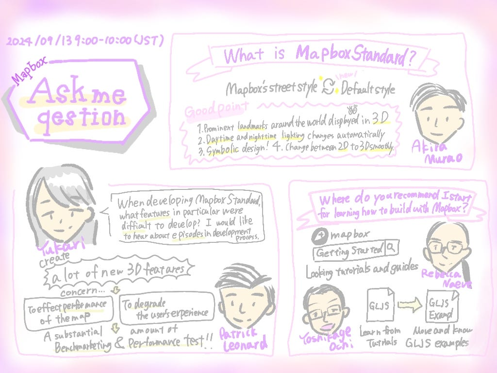
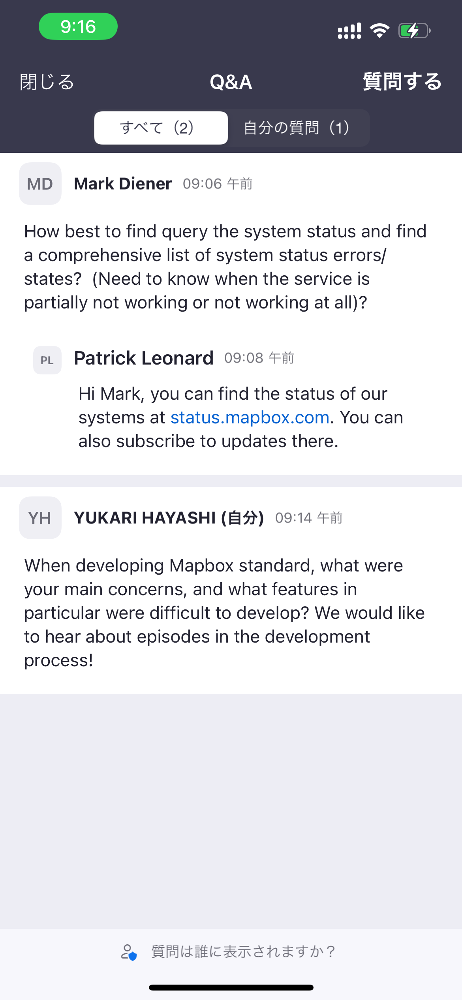

### BUILD with Mapboxに参加しました！！

### BUILD with Mapboxとは

[BUILD with Mapbox](https://www.mapbox.com/build-jp)とは最新の位置情報テクノロジーに関するオンラインカンファレンス。1週間にわたる豪華な基調講演やゲストスピーカーの登壇、プロダクトチームから詳細な最新情報、[Mapbox](https://www.mapbox.com/)コミュニティとのテクニカルセッションが行われました。

> 日時：2024/09/09(月)–2024/09/13(金)

> アジェンダ：イベントスケジュールは[こちら](https://www.mapbox.com/build/agenda-jp)からご確認ください。

> アーカイブ録画：当日の録画は[こちら](https://events.zoom.us/ev/AhSmTxyzWelfrM2qjkO7uJdl1gI9TvzWFegfoi5qFQ8x3w28nW1-~Asmoq3F3qn-uarUb9VYpvJSHZ14_nUJO_UxVQ6PeMAHMKlnJrAUHg92pzw)から視聴可能です。

#### 参加した講演の様子

日本時間でのスタートは9/10 0時からでした。イベントには、世界各国から多くの参加者が集まっていました。

最初の基調講演は、「How Leaders in Location Optimize for Customization, Efficiency, and Innovation(カスタマイズ、効率化、イノベーションを最適化する位置リーダーたち)」をタイトルに、９名のスピーカーたちが講演を行いました。

Garrett Millerさんは、位置情報リーダーに共通するものは「カスタマイズ、効率性、革命」だとおっしゃっていました。またMapboxのエンジニアチームを通じて、Mapboxの最新技術や最新情報の共有が行われました。

今回の講演からYahoo！天気に、Mapboxの技術が活用されていることを初めて知りました。今まで、Mapbox＝地図という抽象的なイメージしかありませんでしたが、日本での事例が分かり親近感が湧きました。→[https://www.mapbox.com/showcase/yahoo-japan-weather-disaster](https://www.mapbox.com/showcase/yahoo-japan-weather-disaster)（MapboxがYahoo!weather&disasterでどのように活用されているのかを確認することができます。）

続いて、Garrett Millerさんが話されていたテーマをもとにパネルトークが行われました。

Aldonaさんは、今後位置情報技術が発展していくにあたって、AIが活用されていくと話していました。そのため、AIと人間の共存、プライバシーやセキュリティについて質問しました。

> 開発がどうなるのかははっきりしていませんが、社内のデータを別のAIツールと共有することはありません。現時点では、それが正しい方法かどうかはわからないです。これは私たちがテストして試していることです。開発が進めば進むほど、多くのことが明らかになると思います。でも、現時点では、批判的に扱い、完全には信用せず、さまざまなソースを組み合わせてみることが重要だと思う。

Aldonaさんから上記の回答をいただきました。AIを使った新たなプロダクトの開発により、作業の効率化や正確性の向上につながればいいなと思います。

日付が変わり、9/12の9時からは、ゲストスピーカーとして古橋先生が登壇しました。講義タイトルは「Japan Documentation and Developer Tools （日本のドキュメントと開発ツール）」でした。古橋先生は、Mapboxとの出会いや大学生の講義でMapboxをどのように活用しているのかなどについて話されました。

古橋先生に、Mapboxを活用して大学生に授業するとき、生徒たちに何を理解してほしいと思い授業をしていますか？生徒に知識を教えるときに意識していることなど、、という質問をさせていただきました。

質問に対して、以下の回答をいただきました。古橋先生の生徒として、このようなことを意識して授業に取り組んでいきたいです。

> 地図というのは自分で作れるものだと自分で気づいている人はまだ多くない。だからこそ、国土地理院などの地図は与えられるものという認識ではなく、地図データを更新・デザインできることを知ってほしい。

> 地図は自分でデザインできる時代になったことを理解してほしい。

9/13の９時からは12名のゲストスピーカーによる質問会がありました。

Mapboxの最新技術に対する質問や操作説明、今後の開発などさまざまな質問に対して、スピーカーの方々が回答していました。１日目から学んできたMapboxについての知識をブラッシュアップする良い機会となりました。

### 感想

地図業界の中で最前線を走っているMapboxですが、私自身Mapbox関して知識不足な部分が多くありました。今回のオンラインカンファレンスを通じて、社会でMapboxがどのように使われているのかを知るきっかけとなりました。また、日常で当たり前に活用していた位置情報技術に対して、ありがたみを感じる機会となりました。

一方で、今回の会議のように専門的な英単語を聞き取り、即座に理解することは自分にとってとても難しいことだと感じました。そのため、私は講義中の質問で、技術的なことやMapbox製品に関するより深いことを聞くことができませんでした。今後も国際会議に参加にあたって、まずは日本語で地図に関する知識を学び、基礎を身に付けていきたいです。
