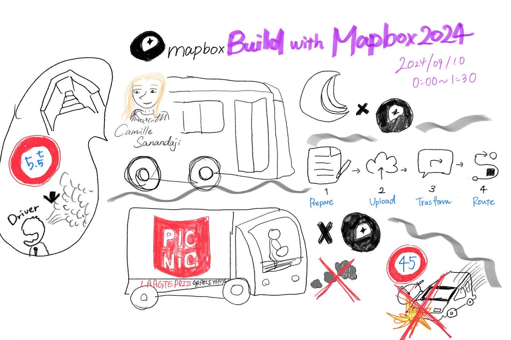
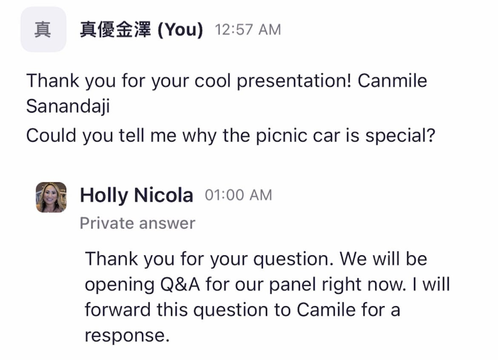
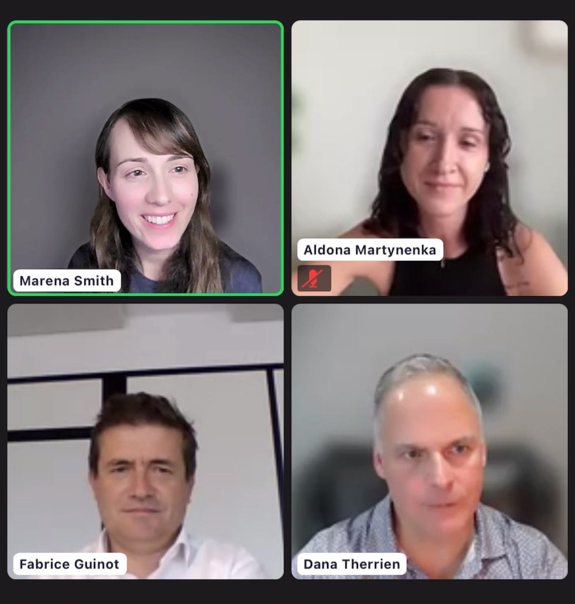
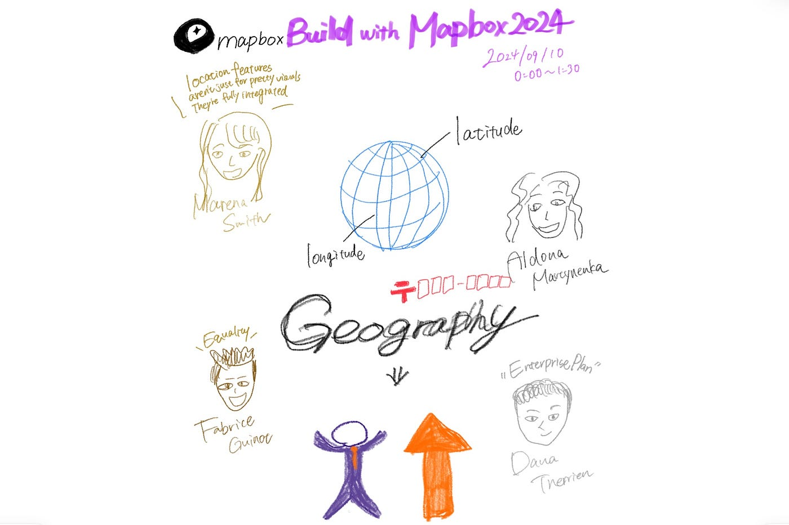
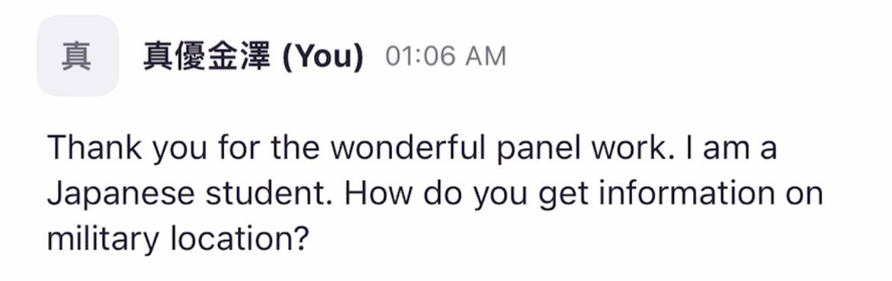
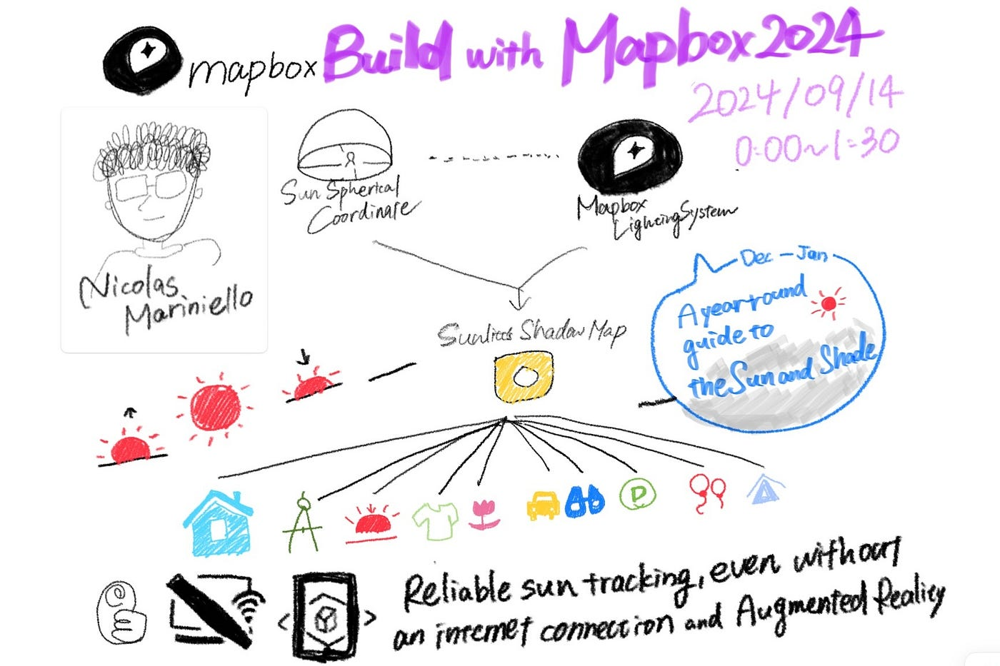
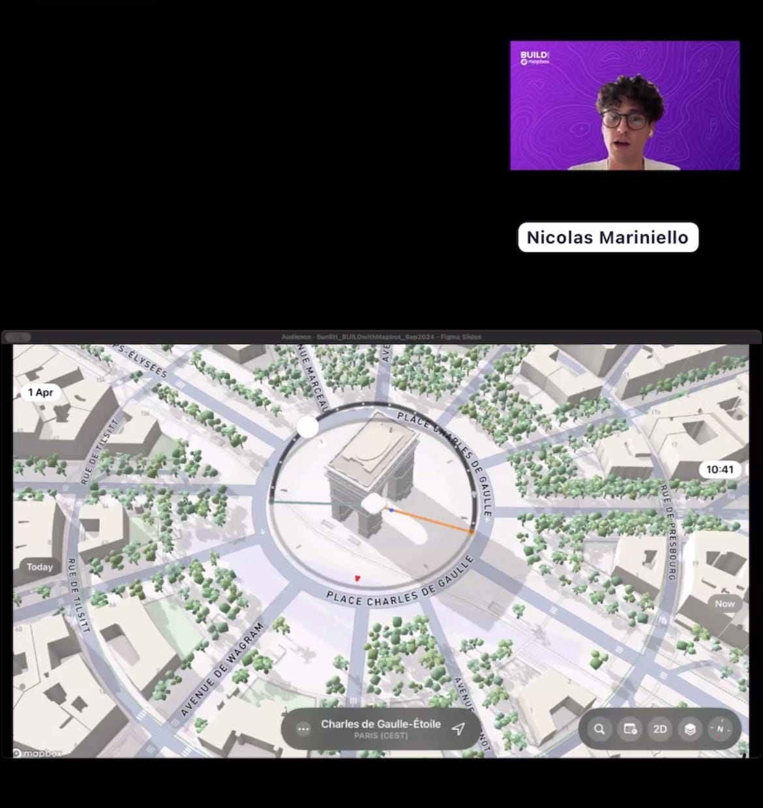
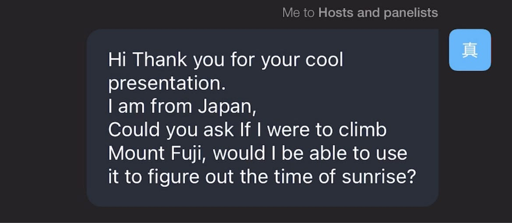

## BUILD with Mapbox 2024で学んだこと

世界各国から参加者の集うBUILD with Mapboxが

日時:2024年9月10日0:00〜9月14日2:00(日本時間)

場所:オンライン

にて開催されました。

“本当の位置情報テクノロジーリーダーになる”とはどういう意味なのかを考えさせられる1週間の会話と応用ワークショップでした。

詳細は以下のPermalinkとなります。

[BUILD with Mapbox 2024
BUILD with Mapbox: Leaders in Locationevents.zoom.us](https://events.zoom.us/ev/AhSmTxyzWelfrM2qjkO7uJdl1gI9TvzWFegfoi5qFQ8x3w28nW1-~Asmoq3F3qn-uarUb9VYpvJSHZ14_nUJO_UxVQ6PeMAHMKlnJrAUHg92pzw)

Day1 9/10 0:00–1:30

> **How Leaders in Location Optimize for Customization, Efficiency, and Innovation**

位置情報におけるリーダーとは何を意味するのかについて、位置情報技術の導入で大成功を収めた企業の事例をいくつかあげてくださいました。

### 1人目 Camille Sanandajiによる講演

【CORPORATE TECHNOLOGIES GROUP】

公共交通機関向けのナビゲーションソリューションについて、具体的には、バスや電車だけでなく、バンや大型建設車両などを含む混合車両の運用も行う交通機関のために、カスタムルーティングやナビゲーションを提供するソリューションを構築・維持する内容です。ニューヨークのパークウェイの一部では、特別な許可を得て大型車両が利用可能ですが、多くの地下道や橋が低い高さ制限や重量制限を持っているため、これらを避けることが重要です。ドライバーがこの複雑な道路ネットワークを完全に把握するのは難しく、リスクの高い区域を誤って使用する可能性があります。そこで、MapboxのナビゲーションSDKを活用し、独自のデータを基に特定の区域を回避できるカスタムナビゲーションが提供されます。これにより、大型車両オペレーターは適切なルート案内を受けることができるそうです。

[Project Management Implementation and Support | CTG — Corporate Technologies Group (ctgusa.net)](https://ctgusa.net/project-management-implementation-and-support/) （CTGについて）

【PICNiC】

ピクニックは、ユニークな配送バンを使って高効率かつ低排出の配達を行っていますが、これらの車両は最高速度が45km/hと制限されているため、高速道路での運転が困難です。また、道路状況の変化が車両に損傷を与える可能性もあります。ピクニックでは、地図スタジオを使用して、規制の変更やドライバーからのフィードバックに基づき配送ルートをカスタマイズし、コンプライアンスを維持しながら安全な運転をサポートしているそうです。

[Thuisbezorgd | Picnic](https://picnic.app/nl/thuisbezorgingen/) (Picnicについて)

→持続可能性を配慮した電動車両Picnicにおいて地理スタジオを利用してサービスが提供できるから。

### **2人目 Marena Smith, Fabrice Guinot, Aldona Martynenka, Dana Therrienによるパネルディスカッション**

上記のような企業が緯度経度や郵便番号レベルの細かい地理情報を利活用し市場評価を行うことで各地域でのビジネス機会を把握し、どの郵便番号エリアでより多くの成長機会を得ることができるのかを知ることができるそうです。また、サービスを提供するエリアを移動する（広げる）価値にについても検討していました。

→戦争地域等においても緯度や経度などの地理的情報があれば可能。

Day2 9/14 0:00–1:30

> **Developer Show & Tell**

#BuiltWithMapboxプロジェクトのShow & Tellコミュニティで、他のMapbox開発者と繋がりましょう。

### 3人目 Nicolas Marinielloによる講演

→使用可能。

感想

私自身2度目となる国際会議への出席はとても緊張しました。前回とは異なりオンラインでの開催は視聴側の雰囲気を掴めなかったり、pc不備でスマートホンを利用し参加してしまったことを反省してます。しかし、Mapboxがどのような活動をしているのかや国際規模の大きさを知ることができ、これからより専門性を持って研究室への取り組みができるきっかけとなりました。
