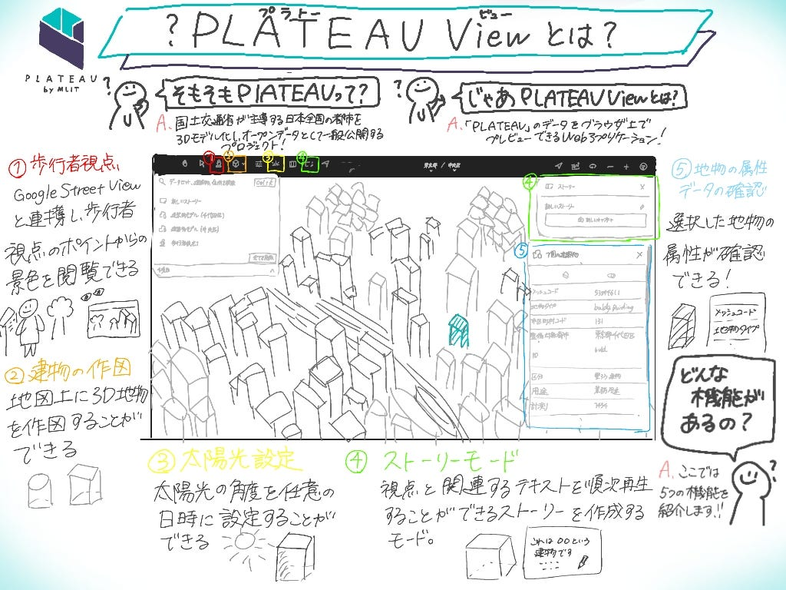
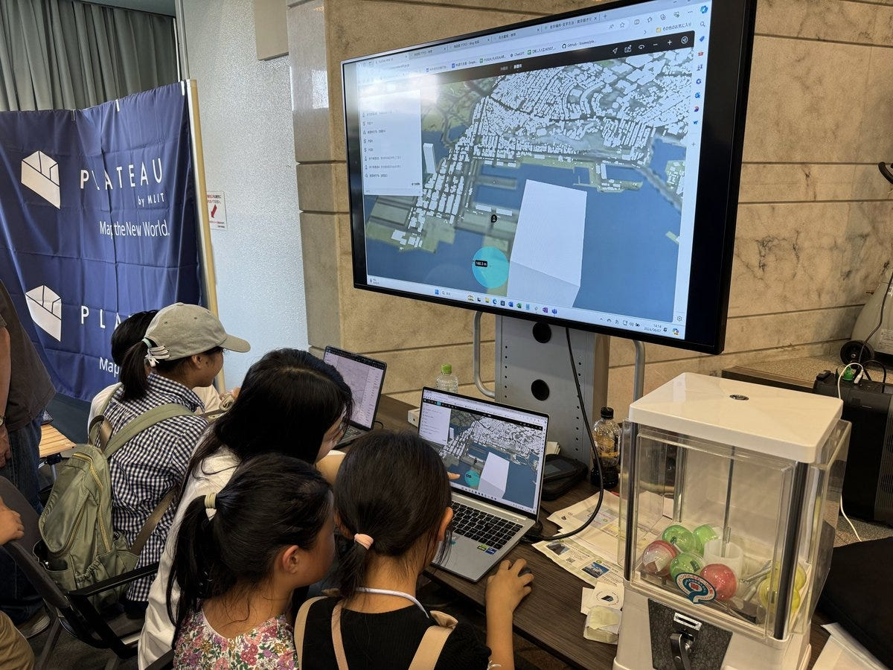

### **林が体験した夏休みの地図との思い出**

こんにちは。ドローン部3年の林です。

今回の週報では、林が夏休みにどんなことをしたのかについて書きました！次の週報では佐藤が夏休みに取り組んだことについて話します！

今年の8月7日・8日に開催された『こども霞が関見学デー』に、Eukaryaのインターン生として参加させていただきました。

#### 「こども霞が関見学デー」とは？

[こども霞ヶ関見学デー](https://www.mext.go.jp/a_menu/ikusei/kengaku/)は、霞が関に所在する各府省庁等の特色を生かし、子供のための展示等様々なプログラムを行うイベントです。
毎年、政府の施策に対する理解を深めてもらうこと、活動参加を通じて親子の触れ合いを深めてもらうこと、子供たちを対象に広く社会を知ってもらうことを目的に実施されています。

> 日程：2024/08/07,08

> 場所：霞が関に所在する文部科学省をはじめ、各府省庁等

約1,200人を超える親子連れが来場したと聞き、大盛況の2日間となりました。

Eukaryaは、「[Project PLATEAU](https://www.mlit.go.jp/plateau/)」のブースとして、[PLATEAU VIEW](https://plateauview.mlit.go.jp/)を使った建物探しゲーム・作図機能を用いた建築シミュレーションの紹介等を行いました。

#### そもそも「PLATEAU」「PLATEAU View」とは？

**PLATEAU（プラトー）**とは、日本の国土交通省が推進する都市データプラットフォームのプロジェクトです。3D都市モデルを整備・公開することで、都市計画や災害対策、まちづくりなどさまざまな分野で活用されることを目指しています。

**PLATEAU VIEW（プラトービュー）**は、PLATEAUのデータをプレビューできるウェブアプリケーションで、3D都市モデルの上に様々な情報を重ねてシミュレーションや分析が行えます。建物の浸水状況を可視化するために、浸水深のデータとPLATEAUのデータを重ね合わせることもできます。

#### **会場の様子**

私は１日目のみの参加でしたが、２日目には同じ研究室のメンバーである高井くんも参加していました。

高学年の小学生が多く参加していましたが、タイピング操作をすらすらとこなす子どもや、一度教えるだけですぐに習得し、楽しんで取り組む姿に驚かされました。現代の小学生のITスキルの高さと学習意欲の旺盛さを実感しました。

PLATEAU VIEWの大きな魅力の一つである3D建物モデルを表示させると、子どもたちからは「すごい！」「かっこいい！」という感嘆の声が上がりました。この反応を通じて、子どもたちと一緒にその魅力を共有できたことがとても嬉しかったです。

#### **感想**

今回、Eukaryaのインターン生として貴重な経験をさせていただきました！イベントを通じて、私自身も子供たちと同じように、地図の進化に感動しました。まだまだ学ぶべきことは多いですが、Eukaryaで得た知識を古橋研究室で活かし、また古橋研究室での経験をEukaryaに還元することで、双方の学びを深めていきたいと思っています。今後も、学んだ知識やスキルを自分の成長だけでなく、他の人にも役立てられるような行動を心がけていきます！
