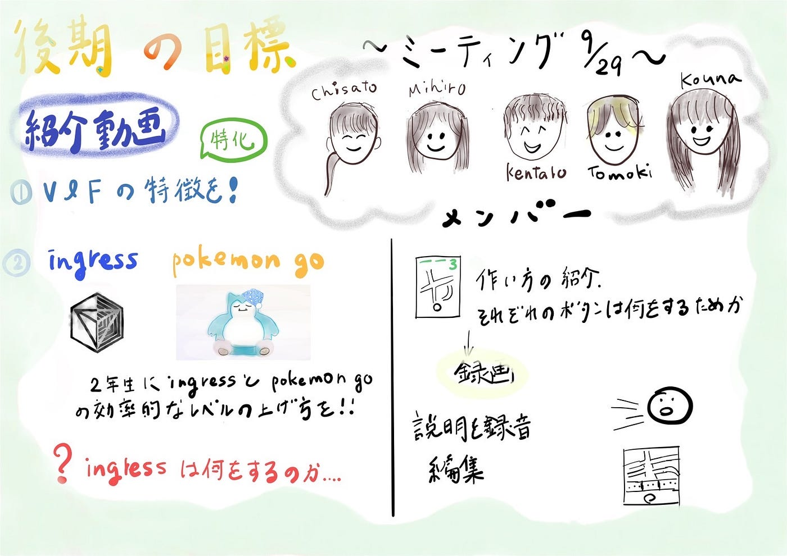

### 【V＆F週報】後期も動画作りの日々

お疲れ様です。3年の高井です。

今週は、後期のV＆Fの方向性を決める話し合いを行いました。その結果、後期では次の2つの内容の動画を作成することになりました。

**①V＆Fに特化した紹介動画**
→前期に作成した古橋研究室紹介動画では研究室全体を紹介したが、この動画ではV＆Fの活動内容にフォーカスする。

**②Ingress、Pokémon GOなどの位置情報ゲームの効率的なレベル上げの解説動画**
→来年度以降の古橋ゼミ生にも需要がある。また、Youtubeで検索してみたところ、Ingressのレベル上げに特化した解説動画はほとんどなく、あったとしてもかなり前にアップロードされたものしかなかったため、ブルーオーシャンであると思った。

前期に引き続き、後期も動画を作成していきたいと思います。

> グラレコ

