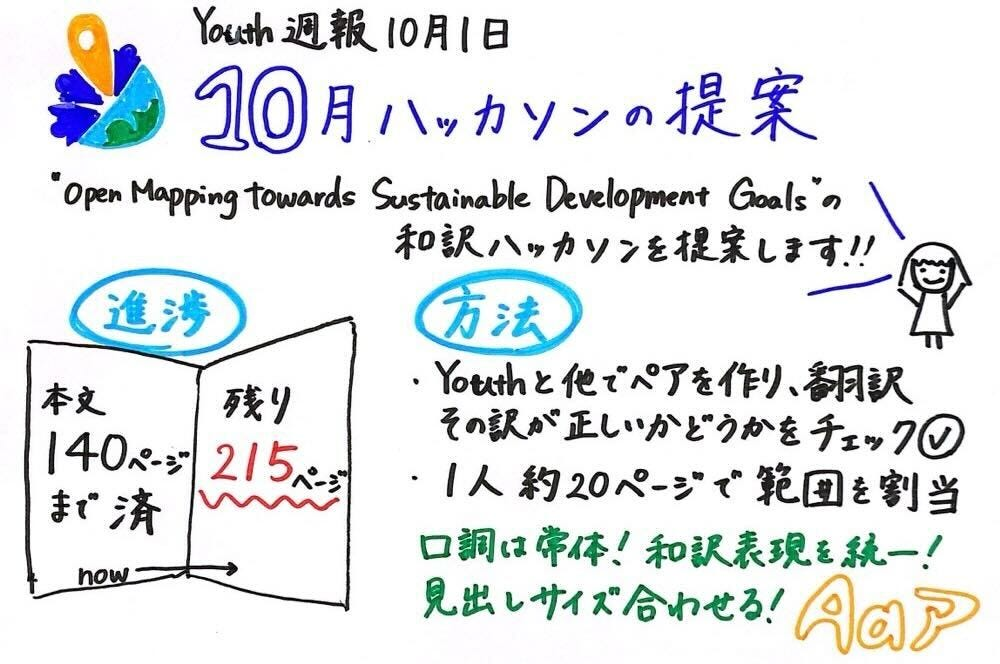

### 【Youth週報】10月のハッカソンを提案します！

こんにちは！4年の上原です。最近、朝晩がすっかり冷え込んでいるので、毎日着る服に悩んでいます。

### 提案

後期のYouthの活動は、10月ハッカソンとして、「[Open Mapping towards Sustainable Development Goals](https://link.springer.com/book/10.1007/978-3-031-05182-1?fbclid=IwAR0mxXoILYo2Ar1akXx7F3QDRs6TqVAv7CIYDUPNo6YihQb4pQ0NFWNFV_g)の和訳」を提案し、計画を考えることから始まりました。

[Open Mapping towards Sustainable Development Goals
This open access book collects the experiences of young people in YouthMappers to address pressing issues facing their…link.springer.com](https://link.springer.com/book/10.1007/978-3-031-05182-1?fbclid=IwAR0mxXoILYo2Ar1akXx7F3QDRs6TqVAv7CIYDUPNo6YihQb4pQ0NFWNFV_g)

この和訳は私たちYouthMappersAGUが2023年の後期から取り組んできたものです。

#### 意義

そもそもの和訳の意義としてこのようなことが考えられると思います。

- 他言語化によって、YouthmappersやOSMチームの取り組みの日本での認知度を向上させ、日本で同じようなケースに直面した時の先行研究として理解される

- 他の国・地域の取り組みを知ることで今後の活動のヒントになる

- 活動への理解が深まり、海外のマッパーたちとの話題のきっかけになる

#### 進捗

2023年～2024年9月までに、全370ページ（目次とインデックスを除く）中140ページまで、担当を割り当てて和訳が進んでいる状況です。

今までの和訳資料は[Googleドライブ](https://drive.google.com/drive/u/0/folders/1Qp1IYP81VfWuVNOYUUY5OyY2pMRHmxDu)及び[GitHub](https://github.com/furuhashilab/Open-Mapping-towards-Sustainable-Development-Goals)にまとめてあります。バックアップも保存済みです。
※Googleドライブはゼミ生のみアクセス可

そのため、残り215ページをゼミ生12名で分担することを提案します。

#### 方法

1人20ページほどの分量で担当を割り当てました。
※本文中のページ番号と対応しています。PDFの番号ではないので注意！

①林ゆ： p.141~159
 高井： p.161~179
②佐藤： p.181~201
 末木：p.203~223＋№2,№3のやり残し
③金澤：p.224~245＋№2のやり残しと№3の修正
 福田：p.246~266
④上原：p.267~285
 滝沢：p.287~304
⑤伊藤：p.305~324＋№2,№3のやり残し
 古内：p.324~340
⑥深水：p.341~358
 林み：p.359~370＋№1~No3までの担当箇所

和訳が完了したら、[Googleドライブ](https://drive.google.com/drive/u/4/folders/1Qp1IYP81VfWuVNOYUUY5OyY2pMRHmxDu)に格納し、バックアップもとってほしいです。バックアップも同様に[Googleドライブの中のフォルダ](https://drive.google.com/drive/u/4/folders/1InkHcuNs0U0p7oZnJhfVfrYEhiSShqM6)へ収納、[Githubのイシュー](https://github.com/furuhashilab/Open-Mapping-towards-Sustainable-Development-Goals/issues)にもぶら下げておいてください。

そして、他のサークル所属の人が急に割り振られてもびっくりしてしまうと思うので、Youthとペアにしてサポートをできる体制をとりたいと考えています。担当範囲は1人1人個別に翻訳してもらいつつ、Youth所属の6名はサポートもお願いします！

＜Youthがやること＞

- 自分とペアの分の和訳用Googleドキュメントの作成

- 和訳が正しいかどうかの確認

- 和訳済みのドキュメントがドライブに保存されているかどうか確認

- 困った時のサポート

ゼミ生リストの順番で機械的に割り振って決めてしまったので、もし何か問題があれば教えてください。

#### 和訳をする時のルール

また、和訳する際の注意点は以下の通りです。

- [DeepL](https://www.deepl.com/ja/translator)などの翻訳ツールを使ってよい

- 口調は**常体（「～だ／である」調）**に統一する

- 単語の和訳表現を統一させる
例）”map” の訳を、「地図」「マップ」と同一本文中で表現が異ならないように注意する

- 見出しのサイズを英語と日本語で合わせる（メニューから選択する）

- Referenceの中身は和訳せず、そのままコピペでよい

- 訳し方が分からない単語等があればコメントをつけておく

Youthだけの力では和訳完了が遅くなってしまうので、皆さんのお力をお借りしたいです！ぜひお手伝いお願いします！

#### グラレコ

