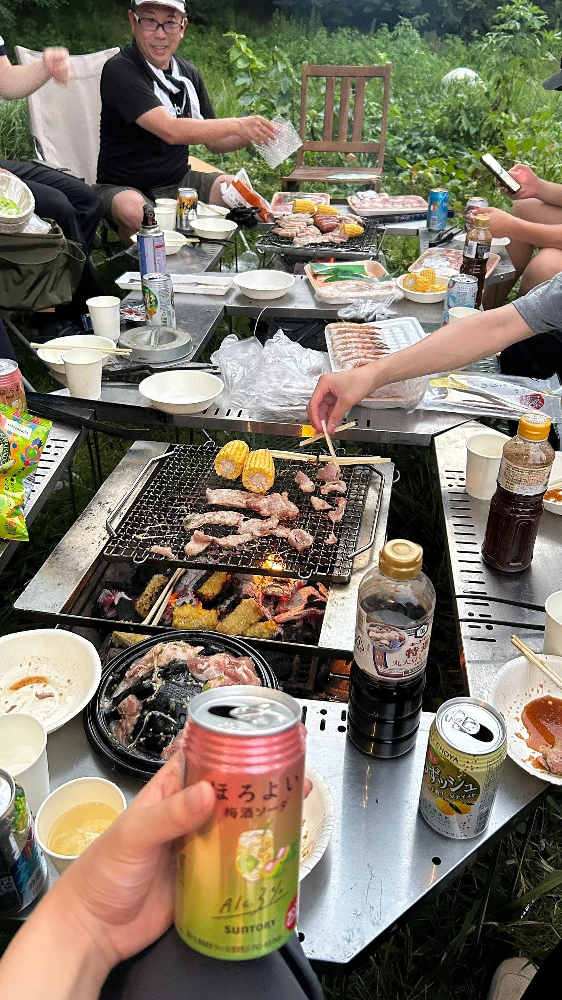
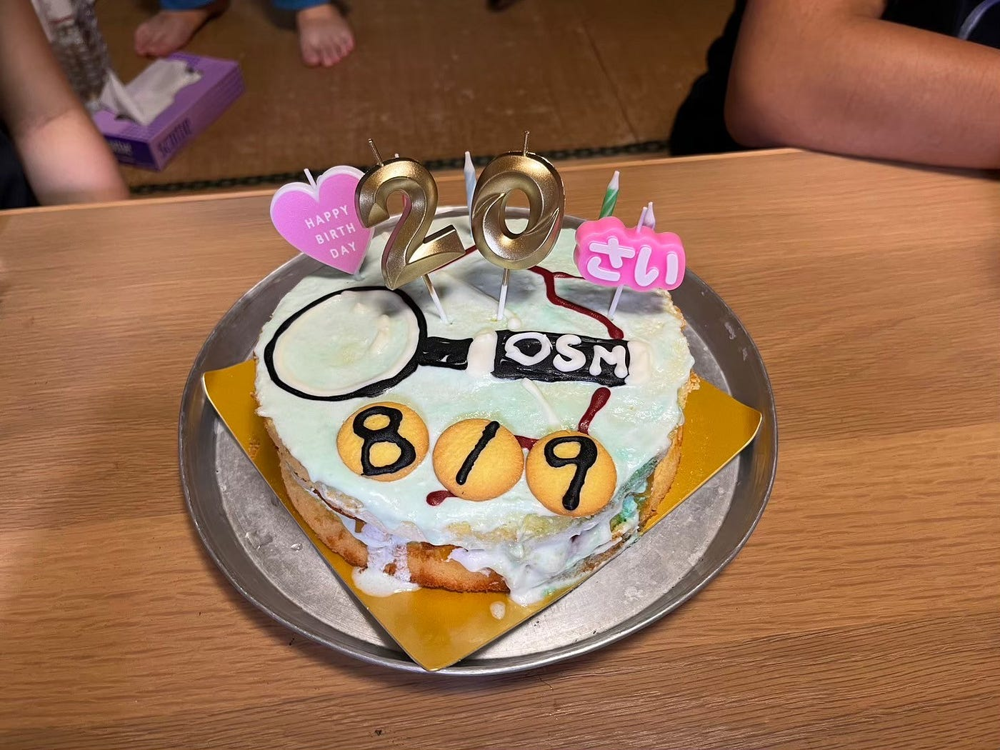
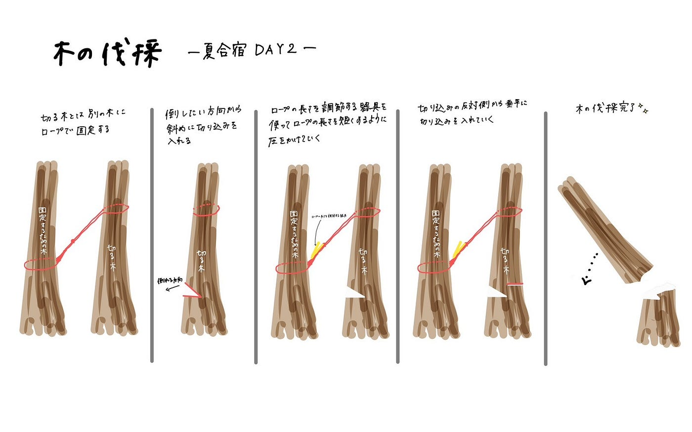
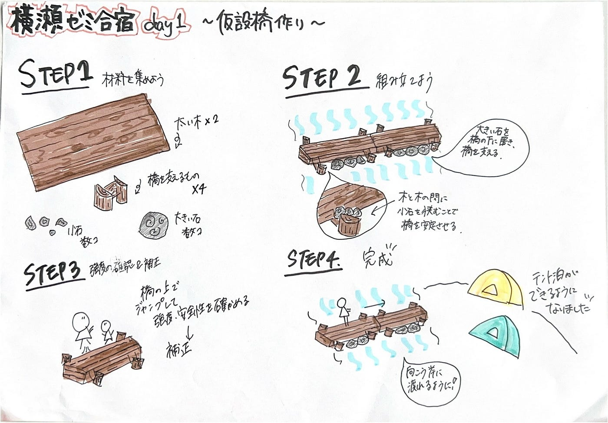

#### デザイン部週報 古橋研究室ANNEXでの夏合宿

こんにちは、三年の福田です。

夏休みが終わり、後期の授業が始まりました。最初の週報は夏休みに行われた合宿についてまとめます。

８月３日〜５日の三日間、３、４年生で秩父横瀬町にある[古橋研究室ANNEX](https://maps.app.goo.gl/DuUxWzyxqTX1gpN98)で過ごしました。

**一日目**

お昼頃に集合しました。川を渡れるように、午後からは橋を作りました。

こんな感じでうまく調整しながら、靴が濡れないように注意しながら橋を作ることができました。（サンダル必須）少ししか写ってないが、橋を渡るとみんなが張ったテントがあります。

買い出し

準備が終わり、BBQの準備をするために何人かは先生と一緒に買い出しに行きました。

そして一日目に重要なことはゼミ論の構想発表で、具体的にどのような活動を行うかこれまでに考え、まとめるようにします。GitHubにある[卒論／ゼミ論のルール](https://github.com/furuhashilab/README/issues/5)をよく確認しましょう。

**二日目**

ツリーハウス作りの手伝いをしました。子供達にとって秘密基地となるような場所を作ります。周りの木を切り、視界をよくしていきました。

**三日目**

OSM20歳のケーキを作りました。8月9日よりも前倒ししたので、我々が世界で最初のイベントでした。[https://birthday20.openstreetmap.org](https://birthday20.openstreetmap.org)

まとめ

テント泊は千年の森のキャンプを通じて、素早く張ることができ、泊まることにも慣れました。三日間通じて、みんなで協力することが多く、自由行動も多かったです。移動の際に、Stravaを使って記録したり、写真を撮るなどして後から振り返ることも重要だと感じました。

グラレコ

