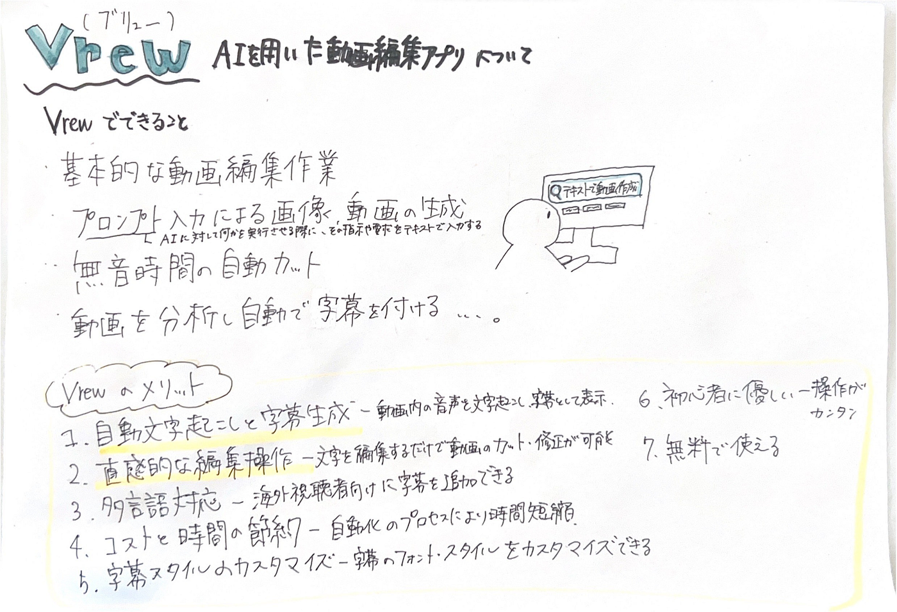

### AIを用いた動画編集【V＆F週報】

こんにちは、4年の深水です。

今週は[Vrew](https://vrew.ai/ja/)という動画編集アプリをVF内で紹介したので、これをゼミ生にも共有します。

VrewではAIを用いた動画編集が可能で、基本的な動画編集作業のほか、

**・プロンプト入力による画像、動画の生成**

**・セリフ入力によるAI音声の生成**

**・無音時間の自動カット**

**・動画を分析し自動で字幕を付ける**

などが可能です。

プロンプト入力による画像、動画の生成やセリフ入力によるAI音声の生成はchatGPTなどでも使えますが、Vrewを使えば、動画編集を行いながら他のアプリを起動せずにこれらのことを行えます。

また、個人的に便利だと感じているのが**無音時間の自動カット機能**と**動画を分析し自動で字幕を付ける機能**です。

これまで使用していた[Davinci Resolve](https://www.blackmagicdesign.com/jp/products/davinciresolve)では、これらの作業を手動で行う必要があったため、かなりの時間を消費していました。

このように便利なVrewですが、使ってみると

**・Davinci Resolveのようにオフラインで使用することはできない**

**・スマホでも使えるが、スペックによりすごく重くなる**

**・効果音のレパートリーが少ない**

などのデメリットも発見しました。

基本的な使用は**無料**なので、ぜひ使ってみてください。

