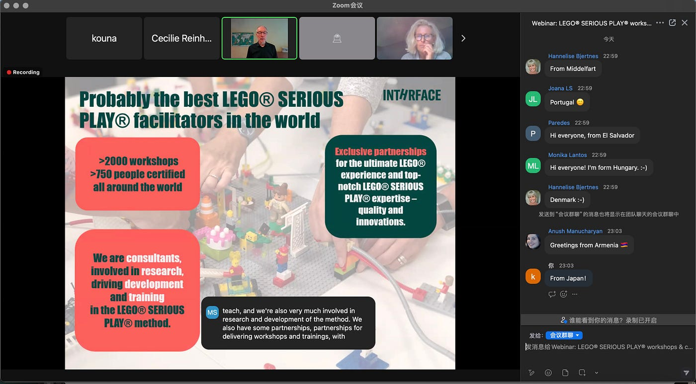
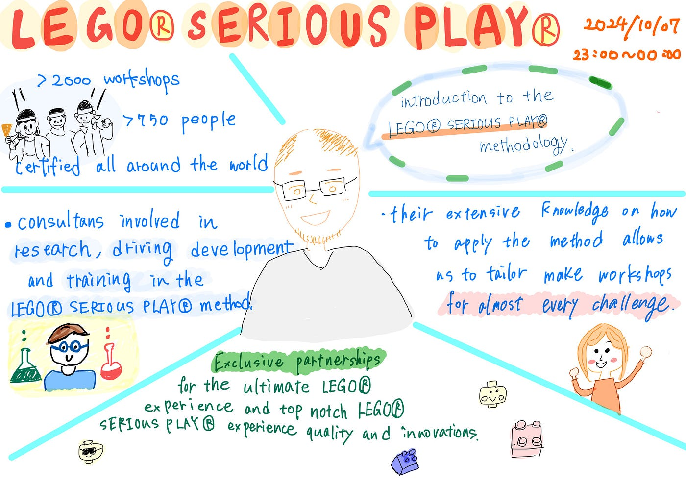
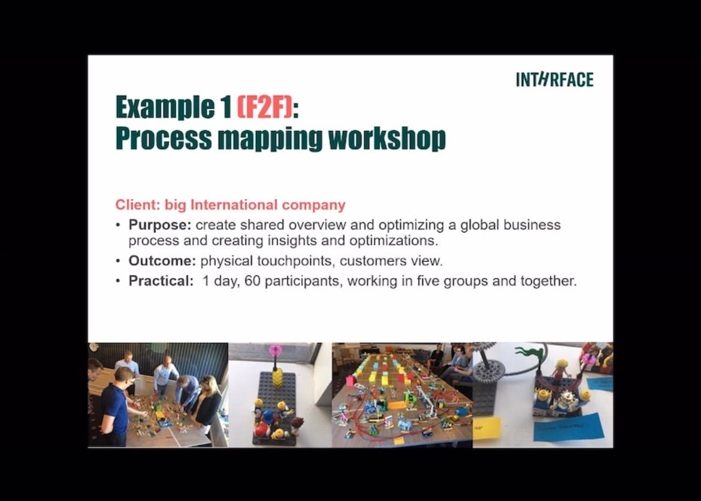
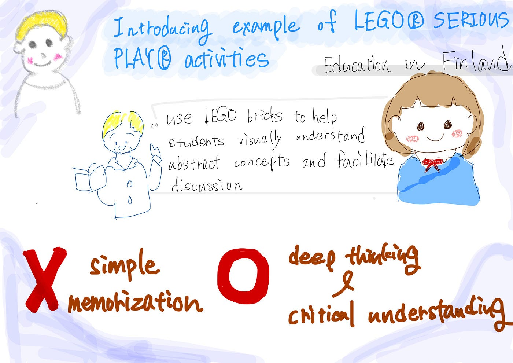
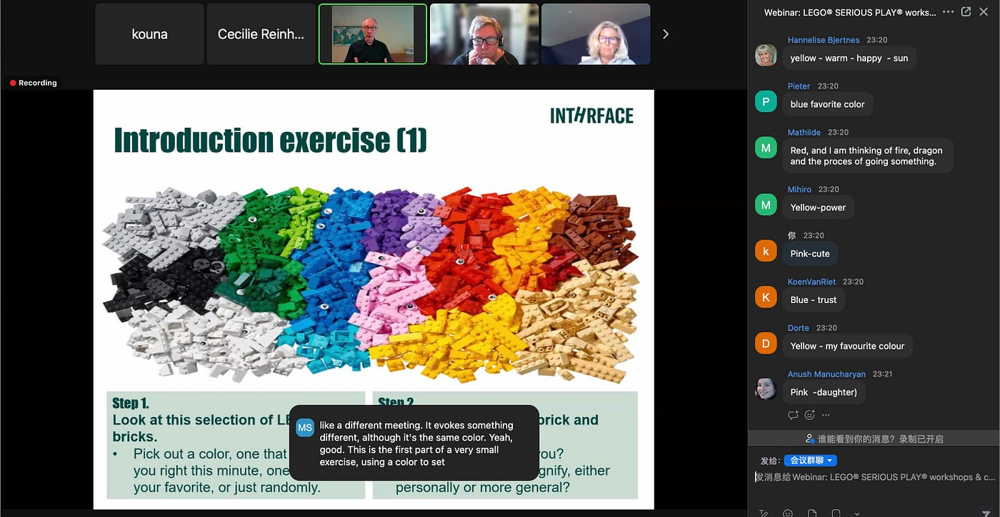
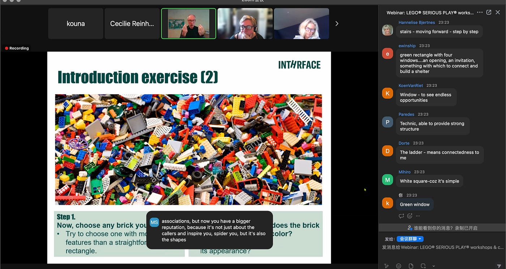
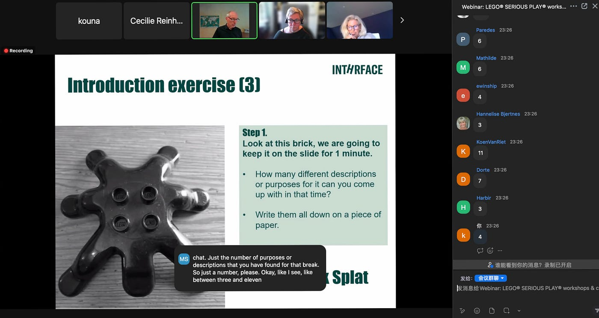
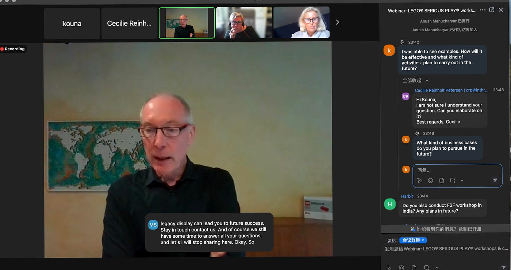
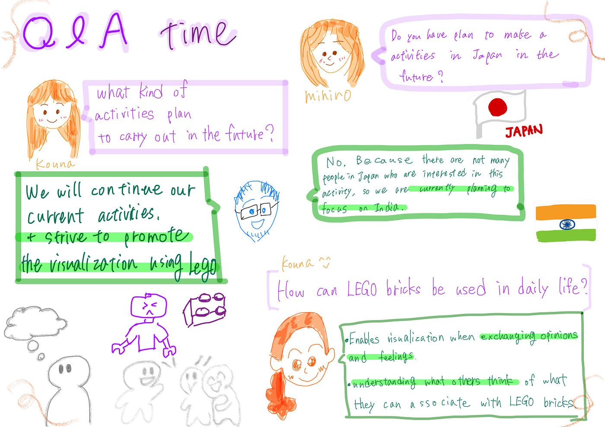

### LEGO® SERIOUS PLAY® Online Webinarに参加しました！

こんにちは、三年の福田です。

**LEGO® SERIOUS PLAY®**

LEGO® ブロックが想像力をいかに簡単に刺激するか、そして、言いたいことに意味を持たせたいときにこれがいかに役立つかを学ぶことができます。そして、LEGO® SERIOUS PLAY®** と呼ばれるこのユニークなクリエイティブ ツールが、現在の課題や将来の課題に効果的かつ想像力豊かに対処するためのフレームワークをどのように提供するのかについて理解することができます。**

・日時：10月7日 日本時間23：00〜24：00

・ウェブサイトは[こちら](https://inthrface.com/en/webinar/)から確認できます

・録画はできないと回答されたため、スクショでまとめます

**参加した講演の様子**

最初に簡単にどこから会議に参加しているのか紹介しました。

初めの講演内容は、LEGO® SERIOUS PLAY®の紹介から始まりました。簡単に内容を日本語訳すると、

> Marc Sonnaert:

> 世界中で**750人の認定されたスタッフ**がいて、**2000回以上のワークショップ**をしてきました。彼らは、レゴブロックを使って問題解決やアイデア創出を行うためのワークショップをし、参加者がブロックを組み立てながら、自分の考えや意見を視覚的に表現することで、チーム内のコミュニケーションを冷静に、新しい発想や解決策を考えることを目的としています。主に企業の戦略立案やチームビルディング、教育、非営利団体での協力促進などに活用されています。

次は発表者が代わり、実際にどのような活動をしているか紹介されました。

他にも色々な活動が紹介され、フィンランドの教育現場で行われるレゴブロックを使った活動が印象に残りました。レゴブロックは決まった形のものを手順通りに作るという印象が強かったので、このようにさまざまな場面で使えることに驚きを感じました。

> In Finland, LSP is used in educational settings. Teachers use LEGO bricks to help students visually understand abstract concepts and facilitate discussion while teaching complex topics. In history and science classes, the activity involves students independently building models with the blocks and discussing them. This promotes deep thinking and critical understanding rather than simple memorization.

> （フィンランドでは、教育現場でLSPが活用されています。教師が生徒たちに複雑なテーマを教えながら、レゴブロックを使って抽象的な概念を視覚的に理解させ、ディスカッションを進めます。歴史や科学の授業で、学生が自主的にブロックを使ってモデルを作り、議論しながらという活動が行われています。これにより、単純暗記ではなく、深い思考と批判的な理解を進められています。）

次には、レゴブロックを使った簡単なゲームが行われました。

皆さんはこのゲームでそれぞれ連想できること、考えることがあるかと思います。会議に参加した人でもみんな違うことをイメージしたことが回答からもわかると思います。このゲームを通じて、自分とは違ったこんな考えをする人がいるんだ、自分は気づくことはできなかったことに簡単に理解ができました。

最後にQ＆Aタイムが取れました。私たちがした質問を集めMarc Sonnaertさんに伝える形でした。

質問をうまくまとめることができなく、この後また改めて質問し、回答をもらうことができました。その内容を日本語でまとめます。

こうな Q：LEGO® SERIOUS PLAY®は今後どのような活動をする予定ですか？新たな挑戦をするなどの予定はありますか？

A：今の活動は継続して続けます。レゴブロックを使った問題解決やチームビルディングのアイデアを可視化することを教育だけでなく、企業などでも進めることに努力します。

Q２：LEGO® SERIOUS PLAY® は私の日常でどのように応用することができますか。

A：身近ですと、家族や友人と意見や感情を交流する際に可視化が可能になったり、レゴブロックから連想できることを他人の考えることを理解することに応用することができます。

同じく三年のみひろもこの会議に参加していてその内容もまとめます。

Q：日本ではLEGO® SERIOUS PLAY®の活動を行う予定はありますか。

A：日本ではまだ興味がある人や知っている人が少ないため、現在は日本で活動を進める予定はありません。今後は、インドを中心に活動を行う予定です。

**感想**

今まで、レゴブロックはおもちゃというイメージしかなく、教育等で使えるとは思ったことはなかったです。しかし、今回の講演に参加して、レゴブロックを使った活動実例を見るなどして、それを使って色々な発想を可視化できることに気づくことができました。また、まだまだ日本ではレゴブロックの活動を知らない人が多く、日本では活動できないとの話だったので、もっとたくさんの人に知ってもらうように宣伝を進めたいと思いました。

ゼミでの活用を考えた場合、例えば私たちの位置情報確認ゲームのロゴをレゴブロックで作ったり、ドローンを作ったり、テントを作ったりしてどのような建て方をするのか、みんなはどのようなものを想像するのかシェアすることができるのではないかと思いました。

・LEGO® SERIOUS PLAY®についてのパンフレットも添付します。
