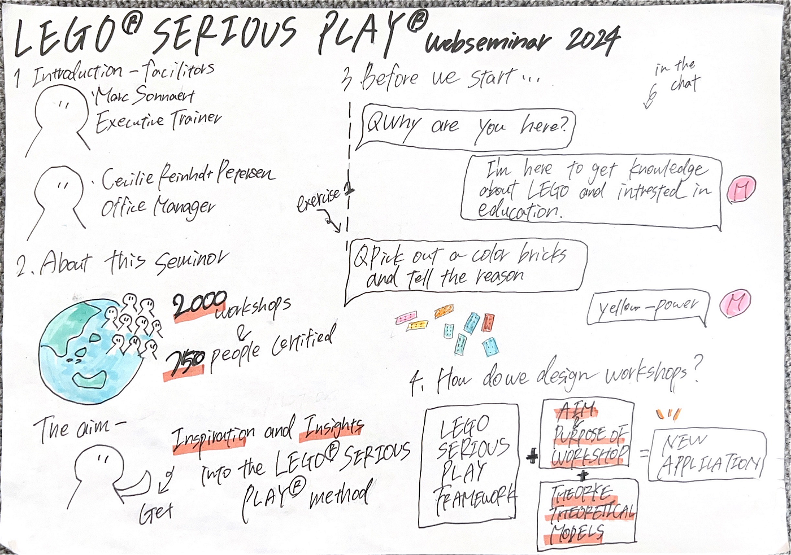
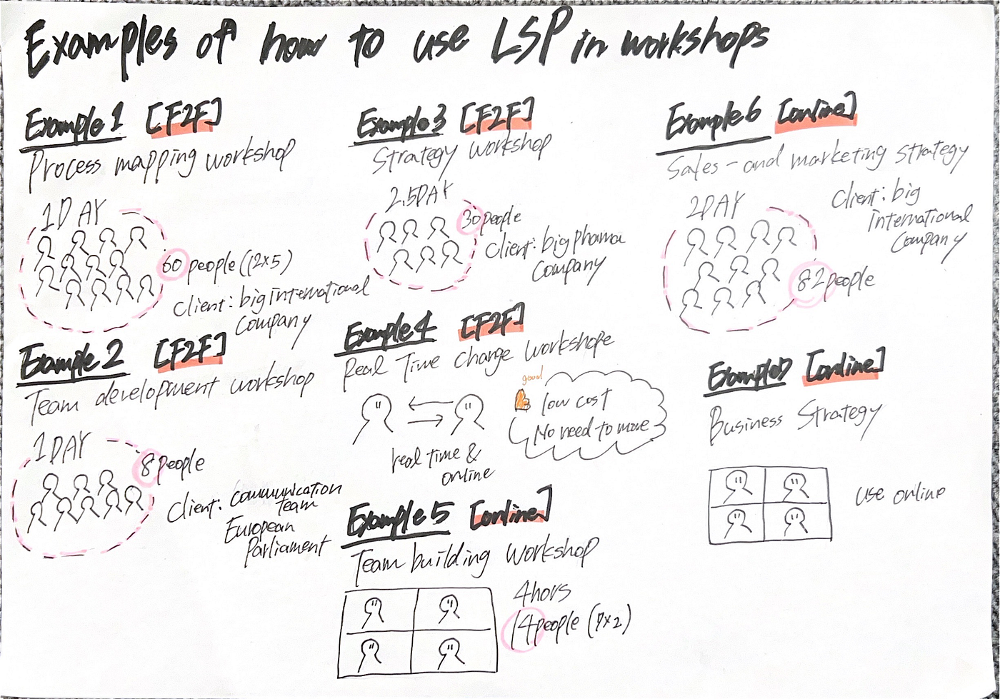
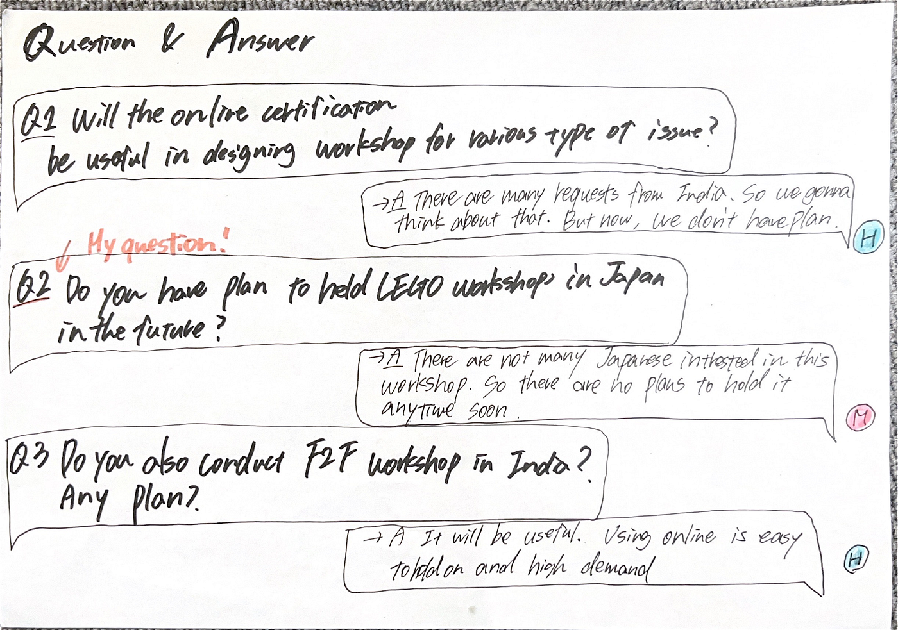
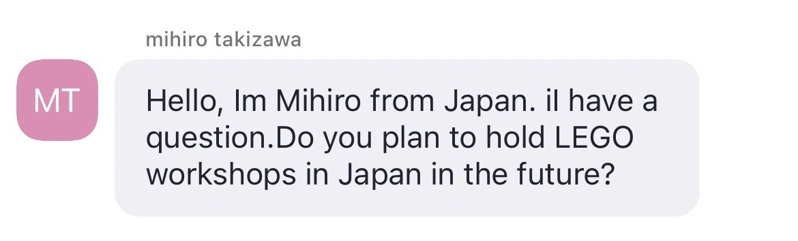

### LEGOのセミナー参加報告

こんにちは、3年の滝沢です。

この記事では、LEGO SERIOUS PLAY webseminarの詳細と参加した感想を書きます。セミナーの詳細は以下の通りです。

LEGO SERIOUS PLAY webseminar

日時：2024年10月7日16：00～17：00 CEST（日本時間23：00～24：00）

場所：オンライン開催

開催者：Marc Sonnaert氏

内容：⑴LEGO SERIOUS PLAYメソッドの理論と歴史⑵LEGO SERIOUS PLAYのエクササイズ・メソッドの紹介⑶LEGO SERIOUS PLAYを始める方法

[詳細Permalink](https://inthrface.com/en/webinar/?utm_source=ActiveCampaign&utm_medium=email&utm_content=Your%20LEGO%C2%AE%20SERIOUS%20PLAY%C2%AE%20webinar%20is%20tomorrow&utm_campaign=%233%20Day%20before%20reminder)⇓

[LEGO® SERIOUS PLAY® Online Webinar (Free) — Inthrface
Join our free webinar and learn all you need to know about our workshops or before signing up for one of our LSP…inthrface.com](https://inthrface.com/en/webinar/?utm_source=ActiveCampaign&utm_medium=email&utm_content=Your%20LEGO%C2%AE%20SERIOUS%20PLAY%C2%AE%20webinar%20is%20tomorrow&utm_campaign=%233%20Day%20before%20reminder)

※ZOOM中のこのセミナーの資料は他に共有してはいけないとのことなので、セミナーの様子のスクリーンショットはありません。

> 第１講演 LEGO SERIOUS PLAYについてのイントロダクション

⑴２名のファシリテーターの紹介→管理者トレーナーのMarc Sonnaert氏とオフィスマネージャーのCecilie Reinholt Petersen氏の紹介がありました。

⑵このセミナーの目的について→参加者がLEGO SERIOUS PLAYに関するインスピレーションと洞察を得るため

⑶このセミナーのルール→①カメラはオンでミュート②質問はチャット機能のみ③セミナー中は録画・写真撮影は禁止

⑷3つの参加型演習問題→１つ目は、色のついたブロックを選びその理由を問うもの。2つ目は様々な形のブロックから１個選び理由を問うもの。3つ目は、あるブロックの使い方が何種類あるかを問うもの→この問題は実際にLSPで利用されている。

⑸LEGOのワークショップの設計について→ワークショップの目的と目標＋理論と理論モデル＝新しいアプリケーション

> 第２講演ワークショップでLSPを使用する方法の例と認定を受ける方法

⑴執行例１プロセスマッピングワークショップ→大手国際企業がクライアント。共有の概要を作成し洞察と最適化を図ることにより物理的なタッチポイントと顧客評価を得ることができる。ワンデイで参加者60人の５つのグループに分かれて行う。

⑵執行例２チーム開発ワークショップ→コミュニケーションチームと欧州議会がクライアント。チームの現状を理解し、チームがどのように協力するか、期待される結果を目的としてチーム課題に関する共通言語と共有チーム開発を行う。ワンデイで参加者８人で実施

⑶戦略的ワークショップ→大手製薬会社がクライアント。４年間の戦略を共同で作成し、新薬を世界規模で発売することを目的とし、戦略計画と課題・機会の優先順位付けを得る。2.5日間で参加者30人で実施

⑷リアルタイムワークショップ→対面とオンラインのコラボで実施。低コストで移動不要、材料費が低いことが利点。

⑸ビルディングワークショップ→リモートでワークショップを行い、リモートワーク環境でのコラボレーションの向上を目指す。4時間で参加者14人、２つのグループに分けて実施

⑹販売及びマーケティング戦略→大手国際企業がクライアント。ワークショップのパフォーマンスを分析・評価・革新する。２日間で7時間、参加者82人で実施。

⑺ビジネス戦略

> 第３講演QandA

Q1オンライン認定は、様々なタイプの問題に対するワークショップの設計に役立ちますか →A役に立つであろう。オンラインは移動不要で簡単にできるため、需要が高い。

Q2日本でLEGOワークショップを開く予定はありますか。 →Aこのワークショップにそもそも興味のある日本人が少ないため、近い将来開催するお帝はない。

Q3インドでワークショップを開く予定ですか。何か今後のプランはありますか。
→AインドでF2Fのワークショップを開いてほしいというリクエストがたくさんあり非常に需要が高いため今後検討する。今現在はワークショップは開いてない。

LEGO SERIOUS PLAYについて補足資料以下⇓

感想

今回、２回目の国際会議に参加しました。１回目は昨年2023年秋の FOSS４G bkkに参加しており、多くの国々の方々が出席し講演数も多く大規模開催で圧倒されたことを覚えています。当時はゼミに参加する前だったので内容に追いついていくことにとても必死で、様々な国の英語を聞き取るのも難しかったです。今回はオンラインだったので落ち着いた雰囲気で参加することができましたが、登壇者がヨーロッパの人だったので普段慣れている英語と異なり若干聞き取りにくかったです。今後も様々な国際会議に出席したいので、いくら空間情報について知識はあっても内容を理解できなかったら意味がないので、様々な国籍の人の英語を聞き取れるようになる必要があると感じました。今回の会議は１時間と短かったので、数日開催される会議にも出席したいと思いました。会議の内容は誰もが知っているLEGOについてだったので理解しやすく、本来子どもの遊びに使われるものが私の興味のある教育分野で活躍する可能性があると知り興味深かったです。日本ではLEGO SERIOUS PLAYの開催予定はないらしいですが、調べてみるとどうやら日本に子どもが通うLEGO教室があり、子どもの頭脳を鍛える場所として活躍しているということが分かりました。今後のLEGOの教育現場での活躍に期待です。
