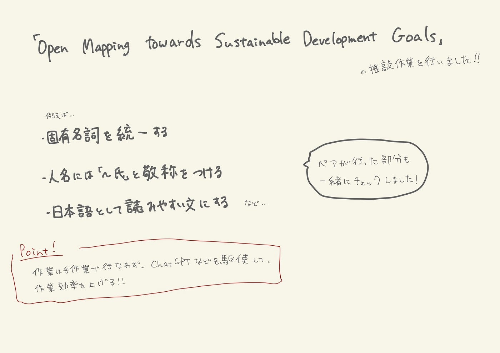

こんにちは！3年の林です。最近は、やっと新学期にもだいぶ慣れてきて、課題に毎日追われています。

まずは、先週のハッカソンの翻訳作業、ありがとうございました！おかげ様で全て、訳すことができました。

ということで、今週のYouthの活動は、先週、和訳作業が完了した、

「[Open Mapping towards Sustainable Development Goals](https://link.springer.com/book/10.1007/978-3-031-05182-1?fbclid=IwAR0mxXoILYo2Ar1akXx7F3QDRs6TqVAv7CIYDUPNo6YihQb4pQ0NFWNFV_g)」の推敲作業でした。

主に、翻訳が完了した部分で、表記の揺れを統一しました。

以下の点を中心に推敲作業を行いました！

・固有名詞を統一する（無理にカタカナにせず、英語表記にする）

・人名には「〜氏」と敬称をつける

・日本語として読みやすい文にする

これらの作業を一から手作業で行うのは大変かつ、手間がかかるので、上手くChatGPTなどの媒体を利用して作業を行いました。

必要に応じて、色々なテクノロジーを駆使して作業して、これからは、どんどん作業効率を上げていきたいです！

グラレコ

