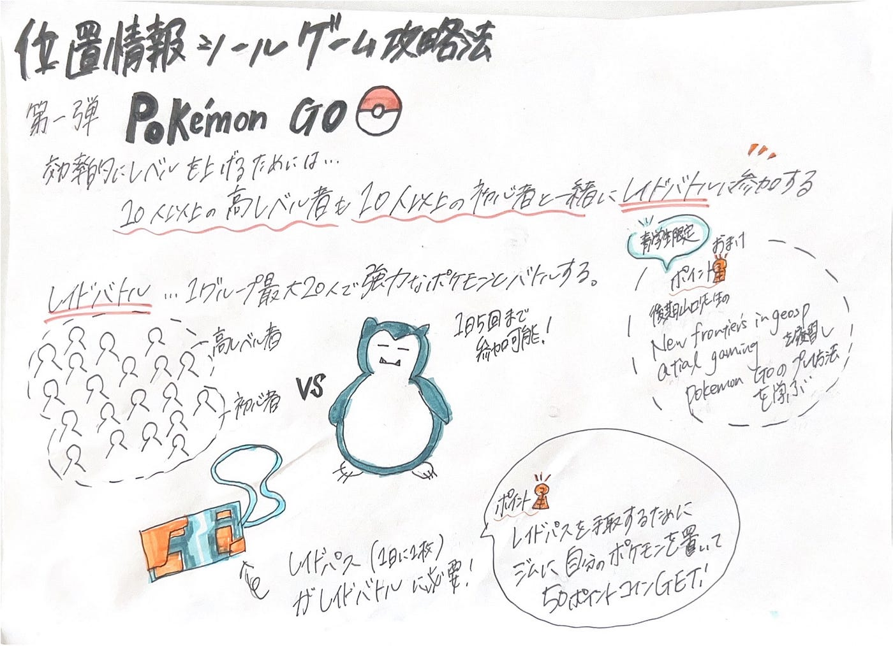

## デザイン週報（10/15）

お久しぶりです！3年の末木です。

今週のデザイン部は後期やりたいことについて話し合いました！

その中で、ゲームの攻略法紹介という案が出てきたので、今回は第一弾として[Pokémon GO](https://pokemongolive.com/)の攻略法を紹介します。

> Pokémon GOの特徴

『Pokémon GO』は、[Niantic](https://nianticlabs.com/)が開発し、2016年にリリースされたスマートフォン向けの位置情報ゲームです。以下が主な特徴です。

1.	位置情報ベースのゲームプレイ: ゲームは実際の地理情報に基づいており、プレイヤーは現実世界を歩き回りながら、スマートフォンを通じてポケモンを捕まえたり、ジムでバトルしたりします。

2.	拡張現実（AR）機能: AR機能により、カメラを通して現実の風景の中にポケモンが現れるように表示されます。これにより、ポケモンを現実世界で捕まえているような感覚を楽しめます。

3.	コミュニティとイベント: 『Pokémon GO』は、地域や世界中で定期的に開催されるイベントが豊富で、コミュニティ・デイやレイドバトルなど、プレイヤー同士が協力したり、競い合ったりする機会があります。

4.	レイドバトルとジムバトル: プレイヤーは、特定の場所に設置された「ジム」で他のプレイヤーとポケモンバトルを行ったり、強力なポケモンと協力して戦う「レイドバトル」に参加したりできます。

5.	ポケストップとアイテム収集: プレイヤーは「ポケストップ」でアイテムを入手し、ポケモンの捕獲やバトル、進化などに使用します。ポケストップは現実世界の名所やランドマークに位置しています。

このように、『Pokémon GO』は現実世界との連動やコミュニティの活性化を目的とした独自の要素を持ち、世界中のプレイヤーに親しまれています。

出典: ChatGPT（OpenAI）との対話、2024年10月15日取得

> Pokémon GOレベル上げのコツ

上記した特徴が攻略法にも大きく関わってくるため、特徴を活かした遊び方がポイントです！

私たちデザイン班が考えたPokémon GO攻略法は以下の通りです。

- 10人以上の高レベル者も10人以上の初心者と一緒にレイドバトルに参加する

- レイドバトルに参加するためのチケット(1日1枚しかもらえない)を手に入れるために、ジムに自分のポケモンを置いて50ポイントのコインを集める

- （＋α）山口先生のNew Frontiers in Geospatial Gaming を履修しPokémon GOの効率的な上げ方やプレイ方法を学ぶ

以下がグラレコです！

また、デザイン部にはV&Fと兼部しているメンバーも多いため、この内容をV&Fも動画の参考にしてコラボとしてやっていくのも良いのではという提案も出ました。
