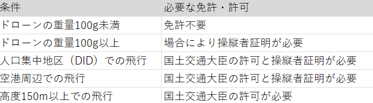
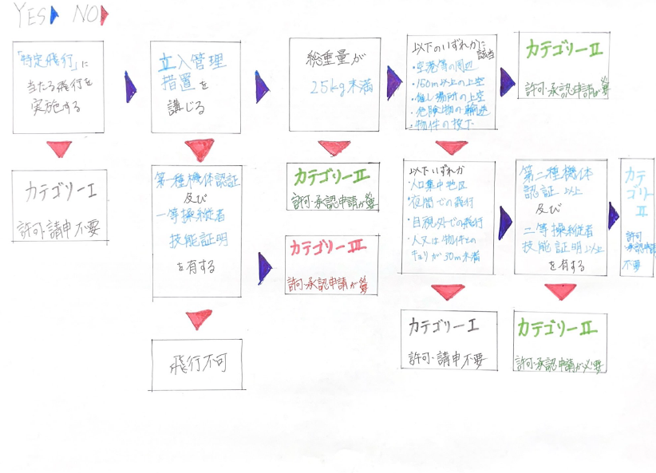

### ドローン操縦に必要な免許と条件

こんにちは、ドローン部３年の佐藤です。

ドローンの普及に伴い、個人や企業が様々な分野でドローンを活用しています。しかし、その使用に際しては、法律や規制に注意が必要です。記事では、ドローン操縦に必要な各種免許とその条件について、無線免許を含めて解説しようと思います。

### 1. 日本におけるドローン規制の概要

日本では、国土交通省がドローンの使用に関する規制を策定しています。主要な法律として「航空法」があり、この法律の下でドローン飛行が制限されています。また、2022年12月には「無人航空機操縦者技能証明」が導入され、特定の条件下での飛行には免許の取得が義務化されました 。

### 2. 無人航空機操縦者技能証明とは

「無人航空機操縦者技能証明」は、ドローンの操縦者が安全な操作に必要な知識と技能を持っていることを証明する国家資格です。この免許には「一等」と「二等」があり、飛行リスクに応じて必要な証明が異なります。

一等操縦者証明：高リスクの飛行（例：第三者上空での目視外飛行）を行う場合に必要です。
二等操縦者証明：比較的低リスクの飛行（例：無人地帯での目視外飛行）に必要です 。

### 3. 各種免許が必要となる条件

#### 3.1 ドローンの重量による区分

100g未満のドローン：免許不要。
100g以上のドローン：機体登録が必要で、特定の条件下では免許必要。

#### 3.2 飛行場所と空域

人口集中地区（DID）や空港周辺での飛行：国土交通大臣の許可が必要で、免許がなければ許可がおりない。
高度150m以上の空域での飛行：国土交通大臣の許可が必要。

#### 3.3 飛行方法

目視外飛行：操縦者がドローンを直接目視できない状態での飛行。二等操縦者証明が必要。
夜間飛行：日没から日の出までの間の飛行には、二等操縦者証明。

物件投下：ドローンから物を投下する場合、一等操縦者証明と国土交通大臣の許可が必要。

#### 3.4 飛行目的

業務目的：測量、物流、撮影などの業務用として使用する場合、免許が必要な場合がある。
レジャー目的：趣味での飛行でも、特定の条件を満たす場合には免許が必要 。

#### 3.5 無線免許が必要となる場合

ドローンの操縦には無線通信が不可欠であり、使用する無線機器の種類や周波数によっては無線従事者免許。

#### 技適マークがある場合

技適マーク付きの無線機器を使用している場合、無線免許は不要。多くの市販ドローンは、この特定小電力無線機器の範疇。

#### 無線従事者免許が必要な場合

出力を改造した場合や、技適マークがない海外製無線機器を使用する場合は、無線従事者免許が必要です。特定の周波数帯や高出力無線機器を使用する際も同様。

#### 無線従事者免許の種類

第四級アマチュア無線技士：アマチュア無線で使用可能な免許で、趣味の範囲で使用する場合に有効。ただし、業務使用はできない。
第三級陸上特殊無線技士：業務用無線機器の操作には、この免許が必要。

### 4. 免許取得のための手続きと要件

#### 操縦者証明の取得

年齢要件：二等は16歳以上、一等は17歳以上。
身体要件：視力や聴力など一定の基準あり。
学科試験と実地試験：航空法に関する筆記試験と、実際の操縦技能を確認する実地試験必須。

#### 無線従事者免許の取得

試験の受験：国家試験または養成課程の修了が必要。特に年齢要件はなく、試験は法規や無線工学の基礎知識が問われる。

### **～余談～**

#### **三陸特＆四アマを受験した感想と無線学習内でドローンに関係する内容**

ドローンを操作する際に無線免許が必要になる周波数帯について、日本では**電波法**で定められています。無線機器を使用する際に、周波数帯と出力の規制によって、無線免許が必要かどうかが決まります。以下に、無線免許が必要な主な周波数帯について説明します。

#### 1. 免許が不要な周波数帯

一般的に、市販されている多くのドローンは、以下の周波数帯を使用しており、技適マーク（技術基準適合証明）付きの機器であれば無線免許が不要です。

- **2.4GHz帯**：特定小電力無線に分類される帯域。ドローンの操作やWi-Fi機器などで広く使われている。

- **5.8GHz帯**：こちらも免許不要で、ドローンのFPV（First Person View）システムなどに使用される。

これらの周波数帯は出力が低いため、免許なしで使用できる特定小電力無線機器に該当します。

#### 2. 無線免許が必要な周波数帯

以下の周波数帯や無線機器を使用する場合は、**無線従事者免許**が必要です。

- **27MHz帯**、**40MHz帯**：この周波数帯は古くからラジコンやドローンで使用されてきましたが、免許が必要です。出力や利用条件によっては、無線従事者免許（例：第三級陸上特殊無線技士）が必要。

- **920MHz帯**：この周波数帯も免許が必要な場合があります。特定の条件で無線従事者免許が求められることが多い。

- **高出力の433MHz帯**：業務用のドローンや遠距離通信用のドローンが使用することがありますが、この場合も免許必須。

- **1.2GHz帯**や**1.3GHz帯**：高性能なFPVドローンなどで使用されることがあり、免許が必要です。これらはアマチュア無線帯域としても利用されるため、**アマチュア無線技士**の資格。

#### 3. 海外製ドローンに注意

海外製のドローンや無線機器は、日本国内の電波法に適合していない場合があり、技適マークがないものが多いです。その場合、使用する周波数帯に応じて無線従事者免許が必要となることがあります。特に海外で購入した高出力無線機器や改造された機器の使用は、免許が必要になるケースが多いため、注意が必要です。

#### 4. 無線従事者免許の例

無線免許が必要な場合、以下の資格が代表的です。

- **第三級陸上特殊無線技士**：主に業務用の無線機器を操作する際に必要な免許。

- **第四級アマチュア無線技士**：アマチュア無線を使う場合に必要。1.2GHz帯や433MHz帯を使用する際に必要です。ただし、業務目的での使用は禁止されています。

### 5. まとめ

ドローンの操縦には、適切な免許の取得と法令遵守が不可欠です。特に業務で使用する場合や、高リスクの飛行を行う際には、操縦者証明や無線免許が必要になるため、事前に準備を整えることが重要です。最新の情報を確認しながら、安全なドローン操縦できるように心がけたいです。

— -

参考文献

1. 国土交通省 無人航空機（ドローン・ラジコン機等）の飛行ルール
2. 総務省 電波利用ホームページ
3. 航空法関連資料
4. 技適マークに関する総務省ガイド
5. 無線従事者免許に関する詳細情報

— -

今回は、ドローンを安全かつ法的に正しく使用するためのポイントを網羅的に解説しました。ドローンの技術は進化し続けており、法律も変化する可能性があるため、最新情報をチェックして適切な対応を行いましょう。ちなみに、佐藤は夏休みに三陸特と四アマの試験に合格したので、興味があったら聞いてください。

### グラレコ

#### 条件別、申請が要るor要らない場合のルート

