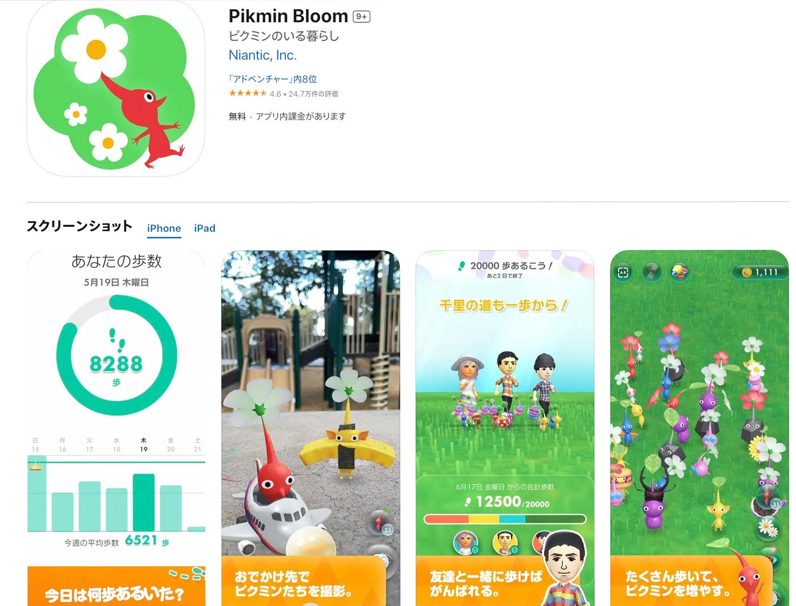
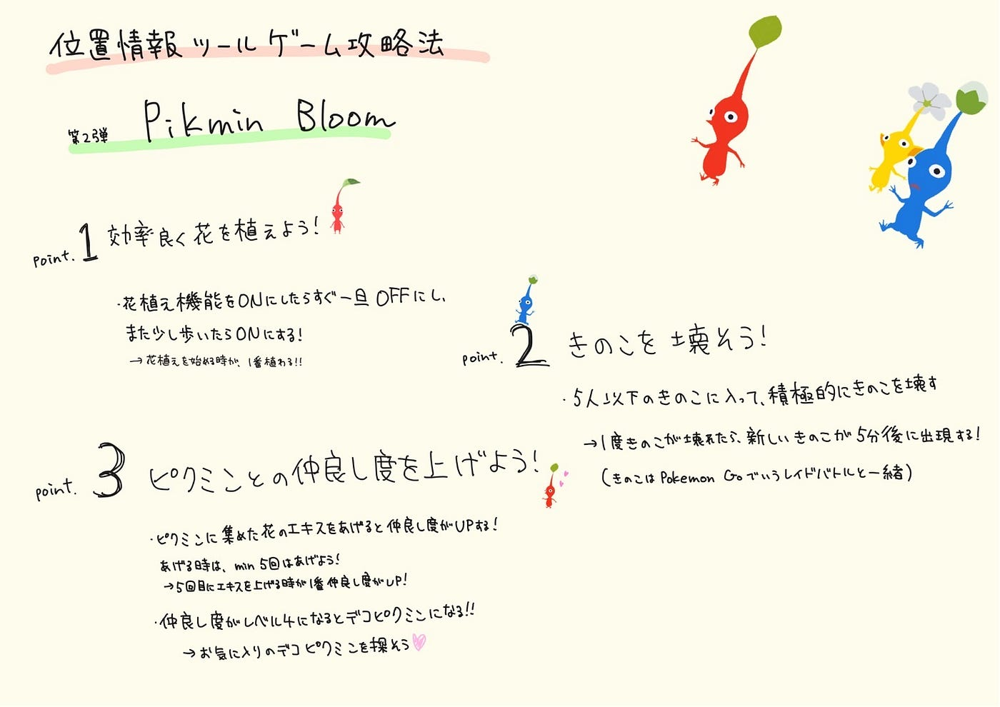

### デザイン部週報 10/21

こんにちは、三年の福田です。

今週は

位置情報ゲーム攻略法第二弾〜**ピクミン **！

ピクミンについて

ピクミンは、任天堂が開発した人気のあるゲームシリーズで、最初の作品は2001年に発売されました。このゲームは、プレイヤーが小さな宇宙探検家「オリマー」となり、様々な色のピクミンを指揮して惑星上での冒険を続ける内容です。Switchだけでなく、スマホでも遊べるようになっています。

ピクミンの特徴：

- 歩くことでピクミンを育て、一緒に冒険する

- 歩いた場所に花を植えることができる

- 歩数に応じてピクミンの苗が育つ

- フルーツから採れる「エキス」をピクミンに与えて育てる

- レベルアップすることで、ピクミンにおつかいを頼れるようになる

- ARモードを使って現実世界にピクミンを出現させ、写真撮影ができる

- 公園や街中など、様々な場所でピクミンとの写真が撮っている

家族と一緒に楽しむことができたり、運動不足解消にも繋がったりと楽しく歩くことができます。参考にしたウェブサイトもぜひご覧になってください。

→[https://pikminbloom.com/ja/gameplay/](https://pikminbloom.com/ja/gameplay/)

ピクミンのレベルの上げ方もまとめました。

１．まずは歩くことが基本！

- 1歩1歩の積み重ねが確実にレベルアップにつながります。

２.レベルアップの条件（お題）を確認！

- ホーム画面のプレイヤーアイコンをタップすると、現在のレベルと次のレベルアップに必要な条件が表示されます。これらの条件を満たすことでレベルアップできます。

３.細かいこととして！

- 累計歩数の達成（例：500歩、1,500歩、3,000歩など）

- ピクミンを育てる

- 花を植える

- 花びらを集める

- おつかいを完了させる

⭐️マークピクミンのレベル上げは経験値上げではなく、タスク性にある！

＊注意点：1日の苗育成の上限STEP数（3万歩）を超えると、それ以上歩いても苗が育たない場合があります。

＋ピクミンは歩数の反映が早く、数字がどんどん増えていくため、モチベーションを保ちやすいです。なので、日々の歩数を意識的に増やし、ゲーム内で提示される条件を順番にクリアしてレベルを上げていきましょう。

それぞれのレベルのお題（条件）がまとめられたサイトがあったので、興味がある方はぜひ参考にしてください。→[https://9-bit.jp/pikminbloom/16](https://9-bit.jp/pikminbloom/16)

グラレコ

記事まとめながら興味が湧いて福田もピクミン始めました。
