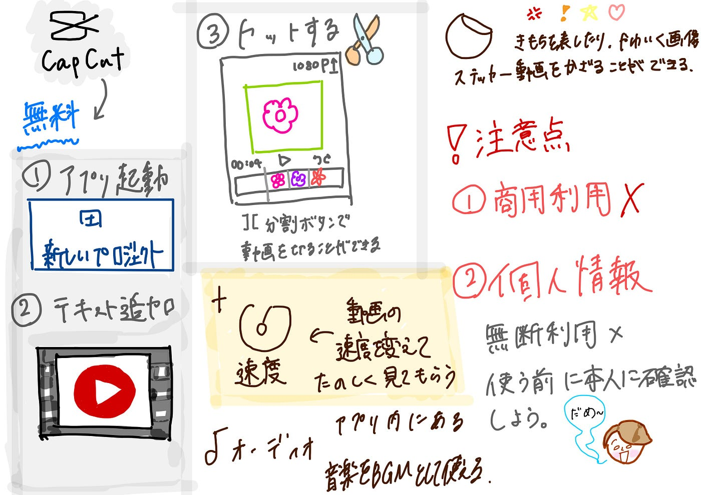

### V＆F 週報

こんにちは、V＆F部3年生の滝沢です。今週は、よく動画編集に使用している [CapCut](https://www.capcut.com/ja-jp/)という動画編集アプリについてご紹介します。

CapCutについて⇓リンク

[https://www.capcut.com/ja-jp/](https://www.capcut.com/ja-jp/)

１主な機能

⑴基本的な動画編集機能
動画のトリミング、カット、結合など、基本的な編集操作が簡単に行うことができます

⑵エフェクトとフィルター
動画にさまざまなフィルターやエフェクトを追加することができます。これにより、クリエイティブな編集が可能になります。
 
⑶テキストとステッカー
動画にテキストやステッカーを追加でき、カスタマイズしたメッセージやアニメーションを挿入することが可能です。
 
⑷音楽と効果音
アプリ内にある豊富な音楽ライブラリからBGMや効果音を追加できるほか、独自の音声や音楽をインポートして動画に追加することも可能です。

⑸スローモーションや逆再生
 — 動画をスローモーションにしたり、逆再生することができ、より面白いエフェクトを演出できます。

⑹高度な編集機能
 — グリーンスクリーン（クロマキー合成）やレイヤー編集など、よりプロフェッショナルな編集をしたいユーザー向けの高度なツールも備えています。

２ CapCutのメリット
・無料で利用可能：高機能な編集ツールが揃っているにもかかわらず、基本的な機能はすべて無料で使用できます。
・直感的な操作：初心者でも簡単に使えるように設計されており、専門的な知識がなくてもクオリティの高い動画を作成できます。
・モバイルフレンドリー：スマホやタブレットで操作しやすく、外出先でも簡単に編集可能です。

３デメリットもある！

・個人情報には注意すること。動画に他の人が写っていたら本人に確認しよう。

・商用利用には使えないこと。

今後取り組む予定のV＆Fの紹介動画をCapCutで編集した縦型ショート動画にしてみても面白そう！

グラレコ

